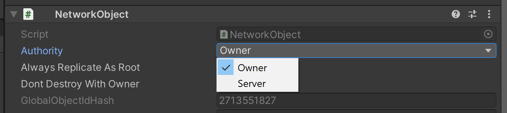
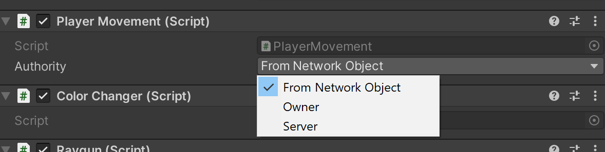

- Feature Name: Authority
- Start Date: 2021-05-19
- RFC PR: [Unity-Technologies/com.unity.multiplayer.rfcs#0015](https://github.com/Unity-Technologies/com.unity.multiplayer.rfcs/pull/0015)
- Issue: [Unity-Technologies/com.unity.multiplayer#0000](https://github.com/Unity-Technologies/com.unity.multiplayer/issues/0000)

# Summary
[summary]: #summary

The authority concept is an abstraction layer for gameplay logic on top of MLAPI. It allows high level components to write game play code without the need of considering the underlying network model. Authority does not directly affect other parts of the framework.

# Motivation
[motivation]: #motivation

## Accessibility
Right now using MLAPI requires extensive knowledge of multiplayer concepts. Beginners often struggle with simple tasks like figuring out the correct way of moving a player object etc. The authority concept among other features will simplify this.

## Flexibility
As a developer I might get into a situation where I want to start releasing my game on a different platform or I might pivot my game to a different genre. The way MLAPI currently works would often not allow such a switch without rewriting a majority of the components. The authority system will provide the necessary flexibility to switch 

## Modularity
Currently when developing with MLAPI it is very hard to develop modular components. Each component might have different logic and a list of expectations which are not compatible with each other. While the authority system will not fully solve this problem it will help developers which create components which can be combined with other components using the same authority. This allows a user to build reusable components which is a core feature of Unity when creating single player games.

## Cross/Multi Platform
Being able to launch a multiplayer game on multiple platforms is important for a lot of our users. Different platforms have very different networking needs:
- Mobile : high latency, high jitter, almost no hackers
- PC: low latency, low jitter, many hackers
- Console: low latency, low jitter, almost no hackers

Based on those platforms conditions different authority modes might be more ideal for some of them. `Mobile` for instance could profit from `Owner Authority` while `PC` or `Console` might want server authority.

The authority feature will allow to develop a game once and then support all those modes.

## Unify Existing Components
`NetworkTransform` has already an authority switch. NetworkNavMeshAgent and NetworkAnimator will need one too. Instead of solving the same problem over and over again we will solve it once.

# Guide-level explanation
[guide-level-explanation]: #guide-level-explanation

NetworkObject have an `Authority` switch. The Authority switch can be used when creating a `NetworkPrefab` to decide which authority model the `NetworkObject` should use.

Currently there are two `Authority` modes:
- Owner: The owner of the `NetworkObject` has authority over it.
- Server: The server always has authority over the `NetworkObject.



We might add new authority modes in the future.

Having Authority over a `NetworkObject` does the following
- There is a `HasAuthority` property on the `NetworkObject` and each `NetworkBehaviour` which will be set accordingly.
- Built in MLAPI components such as `NetworkTransform` or `NetworkAnimator` will synchronize the state of the at
- NetworkVariables with `ReadPermission = NetworkVariablePermission.Authority` can be read from. (write permission also exists)

Having Authority over a `NetworkObject` **does not**: change MLAPI features such as how NetworkVariables or RPCs are sent/received etc. In the future we might have authority modes such as `Predicted` which will change this. But this is not part of the authority mode but will be implemented by the specific feature like `prediction`.

## HasAuthority
The `HasAuthority` property is the core feature of authority. It allows to write game play code in a more flexible way

```csharp
public class SampleClass : NetworkBehaviour{
    
    [ServerRpc]
    public void SetPositionServerRpc(Vector3 position)
    {
        SetPosition(position)
    }

    public void SetPosition(Vector3 position)
    {
        transform.Position = position;
    }

    public void Update()
    {
        if(HasAuthority)
        {
            SetPosition(m_TargetPosition);
        }
        else
        {
            SetPositionServerRpc(m_TargetPosition);
        }
    }
}
```

## NetworkVariables
NetworkVariables will get an additional write and read permission for the authority.

`NetworkVariablePermission.Authority` can be used to make a NetworkVariable only writable/readable by the authority.
This can be used to write code which works for any authority mode. For instance like this.
```csharp
public class SampleClass : NetworkBehaviour{
    
    var m_MyInput = new NetworkVariable<bool>(
        new NetworkVariableSettings()
        {
            ReadPermission = NetworkVariablePermission.Authority,
            WritePermission = NetworkVariablePermission.OwnerOnly
        });

    public void Update()
    {
        // Owner client gives inputs into network variable.
        if (IsOwner)
        {
            m_MyInput.Value = Input.GetKeyDown(KeyCode.Space);
        }

        // The authority which could either be the owner or the server based on the authority mode uses the input to move.
        if(HasAuthority)
        {
            if(m_MyInput.Value)
            {
                m_Rigidbody.AddForce(transform.up * m_Thrust);
            }
        }
    }
}
```
*The authority system allows NetworkVariables to be flexibly used as inputs.*

## Changing Authority

The `Authority` mode of a `NetworkObject` can be changed, on the server only, by calling `networkObject.ChangeAuthority(Authority.Server);`.

This means which peer has authority also changes if the ownership of an object changes when in `owner` authority mode. This means the `HasAuthority` property should never be cached but always accessed directly.

## OnGainedAuthority / OnLostAuthority

`OnGainedAuthority` and `OnLostAuthority` functions can be overridden to get informed about changes to the `HasAuthority` status. `OnGainedAuthority` gets called when `HasAuthority` switches from false to true. `OnLostAuthority` gets called when it switches to false from true
```csharp
public override void OnGainedAuthority()
{
    Debug.Log("Authority Gained :)");
}

public override void OnLostAuthority()
{
    Debug.Log("Authority Lost :(");
}
```


# Reference-level explanation
[reference-level-explanation]: #reference-level-explanation

## Why is Authority a mode?
Why is authority not something like ownership which you give to a client. The reason for that is because authority is a relation between multiple peers. In an authoritative model a set of peers pass inputs to the authoritative peer for processing.

Because we are a star topology we have some technical limitations. For instance we could not have one client generate the inputs but pass it to another client which holds authority (because this would break the encapsulation principle of time explained in the NetworkTime RFC).

Because of the above we will only support authority models where the owner of an object collects inputs and sends them to the authoritative peer which has to be either the owner or the server.

Accepting inputs from multiple peers is something we will not support with the current proposed design. The authority mode system allows for further extension to support those modes.

## Ownership vs Authority
This RFC will introduce some rules and responsibilities for each of the two systems.

IsOwner:
- Only one peer can own a NetworkObject.
- The `owner` of a NetworkObject can use `ServerRpcs` on its `NetworkBehaviour` by default.
- The `owner` is responsible for collecting inputs and redirecting them to the authority.
- The `owner` is encouraged write to `NetworkVariables` with readpermission = authority but not to other NetworkVariables.
- When the owner peer disconnects, the object it owns might get destroyed when `DontDestroyWithOwner` is set to false.

HasAuthority:
- The `authority` should run gameplay code such as physics, movement, path finding, animation etc.
- The `authority` should update NetworkVariables which get used by other clients to visualize the game state.

IsServer:
- The server has permission to change ownership and authority of NetworkObjects.
- `IsServer` should be avoided for gameplay related code.

## NetworkObject Authority

NetworkObject will get an Authority Property and a way to query for authority with `HasAuthority`:
```csharp
public Authority Authority => m_Authority;

public bool HasAuthority
{
    get
    {
        if (IsSpawned) // This is needed because else we don't know whether we are a server.
        {
            return IsOwner ? Authority == Authority.Owner : NetworkManager.IsServer && Authority == Authority.Server;
        }
        throw new SpawnStateException($"Cannot get authority for not spawned {nameof(NetworkObject)}");
    }
}
```

There will also be a function to change authority:
```csharp
public void ChangeAuthority(Authority authority)
{
    Assert.IsFalse(authority == Authority.FromNetworkObject)
    NetworkManager.SpawnManager.ChangeAuthority(this, authority);
}
```

NetworkSpawnManager will contain the logic for sending authority changes this is mirrored from how ownership is changed:
```csharp
private void ChangeAuthority(ulong networkObjectId, byte serializedAuthorityValue)
{
    if (!NetworkManager.IsServer)
    {
        throw new NotServerException("Only the server can change authority");
    }

    using var buffer = PooledNetworkBuffer.Get();
    using (var writer = PooledNetworkWriter.Get(buffer))
    {
        writer.WriteUInt64Packed(networkObjectId);
        writer.WriteBits(serializedAuthorityValue, 1);
        NetworkManager.MessageSender.Send(NetworkConstants.CHANGE_AUTHORITY, NetworkChannel.Internal, buffer);
    }
}
```

Wrapper function for NetworkObject change in NetworkSpawnManager:
```csharp
public void ChangeAuthority(Authority authority)
{
    if (networkObject.IsSpawned == false)
    {
        throw new SpawnStateException("Object is not spawned");
    }

    // convert flags to index
    var serialized = new BitField32((uint)authority).CountLeadingZeros();
    ChangeAuthority(networkObject.NetworkObjectId, serialized);
}
```

The deserialization side will contain similar logic as change ownership and will apply authority changes to the NetworkObject.

## NetworkVariable Authority

We introduce a `NetworkVariablePermission.Authority` permission. This is a very simple change to the NetworkVariable we just add the following to the read/write queries
```csharp
public bool CanClientRead(ulong clientId)
{
    switch (Settings.ReadPermission)
    {
    //....
        case NetworkVariablePermission.Authority:
            return m_NetworkBehaviour.HasAuthority;
    //.....
    }
    return true;
}
```

## OnGainedAuthority / OnLostAuthority

Will be implemented by listening to authority mode changes internally and then checking whether the resulting `HasAuthority` flag is different.

# Drawbacks
[drawbacks]: #drawbacks

- The authority system is very loosely integrated into MLAPI. It does not change how NetworkVariables and RPCs work etc. While there are many upsides to keeping authority as a separate abstraction layer it could also be a missed opportunity depending on the direction we want to take MLAPI.

- An ACL system could potentially change how we think about ownership or authority or at least allow us to implement the authority system with much less code changes needed. Waiting for the ACL system could be a good idea.

- Authority increases the spawn header size of a `NetworkObject` by 2 bit and the header size of `NetworkBehaviours` which use the `AllowAuthorityOverride` by 2 bit. In the future once we have more authority modes these headers will potentially get even larger.


# Rationale and alternatives
[rationale-and-alternatives]: #rationale-and-alternatives

- Why is this design the best in the space of possible designs?
- What other designs have been considered and what is the rationale for not choosing them?
- What is the impact of not doing this?

Authority could have been done as a permission/acl system instead of an authority mode. This would have allowed us to have more fine-grained control over who has authority. We were not able to find many real world use cases where this would be useful so that's why the authority mode was chosen. In the future we might consider storing authority internally as a set of owners instead of an authority mode but then most likely we would still want to expose authority as an authority mode for ease of use.

# Prior art
[prior-art]: #prior-art

## UNet

UNet also had the concept of [NetworkAuthority](https://docs.unity3d.com/Manual/UNetAuthority.html). There was a `Local Player Authority` checkbox on NetworkIdentity (MLAPI equivalent of NetworkObject). The UNet authority feature was very different from MLAPI's in UNet the authority was the one who was able to call commands (equivalent of server rpc). In UNet SyncVars (equivalent to NetworkVariable) where always controlled by the server, a client could never change them.

The UNet authority system has a lot of problems. The NetworkTransform component was using authority because it used RPCs. Many user made components could not support authority because they wanted to have client driven SyncVars.

This system is very limited and not really `authority` it is more what we have in MLAPI with `ownership`. It looks like the MLAPI `ownership` model has been inspired by the UNet `authority` model. The MLAPI `authority` model will improve MLAPI and allow users to do things which were not possible in UNet.

## DOTS Netcode
DOTS Netcode has a ghost mode which can be interpolated or predicted. The interpolated mode matches our 'server' mode. There is no mode for client authority. The predicted mode is something we do not support yet but can in the future.

# Unresolved questions
[unresolved-questions]: #unresolved-questions

## Scrapping per NetworkBehaviour Authority
See appendix for details. There are very little actual use cases for this and scrapping this will more then half the code size of the authority feature and lower the bandwidth usage of MLAPI.

## Naming
We might want to consider a different name for authority. Some candidates would be `AuthorityMode`, `ControlMode` or `GhostMode`(to match DOTS). Similar `HasAuthority` might be `HasControl`.

## Snapshots / AOI
There are a lot of unknowns on how our snapshot and AOI system will work with `NetworkVariablePermission.Authority`. We do not plan to resolve this unresolved question in the authority RFC as it only introduces an additional `NetworkVariablePermission`. The snapshot / AOI RFCs will answer this question.

## AuthorityChanged Event
Do we need an AuthorityChanged event? We already have `OnAuthorityGained` and `OnAuthorityLost` events but would we need an additional to event to signal if the authority mode itself changed?

## Default NetworkVariable Permissions

The default write permission for a NetworkVariable is currently `NetworkVariablePermission.ServerOnly` and the default write permission is `NetworkVariablePermission.Everyone`. We could consider changing the default write permission to `NetworkVariablePermission.Authority`. It is not clear whether that would simplify or complicate the onboarding experience of MLAPI.

## Shared/Distributed Authority

The RFC does not cover authority modes where multiple peers have authority over an object. It also does not cover prediction. The proposed authority system can be extended to support more authority modes. To support shared/distributed authority we might need an ACL entry to indicate which peers have authority over an object

# Future possibilities
[future-possibilities]: #future-possibilities

## Prediction
The authority feature is a first step towards the goal of supporting client side prediction. When using client side prediction we need precises control over what's being run on the predicted client and run the same on the server. The `HasAuthority` flag will allow us to do this by setting it to true on both the predicting client and the server.

## Commands
Commands in multiplayer games are inputs which are created by the owner/controller of an object and then sent to the authority for execution. The authority mode feature will allow us to implement commands in the future.

## RPCs

Right now RPCs can only be send to the server/clients. This means that a lot of time boilerplate must be introduced to write authoritative concepts.
```csharp
if(HasAuthority)
{
    SetPosition(m_TargetPosition);
}
else
{
    SetPositionServerRpc(m_TargetPosition);
}
```

In the future we could consider introducing an `AuthorityRpc` or similar which sends an RPC to the authority.

## Network Physics

Network physics rigidbodies will use the authority system to decide where the dynamic rigidbody simulation will happen.


# Appendix (Per behaviour authority)

We could decide to also allow per behaviour authority. We decided against this approach because of the complexity involved and the lack of real world use cases. We might reconsider this in the future.

## Guide-level explanation

### NetworkBehaviour Authority

Per default `NetworkBehaviour`s use the same `Authority` mode as their `NetworkObject`. If the `NetworkObject` changes `Authority` all `NetworkBehaviour`s belonging to it will change to that's because the use the `NetworkBehaviour` specific `Authority` mode called `FromNetworkObject`.

`NetworkBehaviour Authority` is an advanced feature which can be used to change the authority of individual components. For most games this should not be necessary and mixing `authority` might lead to unexpected results.

There are two ways to change the `Authority` of a `NetworkBehaviour`

#### 1. In Editor
By default there is only a `Authority` dropdown on `NetworkObject` but not on `NetworkBehaviour`. The `AllowAuthorityOverride` attribute can be used on custom `NetworkBehaviour`s to make the dropdown appear.

#### 2. Runtime
This also need the `AllowAuthorityOverride`. Only the server can change authority by code. On the server you can call `myNetworkBehaviour.ChangeAuthority(Authority.Server);` to change authority. The change will automatically replicated to all clients.

```csharp
[AllowAuthorityOverride]
public class PlayerMovement : NetworkBehaviour
{
}
```



If runtime authority override is wanted but the inspector dropdown is not wanted it can be disabled in the attribute like this:
```csharp
[AllowAuthorityOverride(ShowDropdown = false)]
public class SampleNetworkBehaviour : NetworkBehaviour{}
```

The Unity high level components such as `NetworkTransform` and `NetworkAnimator` will not allow for authority override. If a user wants to use them with authority override they should derive from them and add the attribute.

### SupportedAuthorityModes Attribute
Some NetworkBehaviours might not support all authority modes. This can be indicated with the SupportedAuthorityModes attribute like this:
```csharp
[SupportedAuthorityModes(Authority.Owner | Authority.Server)]
public class SampleNetworkBehaviour : NetworkBehaviour{}
```

Setting the supported authority modes will not prevent code or the inspector from assigning a wrong authority. It will just log a warning whenever the authority gets changed to a value which the behaviour does not support.

Supported authority modes is mainly a tool to signal intent on how a component should be used.

## Reference-level explanation


### NetworkBehaviour Authority
By default NetworkBehaviours do not sync authority. Only NetworkBehaviours with the `AllowAuthorityOverride` will serialize their authority. This allows us to save bandwidth by accessing compile time information.


NetworkBehaviour exposes an authority override property. This property usually doesn't need to be used.
```csharp
public Authority AuthorityOverride { get; }
```

The check for `HasAuthority` is also a bit different:
```csharp
public bool HasAuthority
{
    get
    {
        if (NetworkObject.IsSpawned)
        {
            Authority authority = AuthorityOverride == Authority.FromNetworkObject ? NetworkObject.Authority : AuthorityOverride;
            return IsOwner ? authority == Authority.Owner : NetworkManager.IsServer && authority == Authority.Server;
        }
        throw new SpawnStateException($"Cannot get authority for not spawned {nameof(NetworkObject)}");
    }
}
```

Serialization works similar just uses a different wrapper function:
```csharp
internal void ChangeAuthority(NetworkBehaviour networkBehaviour, Authority authority)
{
    var networkObject = networkBehaviour.NetworkObject;
    if (networkObject.IsSpawned == false)
    {
        throw new SpawnStateException("Object is not spawned");
    }

    // convert flags to index
    var serialized = new BitField32((uint)authority).CountLeadingZeros();
    ChangeAuthority(networkObject.NetworkObjectId, networkBehaviour.NetworkBehaviourId, serialized, 2);
}
```

### SupportedAuthorityModes Attribute
```csharp
    [AttributeUsage(AttributeTargets.Class)]
    public class SupportedAuthorityModesAttribute : Attribute
    {
        private Authority m_AuthorityModes;

        [MethodImpl(MethodImplOptions.AggressiveInlining)]
        public static bool SupportsAuthority(SupportedAuthorityModesAttribute attribute, Authority authority)
        {
            // Enum.HasFlag but faster
            return (((byte)attribute.m_AuthorityModes & (int)authority) != 0);
        }

        public SupportedAuthorityModesAttribute(Authority authorityModes)
        {
            m_AuthorityModes = authorityModes;
        }
    }
```

At runtime modes get cached in a static lookup table `Dictionary<Type, Authority>` to avoid reflection in the hot path.

Supported Authority mode just changes some minor details in NetworkObjectEditor to display components with not supported authority and after changing authority it will check whether the behaviour is still supported. In addition it checks foreach NetworkBehaviour whether the authority mode is still allowed when authority gets changed and if not logs a warning to the console.

### AllowAuthorityOverride Attribute
Per component authority is a feature which can be useful in some rare situations. The `AllowAuthorityOverride` allows a developer to override the network authority of the network object. This is disabled by default because many components could not support with other components on the same  

```csharp
[AttributeUsage(AttributeTargets.Class)]
public class AllowAuthorityOverrideAttribute : Attribute
{
    public bool ShowDropdown { get; set; } = true;

}
```
The `AllowAuthorityOverride` attribute serves three purposes:

1. Allows code to change authority of a network behaviour.
2. Allows users to add a per component authority dropdown but reduces UX clutter by not showing an authority dropdown on any NetworkBehaviour by default.
3. Reduce bandwidth. With per component authority we would need to synchronize the authority of each object. But with this attribute we can only sync the ones which have the attribute. 