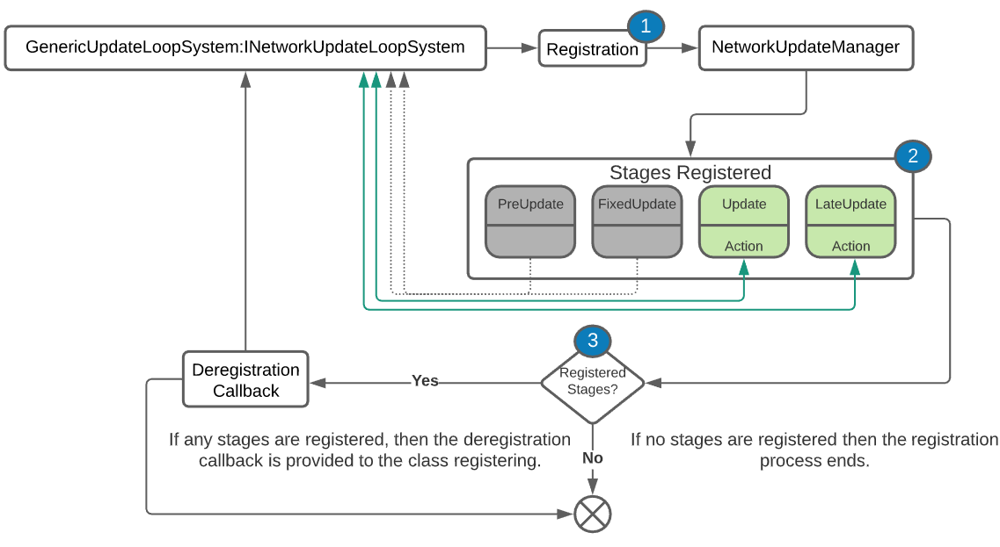

- Feature Name: Network Update Loop System
- Start Date: 1-19-2021
- RFC PR: [Unity-Technologies/com.unity.multiplayer.rfcs#0000](https://github.com/Unity-Technologies/com.unity.multiplayer.rfcs/pull/0000)
- Issue: [Unity-Technologies/com.unity.multiplayer#0000](https://github.com/Unity-Technologies/com.unity.multiplayer/issues/0000)

# Summary
[summary]: #summary

Often there is a need to update specific netcode related systems at intervals outside of the traditional Unity MonoBehavior defined updates (FixedUpdate, Update, and LateUpdate).  It is proposed that a new set of updates are provided to netcode related systems in order to assure tasks that require a specific order of operations are executed prior to or after game logic (MonoBehavior) related code is executed.  As such, it is proposed that a new method for registering and invoking actions that can occur outside of the traditional MonoBehavior updates is implemented.

# Motivation
[motivation]: #motivation

While a MonoBehavior derived class provides three different options of when to handle updates (FixedUpdate, Update, and LateUpdate), there is a need to provide an alternate set of updates, that exist outside of the MonoBehavior realm, for current and future MLAPI systems.  The UnityEngine.LowLevel.PlayerLoop class provides the ability to register new PlayerLoopSystems to be invoked at alternate engine-level update stages (i.e. PlayerLoopSystems) that can occur prior to, during, or after all of the standard update stages offered by a MonoBehavior derived class.  This proposal is meant to further explore the potential opportunity to provide a new set of update stages within MLAPI as well as offer users the additional flexibility to provide their own set of network update logic and/or update actions  through the registration of an alternate network update engine.

# Guide-level explanation
[guide-level-explanation]: #guide-level-explanation

The [Network Game Update Loop diagram](#Network-Game-Update-Loop-diagram) shows a comparison of the various update stages between PlayerLoop (full game loop), Network Updates (all network specific updates), and MonoBehavior (updates exposed to MonoBehavior children).  The proposed additional network update stages (PreUpdate, FixedUpdate, Update, and PostUpdate) provide this functionality:
(*Network*) **PreUpdate**: Things like network tickrate, transport event polling (if supported), and typically anything that requires “beginning of the frame” processing would be invoked at this stage.

(*Network*) **FixedUpdate:** Anything that needs to update before any MonoBehaviour.FixedUpdate call is made would occur at this stage (i.e. updating values of rigid bodies could happen here).

(*Network*) **Update**:  Anything that needs to be updated/processed before any MonoBehavior.Update call is made would occur at this stage (i.e. updating values to systems that might be used prior to any system dependent MonoBehaviour child is updated).

(*Network*) **PostUpdate**: Things like sending out queued messages, getting the results of a batched job (i.e. snapshots or the like) would occur here.


**The original implementation only allowed for a single method to be registered per stage via the ```InternalNetworkUpdateEngine``` (legacy) format.  This had limitations to its design, and as such it was proposed to further extend this functionality to any ```INetworkUpdateLoopSystem``` such that any class could register for any of the new network update loop stages.

# Reference-level explanation
[reference-level-explanation]: #reference-level-explanation
In order to provide a more modular mechanism for registering with the network game update loop system, it is proposed that a new INetworkLoopUpdateSystem interface be used to define the underlying methods that would be used for this process.

Where the RegisterUpdate method is called for each of the four new network loop update stages (PreUpdate, FixedUpdate, Update, and LateUpdate).  The class that defines the RegisterUpdate method would either return an action for the update stage in question or null for no updates during the stage being queried for registration.  This approach not only provides a wider area of coverage (i.e. any class could register), but it also provides the ability to not register thus not adding the additional overhead of invoking an action for a stage not being used by the class.

The class defined below provides one potential way to both define the INetworkLoopUpdateSystem’s methods while providing additional class relative helper methods for registering and deregistering from the network update loop system.
Both the RegisterUpdate and the RegisterUpdateLoopSystemDestroyCallback methods are called by the NetworkUpdateManager during the registration process.  Below is a diagram to help better understand the network update loop system registration process:

1. Class instance registers with the NetworkUpdateMananger.
2. During registration, the NetworkUpdateManager calls the class instance’s RegisterUpdate method that will either return null or an Action to be registered for the particular update stage in question.  (*the diagram above shows only the Update and LateUpdate were registered for example purposes*)
3. If any update stage was registered, then the NetworkUpdateManager will invoke the class instance’s RegisterUpdateLoopSystemDestroyCallback method passing the callback action to be invoked upon the class instance being destroyed or if the class instance just wants to remove itself from the network update loop system stages.
So, any INetworkLoopUpdateSystem derived class can opt to register or deregister from network loop update stages during runtime.  This can be useful if a network object has associated INetworkLoopUpdateSystem based components and is not considered ‘active’ but is still considered enabled.  Under this situation, one could deregister the INetworkLoopUpdateSystem based components to be removed from any network loop system update stages until the network object becomes activated (“active”) again.  The registration and deregistration process provides runtime control over when the network update stages for a specific class will be invoked.  Under other circumstances, one might want to register for only specific network loop update stages depending on certain events or states.  This too can be accomplished by simply deregistering (if already registered) and then re-registering with the new update stages.

Currently, the NetworkingManager and the RpcQueueContainer derive from two predefined INetworkLoopUpdateSystem derived classes (UpdateLoopBehaviour and GenericUpdateLoopSystem).

**NetworkingManager:** Now derives from the UpdateLoopBehaviour and registers for the following network update loop stages:
1. **PreUpdate:** Transport event polling occurs here
2. **Update:** The remainder of the NetworkingManager’s update occurs here.

**RpcQueueContainer:**  Now derives from the GenericUpdateLoopSystem and registers for all network update loop stages:
1. **PreUpdate:**  RPCs registered to be invoked at this stage will be invoked.
2. **FixedUpdate:**  RPCs registered to be invoked at this stage will be invoked.
3. **Update:**  RPCs registered to be invoked at this stage will be invoked.
4. **LateUpdate:**  RPCs registered to be invoked at this stage will be invoked.
5. **LateUpdate:**  Outbound RPCs queued for sending will be batched and sent at this stage

**Invoking RPCs at specific Network Update Loop Stages:**
While there are many future possibilities for this new feature, one of the several driving purposes for this added capability was to provide an intuitive way to invoke RPCs at specific stages during runtime (i.e. dynamically).  In order to accomplish this, the network update loop registration process needed to be enhanced (as explained above) and some minor adjustments to the RPC send parameters were needed.


In order to specify what network update stage one might want an RPC to be invoked, adding the ServerRpcParams or ClientRpcParams as the last RPC method’s parameter and setting the UpdateStage is all that is needed:


The above code snippet shows that the ServerRpc, UpdateMyRigidBodyPosition, will be invoked during the network FixedUpdate stage when invoked on the receiver side (in this case the server).  The class containing the Rpc method itself does not need to be registered with the NetworkUpdateManager as the RpcQueueContainer handles this portion of the RPC invocation process.
# Drawbacks
[drawbacks]: #drawbacks

Why should we _not_ do this?

# Rationale and alternatives
[rationale-and-alternatives]: #rationale-and-alternatives

- Why is this design the best in the space of possible designs?
- What other designs have been considered and what is the rationale for not choosing them?
- What is the impact of not doing this?

# Prior art
[prior-art]: #prior-art

Discuss prior art, both the good and the bad, in relation to this proposal. A few examples of what this can include are:

- For framework, tools, and library proposals: Does this feature exist in other networking stacks and what experience have their community had?
- For community proposals: Is this done by some other community and what were their experiences with it?
- For other teams: What lessons can we learn from what other communities have done here?
- Papers: Are there any published papers or great posts that discuss this? If you have some relevant papers to refer to, this can serve as a more detailed theoretical background.

This section is intended to encourage you as an author to think about the lessons from other projects, provide readers of your RFC with a fuller picture. If there is no prior art, that is fine - your ideas are interesting to us whether they are brand new or if it is an adaptation from other projects.

Note that while precedent set by other projects is some motivation, it does not on its own motivate an RFC. Please also take into consideration that Unity Multiplayer sometimes intentionally diverges from common multiplayer networking features.

# Unresolved questions
[unresolved-questions]: #unresolved-questions

- What parts of the design do you expect to resolve through the RFC process before this gets merged?
- What parts of the design do you expect to resolve through the implementation of this feature before stabilization?
- What related issues do you consider out of scope for this RFC that could be addressed in the future independently of the solution that comes out of this RFC?

# Future possibilities
[future-possibilities]: #future-possibilities

Think about what the natural extension and evolution of your proposal would be and how it would affect the Unity Multiplayer as a whole in a holistic way. Try to use this section as a tool to more fully consider all possible interactions with the Unity Multiplayer in your proposal. Also consider how the this all fits into the roadmap for the project and the team.

This is also a good place to "dump ideas", if they are out of scope for the RFC you are writing but otherwise related.

If you have tried and cannot think of any future possibilities, you may simply state that you cannot think of anything.

Note that having something written down in the future-possibilities section is not a reason to accept the current or a future RFC; such notes should be in the section on motivation or rationale in this or subsequent RFCs. The section merely provides additional information.
