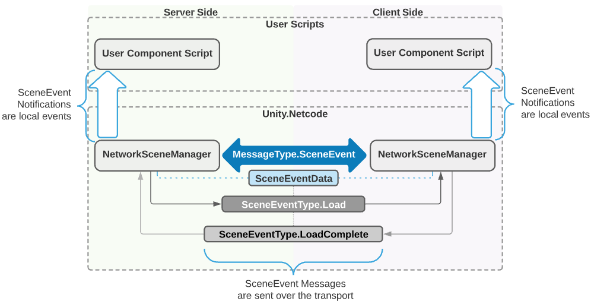
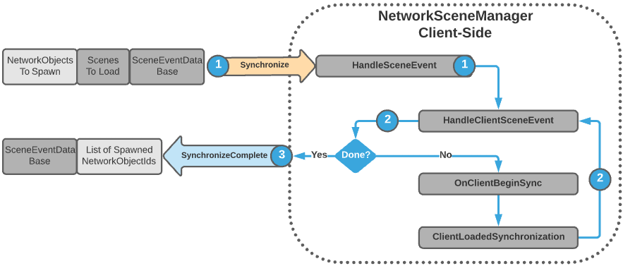

# (Feature Name Goes Here)
[feature]: #feature

- Start Date: `20201-07-01`
- RFC PR: [#0000](https://github.com/Unity-Technologies/com.unity.multiplayer.rfcs/pull/0000)
- SDK PR: [#0000](https://github.com/Unity-Technologies/com.unity.multiplayer.mlapi/pull/0000)

# Summary
[summary]: #summary

Scene loading and transitioning has been one of the problematic “hot-spots” for Unity Netcode.  This goal behind this proposal is to improve upon the [NetworkSceneManager](https://github.com/Unity-Technologies/com.unity.multiplayer.mlapi/blob/6d9d31724f93db0fdac5ad6c76f65fc549746fe6/com.unity.multiplayer.mlapi/Runtime/SceneManagement/NetworkSceneManager.cs#L21) and relative dependencies in order to make scene loading and transitioning always properly synchronize all players (including late joining players) when swapping between menus, lobbies, other Unity Netcode enabled single mode loaded scenes, and provide additive scene loading support.

# Motivation
[motivation]: #motivation
In order to improve upon the NetworkSceneManager while also providing additive scene loading capabilities, there were several areas identified that upon further improvement and/or consolidation would provide a more unified scene messaging, local notification, and synchronization process.  The following are some of the areas identified that played a part in the motivation, with providing additive scene loading being the primary over-all motivation.   

In the existing Unity Netcode source code the approval process (HandleApproval) resides within the NetworkManager class, yet the approval process handles a portion of the scene loading and synchronization process for newly joined players. In order to better unify scene loading and synchronization, this process should be decoupled from NetworkManager and re-implemented in NetworkSceneManager. 

As an example, there are two paths to accomplish the same general scene loading and synchronization process:
* [OnFirstSceneSwitchSync ](https://github.com/Unity-Technologies/com.unity.multiplayer.mlapi/blob/6d9d31724f93db0fdac5ad6c76f65fc549746fe6/com.unity.multiplayer.mlapi/Runtime/SceneManagement/NetworkSceneManager.cs#L242)and [OnSceneSwitch ](https://github.com/Unity-Technologies/com.unity.multiplayer.mlapi/blob/6d9d31724f93db0fdac5ad6c76f65fc549746fe6/com.unity.multiplayer.mlapi/Runtime/SceneManagement/NetworkSceneManager.cs#L215)effectively accomplish the same thing, are handled in different locations, and contain the exact same code with two exceptions:
    * [OnFirstSceneSwitchSync ](https://github.com/Unity-Technologies/com.unity.multiplayer.mlapi/blob/6d9d31724f93db0fdac5ad6c76f65fc549746fe6/com.unity.multiplayer.mlapi/Runtime/SceneManagement/NetworkSceneManager.cs#L242)checks to see if the client is already in the same scene and exists early.  If not it loads the scene synchronously (i.e. blocking until complete) and then notifies the client loaded the scene.
    * [OnSceneSwitch ](https://github.com/Unity-Technologies/com.unity.multiplayer.mlapi/blob/6d9d31724f93db0fdac5ad6c76f65fc549746fe6/com.unity.multiplayer.mlapi/Runtime/SceneManagement/NetworkSceneManager.cs#L215)does not check to see if the client is in the same scene, it preserves NetworkObjects that don't have DestroyWithScene set to true, and then it loads the scene asynchronously.

While this architecture worked with single mode scene loading, additive scene loading creates a new level of complexity that could become problematic to maintain a unified scene loading and synchronization process.  Consider the following diagram below:

With the existing netcode architecture NetworkObjects are always associated with the currently active scene and are serialized in no specific order nor grouped by any form of scene dependencies.  The above diagram outlines one problematic scenario where  NetworkPrefabHandler spawn generators are additively loaded in **Scene_A-1** and **Scene_B-2**.  On the server or host side, there would be no real issues as the scenes would be loaded in the appropriate order and the NetworkObjects would not need to be synchronized locally.  However, on the client side issues arise when NetworkObjects that were dependent upon either **Scene_A-1** and **Scene_B-2** are instantiated before their dependent additive scenes are loaded.   

By addressing some of the initial NetworkSceneManager dependencies and taking into consideration scenarios like the above, there were several areas identified needed to be improved or completely refactored in order to provide additive scene loading capabilities while also creating better foundation for future Unity Netcode features.

# Guide-level explanation
[guide-level-explanation]: #guide-level-explanation
In order to better consolidate the soft synchronization process, the entire “soft synchronization” methods and related properties were migrated into the NetworkSceneManager.

The entire scene loading and transitioning process is now contained within a single point of entry:  The SceneEventData class.  

### **NetworkSceneManager Modifications:**
* [SceneEvent](https://github.com/Unity-Technologies/com.unity.multiplayer.mlapi/blob/bac7f416ae29624277984c6d2d1eee07bf4afb77/com.unity.multiplayer.mlapi/Runtime/Messaging/MessageQueue/MessageQueueContainer.cs#L37): one scene management message for all scene events.
    * As opposed to having a multitude of Netcode messages, the SceneEventData class contains all scene event related message types and associated data.
* [SceneEventData class](https://github.com/Unity-Technologies/com.unity.multiplayer.mlapi/blob/feat/MTT-820-AdditiveSceneLoading/com.unity.multiplayer.mlapi/Runtime/SceneManagement/SceneEventData.cs): all SceneEvent messages contain the state of this class as serialized data.  This migrates all scene loading related serialization and deserialization to a single location which helps to simplify future updates, modifications, and readability.
    * [SceneEventData.SceneEventTypes](https://github.com/Unity-Technologies/com.unity.multiplayer.mlapi/blob/bac7f416ae29624277984c6d2d1eee07bf4afb77/com.unity.multiplayer.mlapi/Runtime/SceneManagement/SceneEventData.cs#L23) enum defines the types of scene events that can be processed.  This allows for the modification or addition of scene events without having to add new internal MLAPI message types and is used for local notifications.
* [NetworkSceneManager.HandleSceneEvent](https://github.com/Unity-Technologies/com.unity.multiplayer.mlapi/blob/bac7f416ae29624277984c6d2d1eee07bf4afb77/com.unity.multiplayer.mlapi/Runtime/SceneManagement/NetworkSceneManager.cs#L1081): provides a single entry point for processing all SceneEvent related messages.
    * SceneEventData is deserialized first when this method is invoked.
        * Deserialization can be specific to the scene event type and the scene event type dictates whether it is being processed for the client or server.
* [NetworkSceneManager.LoadScene](https://github.com/Unity-Technologies/com.unity.multiplayer.mlapi/blob/bac7f416ae29624277984c6d2d1eee07bf4afb77/com.unity.multiplayer.mlapi/Runtime/SceneManagement/NetworkSceneManager.cs#L451): This mirrors the SceneManager.LoadSceneAsync method that accepts the scene name as a string for the first parameter and a LoadSceneMode type as the second parameter.
* [NetworkSceneManager.UnLoadScene](https://github.com/Unity-Technologies/com.unity.multiplayer.mlapi/blob/bac7f416ae29624277984c6d2d1eee07bf4afb77/com.unity.multiplayer.mlapi/Runtime/SceneManagement/NetworkSceneManager.cs#L328):  This mirrors the SceneManager.UnLoadSceneAsync method that accepts the scene name as string.
* **SwitchScene**: This is no longer needed and was removed.

### **Client Approval Modifications:**
For the most part, scene loading has been decoupled from the client approval process yet it is still started from within the same NetworkManager.HandleApproval method.
* [HandleApproval](https://github.com/Unity-Technologies/com.unity.multiplayer.mlapi/blob/bac7f416ae29624277984c6d2d1eee07bf4afb77/com.unity.multiplayer.mlapi/Runtime/Core/NetworkManager.cs#L1387) (Server side):  the client is now only sent its LocalClientId and network time in the ConnectionApproved message.
    * [SynchronizeNetworkObjects](https://github.com/Unity-Technologies/com.unity.multiplayer.mlapi/blob/bac7f416ae29624277984c6d2d1eee07bf4afb77/com.unity.multiplayer.mlapi/Runtime/SceneManagement/NetworkSceneManager.cs#L734): this method is then called only if EnableSceneManagement is true.  This begins the client synchronization process (late-Joining clients are handled here as well) and is what generates a SceneEvent message of type Event_Sync.
    * [NotifyPlayerConnected:](https://github.com/Unity-Technologies/com.unity.multiplayer.mlapi/blob/bac7f416ae29624277984c6d2d1eee07bf4afb77/com.unity.multiplayer.mlapi/Runtime/Core/NetworkManager.cs#L1453) If a player NetworkObject was created then any existing clients are notified of the newly connected client.  This code was moved out of HandleApproval for easier readability and future modifications that might change when this message is sent to the existing clients.
* [HandleConnectionApproved](https://github.com/Unity-Technologies/com.unity.multiplayer.mlapi/blob/bac7f416ae29624277984c6d2d1eee07bf4afb77/com.unity.multiplayer.mlapi/Runtime/Messaging/InternalMessageHandler.cs#L59) (Client side): the approved client now only sets the NetworkManager.LocalCientId and synchronizes the network time.

### **Local Event Notifications:**
One of the original NetworkSceneManager’s weak points was the lack of event notifications exposed to the user.  This was addressed in the pre-release via a series of event notifications that focused on notifying the server that all clients had loaded a scene.  In turn, the server would then generate a network message to communicate this event to the rest of the clients. 

 This process has been improved upon by making all scene events available to both the Unity.Netcode domain and user code domain via [NetworkSceneManager.OnSceneEvent](https://github.com/Unity-Technologies/com.unity.multiplayer.mlapi/blob/bac7f416ae29624277984c6d2d1eee07bf4afb77/com.unity.multiplayer.mlapi/Runtime/SceneManagement/NetworkSceneManager.cs#L101) that provides a [SceneEvent](https://github.com/Unity-Technologies/com.unity.multiplayer.mlapi/blob/bac7f416ae29624277984c6d2d1eee07bf4afb77/com.unity.multiplayer.mlapi/Runtime/SceneManagement/NetworkSceneManager.cs#L15) class as a parameter to subscriber(s) of this event.

Also worth noting, the loading or unloading asynchronous operation is now passed along within the SceneEvent parameter and there is no longer a public facing SwitchSceneProgress. Additionally, both NetworkSceneManager.Load and NetworkSceneManager.Unload now only return a [SceneEventProgressStatus](https://github.com/Unity-Technologies/com.unity.multiplayer.mlapi/blob/bac7f416ae29624277984c6d2d1eee07bf4afb77/com.unity.multiplayer.mlapi/Runtime/SceneManagement/SceneEventProgress.cs#L23) to let users know whether the relative SceneEvent has begun or failed.

# Reference-level explanation
[reference-level-explanation]: #reference-level-explanation

### **Client Synchronization Updates:**
The SynchronizeNetworkObjects method follows a similar pattern as the previous version of the NetworkSceneManager with some additions to account for the loading of multiple scenes (i.e. additive scenes).

1. Client is approved and then receives the SCENE_EVENT type of Event_Sync.
2. [OnClientBeginSync:](https://github.com/Unity-Technologies/com.unity.multiplayer.mlapi/blob/bac7f416ae29624277984c6d2d1eee07bf4afb77/com.unity.multiplayer.mlapi/Runtime/SceneManagement/NetworkSceneManager.cs#L809) The deserialized SceneEventData class contains all of the information needed to load all scenes for the newly joined/approved client to be fully synchronized.  This method is invoked for each scene that needs to be loaded.
    * [ClientLoadedSynchronization:](https://github.com/Unity-Technologies/com.unity.multiplayer.mlapi/blob/bac7f416ae29624277984c6d2d1eee07bf4afb77/com.unity.multiplayer.mlapi/Runtime/SceneManagement/NetworkSceneManager.cs#L864) Upon the completion of a scene being asynchronously loaded, the NetworkObjects associated with the scene are instantiated (“synchronized”).
        * [SynchronizeSceneNetworkObjects](https://github.com/Unity-Technologies/com.unity.multiplayer.mlapi/blob/bac7f416ae29624277984c6d2d1eee07bf4afb77/com.unity.multiplayer.mlapi/Runtime/SceneManagement/SceneEventData.cs#L518): A method of SceneEventData that is invoked from within the ClientLoadedSynchronization method.  This  handles the instantiation and synchronization of the associated scene’s NetworkObjects.
 3. Finally, a check is done to determine if there are still more scenes to be loaded.  If so, then the synchronization process repeats until the client has loaded all scenes and instantiated or soft-synchronized all NetworkObjects.Once completed, the client responds to the server with a SCENE_EVENT type of Event_Sync_Complete which includes the NetworkObjects instantiated and synchronized for the server to determine if a re-synchronization is required.

**The Entire Client Connection Approval and Scene Synchronization Process**

Explain the proposal as if it was already included in the Unity Multiplayer and you were teaching it to another Unity developer. That generally means:

- Introducing new named concepts.
- Explaining the feature largely in terms of examples.
- Explaining how Unity developers should _think_ about the feature, and how it should impact the way they develop multiplayer projects in Unity. It should explain the impact as concretely as possible.
- If applicable, provide sample error messages, deprecation warnings, or migration guidance.
- If applicable, describe the differences between teaching this to existing Unity developers and new Unity developers.

For implementation-oriented RFCs (e.g. for framework internals), this section should focus on how Unity Multiplayer contributors should think about the change, and give examples of its concrete impact. For policy RFCs, this section should provide an example-driven introduction to the policy, and explain its impact in concrete terms.

This is the technical portion of the RFC. Explain the design in sufficient detail that:

- Its interaction with other features is clear.
- It is reasonably clear how the feature would be implemented.
- Corner cases are dissected by example.

The section should return to the examples given in the previous section, and explain more fully how the detailed proposal makes those examples work.

# Drawbacks
[drawbacks]: #drawbacks

Why should we _not_ do this?

# Rationale and alternatives
[rationale-and-alternatives]: #rationale-and-alternatives

- Why is this design the best in the space of possible designs?
- What other designs have been considered and what is the rationale for not choosing them?
- What is the impact of not doing this?

# Prior art
[prior-art]: #prior-art

Discuss prior art, both the good and the bad, in relation to this proposal. A few examples of what this can include are:

- For framework, tools, and library proposals: Does this feature exist in other networking stacks and what experience have their community had?
- For community proposals: Is this done by some other community and what were their experiences with it?
- For other teams: What lessons can we learn from what other communities have done here?
- Papers: Are there any published papers or great posts that discuss this? If you have some relevant papers to refer to, this can serve as a more detailed theoretical background.

This section is intended to encourage you as an author to think about the lessons from other projects, provide readers of your RFC with a fuller picture. If there is no prior art, that is fine - your ideas are interesting to us whether they are brand new or if it is an adaptation from other projects.

Note that while precedent set by other projects is some motivation, it does not on its own motivate an RFC. Please also take into consideration that Unity Multiplayer sometimes intentionally diverges from common multiplayer networking features.

# Unresolved questions
[unresolved-questions]: #unresolved-questions

- What parts of the design do you expect to resolve through the RFC process before this gets merged?
- What parts of the design do you expect to resolve through the implementation of this feature before stabilization?
- What related issues do you consider out of scope for this RFC that could be addressed in the future independently of the solution that comes out of this RFC?

# Future possibilities
[future-possibilities]: #future-possibilities

Think about what the natural extension and evolution of your proposal would be and how it would affect the Unity Multiplayer as a whole in a holistic way. Try to use this section as a tool to more fully consider all possible interactions with the Unity Multiplayer in your proposal. Also consider how the this all fits into the roadmap for the project and the team.

This is also a good place to "dump ideas", if they are out of scope for the RFC you are writing but otherwise related.

If you have tried and cannot think of any future possibilities, you may simply state that you cannot think of anything.

Note that having something written down in the future-possibilities section is not a reason to accept the current or a future RFC; such notes should be in the section on motivation or rationale in this or subsequent RFCs. The section merely provides additional information.
