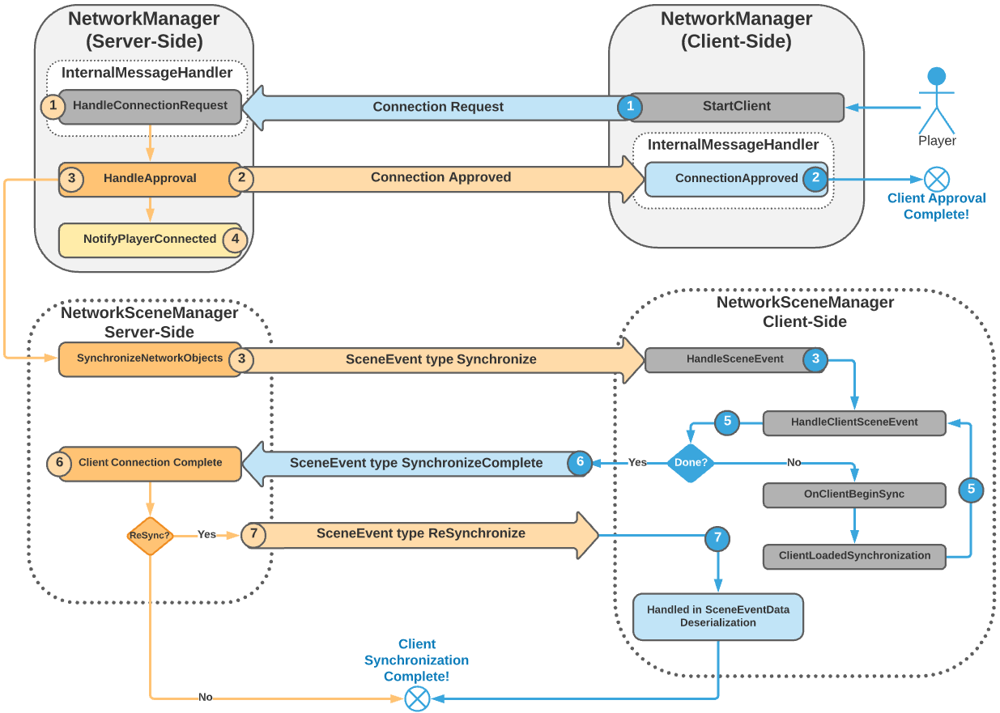
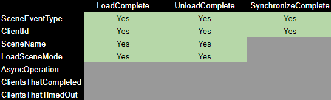

# NetworkSceneManager Robustness and Additive Scene Loading
[feature]: #feature

- Start Date: `2021-07-01`
- RFC PR: [#31](https://github.com/Unity-Technologies/com.unity.multiplayer.rfcs/pull/31)
- SDK PR: [#955](https://github.com/Unity-Technologies/com.unity.multiplayer.mlapi/pull/955)

# Summary
[summary]: #summary

Scene loading and transitioning has been one of the problematic “hot-spots” for Unity Netcode.  This goal behind this proposal is to improve upon the [NetworkSceneManager](https://github.com/Unity-Technologies/com.unity.multiplayer.mlapi/blob/6d9d31724f93db0fdac5ad6c76f65fc549746fe6/com.unity.multiplayer.mlapi/Runtime/SceneManagement/NetworkSceneManager.cs#L21) and relative dependencies in order to make scene loading and transitioning always properly synchronize all players (including late joining players) when swapping between menus, lobbies, other Unity Netcode enabled single mode loaded scenes, and provide additive scene loading support.

# Motivation
[motivation]: #motivation
Additive scene workflows have become commonplace in Unity projects, yet Netcode for GameObjects does not have any support for it and users only option today is to completely disable scene management in the SDK. Additionally, scene management is currently distributed across several areas of the codebase which causes significant challenges for maintenance and modification of the feature area.
The proposed solution would allow synchronization not just of scene loads, but their load type (single or additive), and also tracks all in-scene placed NetworkObjects’ association with their corresponding scenes so they can be properly synchronized with their server assigned NetworkObjectId. 

The updated NetworkSceneManager provides consistent client scene synchronization, more detailed scene event notifications, and new additive scene loading capabilities.


# Guide-level explanation
[guide-level-explanation]: #guide-level-explanation


### **NetworkSceneManager Modifications/Changes:**
* [SceneEvent](https://github.com/Unity-Technologies/com.unity.multiplayer.mlapi/blob/bac7f416ae29624277984c6d2d1eee07bf4afb77/com.unity.multiplayer.mlapi/Runtime/Messaging/MessageQueue/MessageQueueContainer.cs#L37): As opposed to having a multitude of Netcode messages, the SceneEventData class contains all scene event related message types and scene event specific data.
* [SceneEventData class](https://github.com/Unity-Technologies/com.unity.multiplayer.mlapi/blob/feat/MTT-820-AdditiveSceneLoading/com.unity.multiplayer.mlapi/Runtime/SceneManagement/SceneEventData.cs): All SceneEvent messages contain the state of this class as serialized data.  This migrates all scene loading related serialization and de-serialization into a single location which helps to simplify future updates, modifications, and readability.
* [NetworkSceneManager.HandleSceneEvent](https://github.com/Unity-Technologies/com.unity.multiplayer.mlapi/blob/bac7f416ae29624277984c6d2d1eee07bf4afb77/com.unity.multiplayer.mlapi/Runtime/SceneManagement/NetworkSceneManager.cs#L1081): This provides a single entry point for processing all SceneEvent related messages.
* [NetworkSceneManager.LoadScene](https://github.com/Unity-Technologies/com.unity.multiplayer.mlapi/blob/bac7f416ae29624277984c6d2d1eee07bf4afb77/com.unity.multiplayer.mlapi/Runtime/SceneManagement/NetworkSceneManager.cs#L451): This mirrors the SceneManager.LoadSceneAsync method that accepts the scene name as a string for the first parameter and a LoadSceneMode type as the second parameter.
* [NetworkSceneManager.UnLoadScene](https://github.com/Unity-Technologies/com.unity.multiplayer.mlapi/blob/bac7f416ae29624277984c6d2d1eee07bf4afb77/com.unity.multiplayer.mlapi/Runtime/SceneManagement/NetworkSceneManager.cs#L328):  This mirrors the SceneManager.UnLoadSceneAsync method that accepts the scene name as string.
* **SwitchScene**: This is no longer needed and was removed.

### **Client Approval Modifications/Changes:**
For the most part, scene loading has been decoupled from the client approval process yet it is still started from within the same NetworkManager.HandleApproval method.
* [HandleApproval](https://github.com/Unity-Technologies/com.unity.multiplayer.mlapi/blob/bac7f416ae29624277984c6d2d1eee07bf4afb77/com.unity.multiplayer.mlapi/Runtime/Core/NetworkManager.cs#L1387) (Server side):  the client is now only sent its LocalClientId and network time in the ConnectionApproved message.
    * [SynchronizeNetworkObjects](https://github.com/Unity-Technologies/com.unity.multiplayer.mlapi/blob/bac7f416ae29624277984c6d2d1eee07bf4afb77/com.unity.multiplayer.mlapi/Runtime/SceneManagement/NetworkSceneManager.cs#L734): This method is then called only if EnableSceneManagement is true.

### **New Local Event Notifications:**


 The local event notification process has been improved upon by making all scene events available to both the Unity.Netcode domain and user code domain via [NetworkSceneManager.OnSceneEvent](https://github.com/Unity-Technologies/com.unity.multiplayer.mlapi/blob/bac7f416ae29624277984c6d2d1eee07bf4afb77/com.unity.multiplayer.mlapi/Runtime/SceneManagement/NetworkSceneManager.cs#L101) that provides a [SceneEvent](https://github.com/Unity-Technologies/com.unity.multiplayer.mlapi/blob/bac7f416ae29624277984c6d2d1eee07bf4afb77/com.unity.multiplayer.mlapi/Runtime/SceneManagement/NetworkSceneManager.cs#L15) class as a parameter to subscriber(s) of this event.

### **The Entire Client Connection Approval and Scene Synchronization Process**
The approval process no longer includes the scene synchronization data and will be processed as a completely separate message.  If EnableSceneManagement is true, the SynchronizeNetworkObjects method is invoked which generates the Synchronize SceneEvent message.  The client processes all serialized data (i.e. scenes and NetworkObjects) in the Synchronize message, and upon finishing informs the server that is is done (SynchronizeComplete).


In the event that the server determines the client being synchronized missed one or more DestroyObject message(s), the server will send a final ReSynchronize message that contains the NetworkObjectIds of the NetworkObjects that no longer exist.  Upon receiving the ReSynchronize message, the client will remove the NetworkObjects in question and clean up the local SpawnManager's SpawnObjects lists.
*This is a placed holder feature until the snapshot system handles the DestroyObject message*.

# Reference-level explanation
[reference-level-explanation]: #reference-level-explanation

### **Client Synchronization Updates:**
The SynchronizeNetworkObjects method follows a similar pattern as the previous version of the NetworkSceneManager with some additions to account for the loading of multiple scenes (i.e. additive scenes).


1. Client is approved and then receives the SceneEvent type of Synchronize.
2. [OnClientBeginSync:](https://github.com/Unity-Technologies/com.unity.multiplayer.mlapi/blob/bac7f416ae29624277984c6d2d1eee07bf4afb77/com.unity.multiplayer.mlapi/Runtime/SceneManagement/NetworkSceneManager.cs#L809) The deserialized SceneEventData class contains all of the information needed to load all scenes for the newly joined/approved client to be fully synchronized.  This method is invoked for each scene that needs to be loaded.
    * [ClientLoadedSynchronization:](https://github.com/Unity-Technologies/com.unity.multiplayer.mlapi/blob/bac7f416ae29624277984c6d2d1eee07bf4afb77/com.unity.multiplayer.mlapi/Runtime/SceneManagement/NetworkSceneManager.cs#L864) 
      * Once a scene has finished loading, it checks for any remaining scenes to be loaded and will repeat step 2 until the are no more scenes to load.
    * Upon the completion of all scenes being loaded, all NetworkObjects are locally instantiated and/or spawned.
      * [SynchronizeSceneNetworkObjects](https://github.com/Unity-Technologies/com.unity.multiplayer.mlapi/blob/bac7f416ae29624277984c6d2d1eee07bf4afb77/com.unity.multiplayer.mlapi/Runtime/SceneManagement/SceneEventData.cs#L518):  A method of SceneEventData that is invoked after all scenes have been loaded.
 3. Once completed, the client responds to the server with a SceneEvent type of SynchronizeComplete which includes the NetworkObjects instantiated and synchronized for the server to determine if a re-synchronization is required.

### **The Client Scene Synchronization Process**
Consider a scenario with NetworkObjects being dependent upon an additively loaded scene (diagram below) with a spawn generator that registers an INetworkPrefabInstanceHandler implementation.  While the server is creating the Synchronize SceneEvent, NetworkObjects with NetworkPrefabHandler dependencies are sorted towards the end of the spawned NetworkObjects list before they are serialized.  This assures, during the deserialization process,  the spawn generators will be instantiated first to assure any INetworkPrefabInstanceHandler implementations are registered with the NetworkPrefabHandler before the dependent NetworkObjects are spawned on the client side.    


### **Local Event Notifications:**
Additional consideration was put towards providing the user with a plethora of options when it comes to scene event notifications.  Part of this consideration includes the additional level of detail provided to the user through the SceneEvent class's properties:


Also worth noting, the loading or unloading asynchronous operation is now passed along within the SceneEvent parameter and there is no longer a public facing SwitchSceneProgress. Additionally, both NetworkSceneManager.Load and NetworkSceneManager.Unload now only return a [SceneEventProgressStatus](https://github.com/Unity-Technologies/com.unity.multiplayer.mlapi/blob/bac7f416ae29624277984c6d2d1eee07bf4afb77/com.unity.multiplayer.mlapi/Runtime/SceneManagement/SceneEventProgress.cs#L23) to let users know whether the relative SceneEvent has started or failed to start.  The rest of the related SceneEvent messages are delivered via NetworkSceneManager.OnSceneEvent.  

The SceneEvent class provides various properties specific to the notification type.  The following chart shows all server to client event types and which properties are set:


The next chart shows all client to server event types and the properties that are set:



Both the server (or host) and clients will receive event notifications for every scene event that occurs, and if we review back over both the client to server and server to client scene event types, we can see that every notification includes a client identifier (ClientId).  However, while the client identifier is set for every scene event type the value should be considered “relative” to the invoker and the receiver of the scene event type.

**As an example:**
* The server begins a Load scene event and sends this message to the clients
    * The local server SceneEvent notification will contain the server’s client identifier
    * The server completes the event and generates a local LoadComplete notification that contains the server’s client identifier
* The  client(s) receive the Load scene event and begin processing it.
    * The local Load scene event will contain the server’s client identifier
* The client(s) finish and respond with a LoadComplete message to the server
    * The local client SceneEvent notification will contain the client’s identifier
* The server receives the client(s) LoadComplete message
    * The server generates a local LoadComplete notification with ClientId set to the sending client’s identifier.
    
Clients will generate local notifications that use the server’s client identifier (ClientId) value when Server to Client messages are received while the server will generate all local notifications relative to the invoker/sender of the message.  This assures the server side user code will always be aware of all local and client generated scene event messages while clients will only be aware of locally generated and server generated scene event messages.

**When has everyone processed a SceneEvent message?**  
There are two special scene event types that generate messages for the server and all connected clients:  
***LoadEventCompleted and UnloadEventCompleted*** 

Both of these server generated messages will create local notification events (on all clients and the server) that will contain the list of all client identifiers (ClientsThatCompleted) that have finished loading or unloading a scene.  This can be useful to make sure all clients are synchronized with each other before allowing any netcode related game logic to begin.  If a client disconnects or there is a time out, then any client that did not load or unload the scene will be included in a second list of client identifiers (ClientsThatTimedOut).

### **Tracking Event Notifications:**
The following pseudo code provides an example usage of NetworkSceneManager.OnSceneEvent with additional comments about each scene event type.

```C#
public override void OnNetworkSpawn()
{
    NetworkManager.SceneManager.OnSceneEvent += SceneManager_OnSceneEvent;
}

public override void OnNetworkDespawn()
{
   NetworkManager.SceneManager.OnSceneEvent -= SceneManager_OnSceneEvent;
}

private void SceneManager_OnSceneEvent(SceneEvent sceneEvent)
{
    // Both Client and Server Receive these notifications
    switch (sceneEvent.SceneEventType)
    {
        // Handle Server to Client Load Notifications
        case SceneEventType.Load:
            {
                // Server and Client will provide the associated AsyncOperation in the event you need to track this
                // AsyncOperation.progress can be used to determine scene loading progress
                break;
            }
        // Handle Server to Client UnLoad Notifications
        case SceneEventType.Unload:
            {
                break;
            }
        // Handle Client to Server Load Complete Notification(s)
        case SceneEventType.LoadComplete:
            {
                // This will let you know when a load is completed

                // Server Side: receives this notification for both itself and all clients
                // Client Side: receives this notification for itself

                // So you can use sceneEvent.ClientId to also track when clients are finished loading a scene
                break;
            }
        // Handle Client to Server Unload Complete Notification(s)
        case SceneEventType.UnloadComplete:
            {
                // This will let you know when an unload is completed

                // Server Side: receives this notification for both itself and all clients
                // Client Side: receives this notification for itself

                // So you can use sceneEvent.ClientId to also track when clients are finished unloading a scene
                break;
            }
        // Handle Server to Client Load Complete (all clients finished loading notification)
        case SceneEventType.LoadEventCompleted:
            {
                // This will let you know when all clients have finished loading a scene
                // Received on both server and clients
                foreach (var clientId in sceneEvent.ClientsThatCompleted)
                {
                    // Example of parsing through the clients that completed list
                }

                break;
            }
        // Handle Server to Client unload Complete (all clients finished unloading notification)
        case SceneEventType.UnloadEventCompleted:
            {
                // This will let you know when all clients have finished unloading a scene
                // Received on both server and clients
                foreach (var clientId in sceneEvent.ClientsThatCompleted)
                {
                    // Example of parsing through the clients that completed list
                }

                break;
            }
    }
}
```
Scene event notifications provide users with all NetworkSceneManager related scene events (and associated data) through a single event handler.  The one exception would be scene loading or unloading progress which users can handle with a coroutine (upon receiving a Load or Unload event) and checking the AsyncOperation.progress value over time.  The user can then stop the progress checking coroutine upon receiving any of the following event notifications for the scene and event type in question: LoadComplete, UnloadComplete, LoadEventCompleted, and UnloadEventCompleted.


### **Unit Tests:**
Unit tests have some additional requirements and suggested design principles to follow:
* Any NetworkObject created programmatically will need to register as a Network Prefab if it is a MultiInstance unit test
  * You can do this using MultiInstanceHelpers.MakeNetworkedObjectTestPrefab 
* If you are going to be using NetworkSceneManager in a MultiInstance test, you must set NetworkSceneManager.IsTesting to true.
  * You need to unset this upon finishing your unit test.
  


# Drawbacks
[drawbacks]: #drawbacks

So far, the only drawback to this approach is that it is still purely an event driven process and not state driven (which could be the next evolution for this version of scene management).  Since only one scene event can occur at a time, users cannot specify a set of levels to be loaded as a group.  This means that user level code must drive the scene loading process when a series of levels need to be loaded for a full scene transition.  This implementation also considers any scene being loaded as a single loading mode scene as being the currently active scene and does not allow for the synchronization of changing the currently active scene.

# Rationale and alternatives
[rationale-and-alternatives]: #rationale-and-alternatives

As stated in the drawbacks, this was a first pass scene management improvement sweep that included additive scene loading integration.  This implementation could be further improved upon in the following ways:
- Allowing for synchronized changing of the currently active scene.
- Providing a way to specify a group of scenes in one scene event message
- This could be further improved by deriving NetworkSceneManager from SceneManagerAPI in order to make the entire process transparent to the user.

# Unresolved questions
[unresolved-questions]: #unresolved-questions

Questions are welcome.  For the most part the only real question I have is whether we want to spend more time thinking about scene asset dependencies and potentially better ways to solve for future complications when it comes to instantiating and spawning NetworkObjects before their dependencies are loaded, instantiated, and considered spawned.

# Future possibilities
[future-possibilities]: #future-possibilities

A MS-1 near future update to this implementation will be the removal of scene registration and to just use the scenes in the build list as the scene registration.

Deriving from SceneManagerAPi could help improve upon the entire API by removing the need to use NetworkSceneManager.Load and NetworkSceneManager.Unload.  This would allow users to simply use the traditional SceneManager as they normally would for single player games.
