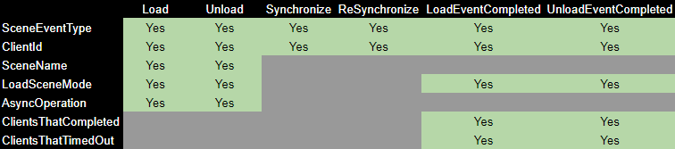

# NetworkSceneManger Refactoring and Additive Scene Loading
[feature]: #feature

- Start Date: `2021-07-01`
- RFC PR: [#0000](https://github.com/Unity-Technologies/com.unity.multiplayer.rfcs/pull/0000)
- SDK PR: [#0000](https://github.com/Unity-Technologies/com.unity.multiplayer.mlapi/pull/0000)

# Summary
[summary]: #summary

Scene loading and transitioning has been one of the problematic “hot-spots” for Unity Netcode.  This goal behind this proposal is to improve upon the [NetworkSceneManager](https://github.com/Unity-Technologies/com.unity.multiplayer.mlapi/blob/6d9d31724f93db0fdac5ad6c76f65fc549746fe6/com.unity.multiplayer.mlapi/Runtime/SceneManagement/NetworkSceneManager.cs#L21) and relative dependencies in order to make scene loading and transitioning always properly synchronize all players (including late joining players) when swapping between menus, lobbies, other Unity Netcode enabled single mode loaded scenes, and provide additive scene loading support.

# Motivation
[motivation]: #motivation
In order to improve upon the NetworkSceneManager while also providing additive scene loading capabilities, there were several areas identified that upon further improvement and/or consolidation would provide a more unified scene messaging, local notification, and synchronization process.  The following are some of the areas identified that played a part in the motivation, with providing additive scene loading being the primary over-all motivation.   

In the existing Unity Netcode source code the approval process (HandleApproval) resides within the NetworkManager class, yet the approval process handles a portion of the scene loading and synchronization process for newly joined players. In order to better unify scene loading and synchronization, this process should be decoupled from NetworkManager and re-implemented in NetworkSceneManager. 


As an example, there are two paths to accomplish the same general scene loading and synchronization process:
* [OnFirstSceneSwitchSync ](https://github.com/Unity-Technologies/com.unity.multiplayer.mlapi/blob/6d9d31724f93db0fdac5ad6c76f65fc549746fe6/com.unity.multiplayer.mlapi/Runtime/SceneManagement/NetworkSceneManager.cs#L242)and [OnSceneSwitch ](https://github.com/Unity-Technologies/com.unity.multiplayer.mlapi/blob/6d9d31724f93db0fdac5ad6c76f65fc549746fe6/com.unity.multiplayer.mlapi/Runtime/SceneManagement/NetworkSceneManager.cs#L215)effectively accomplish the same thing, are handled in different locations, and contain the exact same code with two exceptions:
    * [OnFirstSceneSwitchSync ](https://github.com/Unity-Technologies/com.unity.multiplayer.mlapi/blob/6d9d31724f93db0fdac5ad6c76f65fc549746fe6/com.unity.multiplayer.mlapi/Runtime/SceneManagement/NetworkSceneManager.cs#L242)checks to see if the client is already in the same scene and exists early.  If not it loads the scene synchronously (i.e. blocking until complete) and then notifies the client loaded the scene.
    * [OnSceneSwitch ](https://github.com/Unity-Technologies/com.unity.multiplayer.mlapi/blob/6d9d31724f93db0fdac5ad6c76f65fc549746fe6/com.unity.multiplayer.mlapi/Runtime/SceneManagement/NetworkSceneManager.cs#L215)does not check to see if the client is in the same scene, it preserves NetworkObjects that don't have DestroyWithScene set to true, and then it loads the scene asynchronously.

While this architecture worked with single mode scene loading, additive scene loading creates a new level of complexity that could become problematic to maintain a unified scene loading and synchronization process.  Consider the following diagram below:


With the existing netcode architecture NetworkObjects are always associated with the currently active scene and are serialized in no specific order nor grouped by any form of scene dependencies.  The above diagram outlines one problematic scenario where  NetworkPrefabHandler spawn generators are additively loaded in **Scene_A-1** and **Scene_B-2**.  On the server or host side, there would be no real issues as the scenes would be loaded in the appropriate order and the NetworkObjects would not need to be synchronized locally.  However, on the client side issues arise when NetworkObjects that were dependent upon either **Scene_A-1** or **Scene_B-2** are instantiated before their dependent additive scenes are loaded.   

By addressing some of the initial NetworkSceneManager dependencies and taking into consideration scenarios like the above, there were several areas identified as needing improvement or being completely refactored in order to provide additive scene loading capabilities, a better foundation for future Unity Netcode features, and improving the user experience with Netcode scene management.


# Guide-level explanation
[guide-level-explanation]: #guide-level-explanation
In order to better consolidate the soft synchronization process, all “soft synchronization” methods and related properties were migrated into the NetworkSceneManager.


The entire scene loading, transitioning, serialization, and de-serialization process has been greatly simplified down to a single SceneEvent message type that always carries serialized data generated by the SceneEventData class.


### **NetworkSceneManager Modifications/Changes:**
* [SceneEvent](https://github.com/Unity-Technologies/com.unity.multiplayer.mlapi/blob/bac7f416ae29624277984c6d2d1eee07bf4afb77/com.unity.multiplayer.mlapi/Runtime/Messaging/MessageQueue/MessageQueueContainer.cs#L37): one scene management message for all scene events.
    * As opposed to having a multitude of Netcode messages, the SceneEventData class contains all scene event related message types and scene event specific data.
* [SceneEventData class](https://github.com/Unity-Technologies/com.unity.multiplayer.mlapi/blob/feat/MTT-820-AdditiveSceneLoading/com.unity.multiplayer.mlapi/Runtime/SceneManagement/SceneEventData.cs): all SceneEvent messages contain the state of this class as serialized data.  This migrates all scene loading related serialization and de-serialization into a single location which helps to simplify future updates, modifications, and readability.
    * [SceneEventData.SceneEventTypes](https://github.com/Unity-Technologies/com.unity.multiplayer.mlapi/blob/bac7f416ae29624277984c6d2d1eee07bf4afb77/com.unity.multiplayer.mlapi/Runtime/SceneManagement/SceneEventData.cs#L23) enum defines the types of scene events that can be processed.  This allows for the modification or addition of scene events without having to add new internal Netcode message types and is used for local notifications as well.
* [NetworkSceneManager.HandleSceneEvent](https://github.com/Unity-Technologies/com.unity.multiplayer.mlapi/blob/bac7f416ae29624277984c6d2d1eee07bf4afb77/com.unity.multiplayer.mlapi/Runtime/SceneManagement/NetworkSceneManager.cs#L1081): provides a single entry point for processing all SceneEvent related messages.
    * SceneEventData is deserialized first when this method is invoked.
        * De-serialization can be specific to the scene event type and the scene event type dictates whether it is being processed for the client or server.
* [NetworkSceneManager.LoadScene](https://github.com/Unity-Technologies/com.unity.multiplayer.mlapi/blob/bac7f416ae29624277984c6d2d1eee07bf4afb77/com.unity.multiplayer.mlapi/Runtime/SceneManagement/NetworkSceneManager.cs#L451): This mirrors the SceneManager.LoadSceneAsync method that accepts the scene name as a string for the first parameter and a LoadSceneMode type as the second parameter.
* [NetworkSceneManager.UnLoadScene](https://github.com/Unity-Technologies/com.unity.multiplayer.mlapi/blob/bac7f416ae29624277984c6d2d1eee07bf4afb77/com.unity.multiplayer.mlapi/Runtime/SceneManagement/NetworkSceneManager.cs#L328):  This mirrors the SceneManager.UnLoadSceneAsync method that accepts the scene name as string.
* **SwitchScene**: This is no longer needed and was removed.

### **Client Approval Modifications/Changes:**
For the most part, scene loading has been decoupled from the client approval process yet it is still started from within the same NetworkManager.HandleApproval method.
* [HandleApproval](https://github.com/Unity-Technologies/com.unity.multiplayer.mlapi/blob/bac7f416ae29624277984c6d2d1eee07bf4afb77/com.unity.multiplayer.mlapi/Runtime/Core/NetworkManager.cs#L1387) (Server side):  the client is now only sent its LocalClientId and network time in the ConnectionApproved message.
    * [SynchronizeNetworkObjects](https://github.com/Unity-Technologies/com.unity.multiplayer.mlapi/blob/bac7f416ae29624277984c6d2d1eee07bf4afb77/com.unity.multiplayer.mlapi/Runtime/SceneManagement/NetworkSceneManager.cs#L734): this method is then called only if EnableSceneManagement is true.  This begins the client synchronization process and generates a SceneEvent message of type S2C_Sync SceneEvent that is sent to the newly connected client.
    * [NotifyPlayerConnected:](https://github.com/Unity-Technologies/com.unity.multiplayer.mlapi/blob/bac7f416ae29624277984c6d2d1eee07bf4afb77/com.unity.multiplayer.mlapi/Runtime/Core/NetworkManager.cs#L1453) If a player NetworkObject was created then any existing clients are notified of the newly connected client.  This code was moved out of HandleApproval for easier readability and future modifications that might change when this message is sent to any already approved and connected clients.
* [HandleConnectionApproved](https://github.com/Unity-Technologies/com.unity.multiplayer.mlapi/blob/bac7f416ae29624277984c6d2d1eee07bf4afb77/com.unity.multiplayer.mlapi/Runtime/Messaging/InternalMessageHandler.cs#L59) (Client side): the approved client now only sets the NetworkManager.LocalCientId and synchronizes the network time.

### **New Local Event Notifications:**
*One of the original NetworkSceneManager’s weak points was the lack of event notifications exposed to the user.  This was partially addressed in the pre-release version of Unity Netcode via a series of event notifications that focused on notifying the server that all clients had loaded a scene.  In turn, the server would then generate a network message to communicate this event to the rest of the clients.*


 The local event notification process has been improved upon by making all scene events available to both the Unity.Netcode domain and user code domain via [NetworkSceneManager.OnSceneEvent](https://github.com/Unity-Technologies/com.unity.multiplayer.mlapi/blob/bac7f416ae29624277984c6d2d1eee07bf4afb77/com.unity.multiplayer.mlapi/Runtime/SceneManagement/NetworkSceneManager.cs#L101) that provides a [SceneEvent](https://github.com/Unity-Technologies/com.unity.multiplayer.mlapi/blob/bac7f416ae29624277984c6d2d1eee07bf4afb77/com.unity.multiplayer.mlapi/Runtime/SceneManagement/NetworkSceneManager.cs#L15) class as a parameter to subscriber(s) of this event.


### **Client Synchronization Updates:**
The SynchronizeNetworkObjects method follows a similar pattern as the previous version of the NetworkSceneManager with some additions to account for the loading of multiple scenes (i.e. additive scenes).


1. Client is approved and then receives the SceneEvent type of S2C_Sync.
2. [OnClientBeginSync:](https://github.com/Unity-Technologies/com.unity.multiplayer.mlapi/blob/bac7f416ae29624277984c6d2d1eee07bf4afb77/com.unity.multiplayer.mlapi/Runtime/SceneManagement/NetworkSceneManager.cs#L809) The deserialized SceneEventData class contains all of the information needed to load all scenes for the newly joined/approved client to be fully synchronized.  This method is invoked for each scene that needs to be loaded.
    * [ClientLoadedSynchronization:](https://github.com/Unity-Technologies/com.unity.multiplayer.mlapi/blob/bac7f416ae29624277984c6d2d1eee07bf4afb77/com.unity.multiplayer.mlapi/Runtime/SceneManagement/NetworkSceneManager.cs#L864) Upon the completion of a scene being asynchronously loaded, the NetworkObjects associated with the scene are instantiated (“synchronized”).
        * [SynchronizeSceneNetworkObjects](https://github.com/Unity-Technologies/com.unity.multiplayer.mlapi/blob/bac7f416ae29624277984c6d2d1eee07bf4afb77/com.unity.multiplayer.mlapi/Runtime/SceneManagement/SceneEventData.cs#L518): A method of SceneEventData that is invoked from within the ClientLoadedSynchronization method.  This  handles the instantiation and synchronization of the associated scene’s NetworkObjects.
 3. Finally, a check is done to determine if there are still more scenes to be loaded.  If so, then the synchronization process repeats until the client has loaded all scenes and instantiated or soft-synchronized all NetworkObjects.  Once completed, the client responds to the server with a SceneEvent type of S2C_SyncComplete which includes the NetworkObjects instantiated and synchronized for the server to determine if a re-synchronization is required.

### **The Entire Client Connection Approval and Scene Synchronization Process**
We can see that the approval process does not include the scene synchronization data and will be processed as a completely separate message.  Then if EnableSceneManagement is true, the SynchronizeNetworkObjects method is invoked which generates the S2C_Sync SceneEvent message.  The client processes all serialized data (i.e. scenes and NetworkObjects) in the S2C_Sync message, and upon finishing informs the server that is is done (C2S_SyncComplete).


In the event that the server determines the client being synchronized missed a DestroyObject message, the server will send a final S2C_ReSync message that contains the NetworkObjectIds of the NetworkObjects that no longer exist.  Upon receiving the S2C_ReSync message, the client will remove the NetworkObjects in question and clean up the local SpawnManager's SpawnObjects lists.
*This is a placed holder feature until the snapshot system handles the DestroyObject message*.

# Reference-level explanation
[reference-level-explanation]: #reference-level-explanation

### **The Client Scene Synchronization Process**
With the above modifications, we can now consider the same problematic scenario with NetworkObjects that are dependent upon an additively loaded scene (diagram below).  While the server is creating the S2C_Sync SceneEvent, NetworkObjects are first grouped by their associated scene and then ordered such that NetworkObjects with dependencies will be sorted towards the end of the scene group specific serialized data.  This assures the spawn generators (i.e NetworkPrefabHandler)  will be instantiated before the dependent NetworkObjects.  


In order to set a scene dependency for a NetworkObject that has a dependency in a different scene (in this case the spawn generator), the user is only required to set the scene as a dependency for the dependent NetworkObject as such:
```c#
    var networkObject = obj.GetComponent<NetworkObject>();
    networkObject.SetSceneAsDependency(sceneName);  // sceneName is the scene that contains an asset the NetworkObject depends upon
```
Setting each pooled NetworkObject's scene dependency lets the NetworkSceneManager know about the dependency so it can take it into account when handling player scene and NetworkObject synchronization.  


### **Local Event Notifications:**
Additional consideration was put towards providing the user with a plethora of options when it comes to scene event notifications.  Part of this consideration includes the additional level of detail provided to the user through the SceneEvent class's properties:


Also worth noting, the loading or unloading asynchronous operation is now passed along within the SceneEvent parameter and there is no longer a public facing SwitchSceneProgress. Additionally, both NetworkSceneManager.Load and NetworkSceneManager.Unload now only return a [SceneEventProgressStatus](https://github.com/Unity-Technologies/com.unity.multiplayer.mlapi/blob/bac7f416ae29624277984c6d2d1eee07bf4afb77/com.unity.multiplayer.mlapi/Runtime/SceneManagement/SceneEventProgress.cs#L23) to let users know whether the relative SceneEvent has started or failed to start.  The rest of the related SceneEvent messages are delivered via NetworkSceneManager.OnSceneEvent.  

The SceneEvent class provides various properties specific to the notification type.  The following chart shows all server to client (S2C) event types and which properties are set:



The next chart shows all client to server (C2S) event types and the properties that are set:


Both the server (or host) and clients will receive event notifications for every scene event that occurs, and if we review back over both the client to server and server to client scene event types, we can see that every notification includes a client identifier (ClientId).  However, while the client identifier is set for every scene event type the value should be considered “relative” to the invoker and the receiver of the scene event type.

**As an example:**
* The server begins a S2C_Load scene event and sends this message to the clients
    * The local server SceneEvent notification will contain the server’s client identifier
    * The server completes the event and generates a local C2S_LoadComplete notification that contains the server’s client identifier
* The  client(s) receive the S2C_Load scene event and begin processing it.
    * The local S2C_Load scene event will contain the server’s client identifier
* The client(s) finish and respond with a C2S_LoadComplete message to the server
    * The local client SceneEvent notification will contain the client’s identifier
* The server receives the client(s) C2S_LoadComplete message
    * The server generates a local C2S_LoadComplete notification with ClientId set to the sending client’s identifier.
    
Clients will generate local notifications that use the server’s client identifier (ClientId) value when Server to Client (S2C) messages are received while the server will generate all local notifications relative to the invoker/sender of the message.  This assures the server side user code will always be aware of all local and client generated scene event messages while clients will only be aware of locally generated and server generated scene event messages.

**When has everyone processed a SceneEvent message?**  
There are two special scene event types that generate messages for the server and all connected clients:  ***S2C_LoadComplete and S2C_UnloadComplete*** 

Both of these server generated messages will create local notification events (on all clients and the server) that will contain the list of all client identifiers (ClientsThatCompleted) that have finished loading or unloading a scene.  This can be useful to make sure all clients are synchronized with each other before allowing any netcode related game logic to begin.  If a client disconnects or there is a time out, then any client that did not load or unload the scene will be included in a second list of client identifiers (ClientsThatTimedOut).

### **Tracking Event Notifications:**
The following pseudo code provides an example usage of NetworkSceneManager.OnSceneEvent with additional comments about each scene event type.

```C#
private void Start()
{
    NetworkManager.SceneManager.OnSceneEvent += SceneManager_OnSceneEvent;
}

private void SceneManager_OnSceneEvent(SceneEvent sceneEvent)
{
    // Both Client and Server Receive these notifications
    switch (sceneEvent.SceneEventType)
    {
        // Handle Server to Client Load Notifications
        case SceneEventData.SceneEventTypes.S2C_Load:
            {
                // Server and Client will provide the associated AsyncOperation in the event you need to track this
                // Note: C2S_LoadComplete notifies you of this condition as well
                sceneEvent.AsyncOperation.completed += AsyncOperation_LoadCompleted;
                // AsyncOperation.progress can be used to determine scene loading progress
                break;
            }
        // Handle Server to Client UnLoad Notifications
        case SceneEventData.SceneEventTypes.S2C_Unload:
            {
                // Server and Client will provide the associated AsyncOperation in the event you need to track this
                // Note: C2S_UnloadComplete notifies you of this condition as well
                sceneEvent.AsyncOperation.completed += AsyncOperation_UnLoadCompleted;
                // AsyncOperation.progress can be used to determine scene loading progress
                break;
            }
        // Handle Client to Server Load Complete Notification(s)
        case SceneEventData.SceneEventTypes.C2S_LoadComplete:
            {
                // This will let you know when a load is completed

                // Server Side: receives this notification for both itself and all clients
                // Client Side: receives this notification for itself

                // So you can use sceneEvent.ClientId to also track when clients are finished loading a scene
                break;
            }
        // Handle Client to Server Unload Complete Notification(s)
        case SceneEventData.SceneEventTypes.C2S_UnloadComplete:
            {
                // This will let you know when an unload is completed

                // Server Side: receives this notification for both itself and all clients
                // Client Side: receives this notification for itself

                // So you can use sceneEvent.ClientId to also track when clients are finished unloading a scene
                break;
            }
        // Handle Server to Client Load Complete (all clients finished loading notification)
        case SceneEventData.SceneEventTypes.S2C_LoadComplete:
            {
                // This will let you know when all clients have finished loading a scene
                // Received on both server and clients
                foreach (var clientId in sceneEvent.ClientsThatCompleted)
                {
                    // Example of parsing through the clients that completed list
                }

                break;
            }
        // Handle Server to Client unload Complete (all clients finished unloading notification)
        case SceneEventData.SceneEventTypes.S2C_UnLoadComplete:
            {
                // This will let you know when all clients have finished unloading a scene
                // Received on both server and clients
                foreach (var clientId in sceneEvent.ClientsThatCompleted)
                {
                    // Example of parsing through the clients that completed list
                }

                break;
            }
    }
}
```
Scene event notifications provide users with all NetworkSceneManager related scene events (and associated data) through a single event handler.  The one exception would be scene loading or unloading progress which users can handle with a coroutine (upon recieving a S2C_Load or S2C_Unload event) and checking the AsyncOperation.progress value over time.  The user can then stop the progress checking coroutine upon receiving any of the following event notifications for the scene and event type in question: C2S_LoadComplete, C2S_UnloadComplete, S2C_LoadComplete, and S2C_UnloadComplete.


# Drawbacks
[drawbacks]: #drawbacks

So far, the only drawback to this approach is that it is still purely an event driven process and not state driven (which could be the next evolution for this version of scene management).  Since only one scene event can occur at a time, users cannot specify a set of levels to be loaded as a group.  This means that user level code must drive the scene loading process when a series of levels need to be loaded for a full scene transition.  This implementation also considers any scene being loaded as a single loading mode scene as being the currently active scene and does not allow for the synchronization of changing the currently active scene.

# Rationale and alternatives
[rationale-and-alternatives]: #rationale-and-alternatives

As stated in the drawbacks, this was a first pass scene management improvement sweep that included additive scene loading integration.  This implementation could be further improved upon in the following ways:
- Allowing for synchronized changing of the currently active scene.
- Providing a way to specify a group of scenes in one scene event message
- This could be further improved by deriving NetworkSceneManager from SceneManagerAPI in order to make the entire process transparent to the user.

# Unresolved questions
[unresolved-questions]: #unresolved-questions

Questions are welcome.  For the most part the only real question I have is whether we want to spend more time thinking about scene asset dependencies and potentially better ways to solve for future complications when it comes to instantiating and spawning NetworkObjects before their dependencies are loaded, instantiated, and considered spawned.

# Future possibilities
[future-possibilities]: #future-possibilities

A MS-1 near future update to this implementation will be the removal of scene registration and to just use the scenes in the build list as the scene registration.

Deriving from SceneManagerAPi could help improve upon the entire API by removing the need to use NetworkSceneManager.Load and NetworkSceneManager.Unload.  This would allow users to simply use the traditional SceneManager as they normally would for single player games.