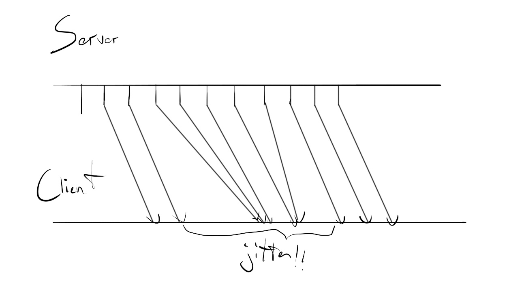
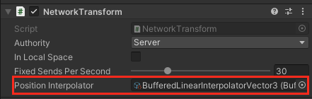
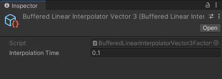
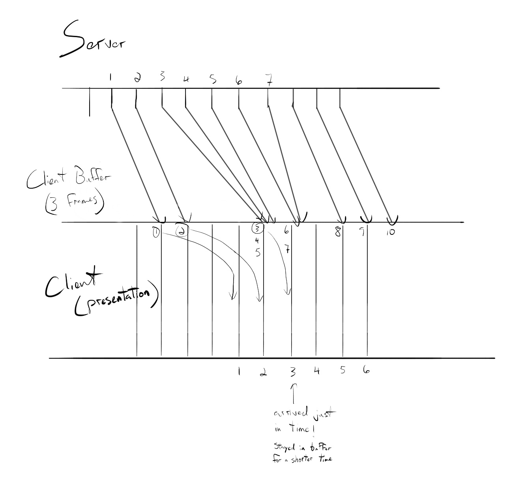

# Network Transform Buffered Interpolation
[feature]: #feature

- Start Date: `2021-07-19`
- RFC PR: [#0000](https://github.com/Unity-Technologies/com.unity.multiplayer.rfcs/pull/0000)
- SDK PR: [#0000](https://github.com/Unity-Technologies/com.unity.multiplayer.mlapi/pull/0000)

# Summary
[summary]: #summary

This RFC proposes upgraded interpolation options from the old NetworkTransform's interpolation that hides jitter and is more flexible for users.


# Motivation
[motivation]: #motivation


NetworkTransform needs a way to help users smooth movements that can resist to different network conditions and allows users to extend it if needed.
The previous implementation didn't offer much flexibility on what interpolation algorithm to use. If I wanted to create my custom interpolation that prevents players from going through walls instead of interpolating linearly, I would need to reimplement at least part of my own NetworkTransform. If I wanted my object to change direction instantaneously I could use a different interpolation implementation than if I wanted to have wobble and inertia.

It also didn't take into account network jitter, which becomes a visible issue on overloaded or unstable networks like you can find with mobile platforms 

The following video shows the MLAPI-0.1.0 NetworkTransform under 5% packet loss and 60-100ms jitter.

https://user-images.githubusercontent.com/71790295/126506051-ebfb1974-e4fc-44ca-9923-2be450c722b6.mp4



This RFC suggests an extensible interface for users to use and create different interpolation algorithms. It also suggests a default buffered interpolator that'll resist to jitter. 
After this, users should be able to select the interpolation algorithm that best fits the GameObject they want to sync.

In addition, this RFC suggests removing the 
```C#
        public AnimationCurve DistanceSendrate = AnimationCurve.Constant(0, 500, 20);
```
configuration (that was used to set interpolation times) to use instead a swappable interpolator.

# Guide-level explanation
[guide-level-explanation]: #guide-level-explanation

NetworkTransform now has this new configuration:
- `Interpolator`: Allows users to select the interpolation algorithm they want to use. This interpolator will interpolate "ghost" side state changes. Note it'll still be up to users to interpolate their authoritative objects however they want. If for example Client 1 is authoritative over a player object, this RFC will add interpolation to the server object and the other clients' objects, not Client 1's object. It'll still be up to users to interpolate that authoritative object (using RigidBody's interpolation for example or anything else).


A default `BufferedLinearInterpolator` is provided. The buffered linear interpolator will buffer values before making them available to NetworkTransform's value update. This will allow NetworkTransform to accumulate jittered network values without affecting the transform's state and latter be able to consume them at regular intervals.

This will smooth tranforms on jittery connections, however it'll add more latency to your transform updates. This should be used carefully as to not add more latency than needed to your game. Bigger buffer values could be expected when targeting mobile platforms for example, while keeping interpolation times lower for platforms with typically more stable connections.

You can find the interpolator's configuration in its associated scriptable object factory.
It is advised to use the same interpolator for all your NetworkTransforms. This way, you're making sure all your objects will be synchronized and use the same delays. Having an interpolator with 100ms delay and another with 500ms delay could cause visible overlaps and desyncs where an object at time say `t=10s` tries to interact with an object buffered at time `t=9.6s`.

If you have a case where you'd like to use a different configuration, you can create a new instance of the interpolator scriptable object and assign it to your object. If you want a new default value for all your NetworkTransforms, you can assign a scriptable object as default value for a class in the Unity Editor, by selecting the C# script and assigning the default value in the script's inspector (this will add a reference in the C# script's meta file).

If you don't want interpolation, you can use the `NoInterpolation` interpolator which will take in new values and present them directly when asked, without doing anything else.

- Left: Host with two NetworkTransform: `0.1.0 NetworkTransform` and new `buffered NetworkTransform`
- Right: Connected client with 60-100ms jitter and 5% packet loss 
  - (The smooth one is the buffered one :) )

https://user-images.githubusercontent.com/71790295/126731436-f9e89d75-4973-49e8-bbb5-84ff67c48a9b.mov
 
An `IInterpolator` interface has been added, to allow users to create their own custom interpolator.
The implemented interpolator needs to keep its own state and will be given new values each time ones are available to the NetworkTransform's OnValueChanged.

```C#
public interface IInterpolator<T>
{
    public void Update(float deltaTime);
    public void NetworkTickUpdate(float tickDeltaTime);
    public void AddMeasurement(T newMeasurement, NetworkTime sentTime);
    public void Teleport(T value, NetworkTime sentTime);
    public T GetInterpolatedValue();
}
```

```C#
public class SimpleInterpolator : IInterpolator<Vector3>
{
    // a user's simple interpolator
    public void Update(float deltaTime)
    {
        m_CurrentTime += deltaTime;
        m_UpdatedVector = Vector3.Lerp(m_StartVector, m_EndVector, m_CurrentTime / MaxLerpTime);
    }

    public void AddMeasurement(Vector3 newMeasurement, NetworkTime _)
    {
        m_EndVector = newMeasurement;
        m_CurrentTime = 0;
        m_StartVector = m_UpdatedVector;
    }

    public Vector3 GetInterpolatedValue()
    {
        return m_UpdatedVector;
    }

    public void Teleport(Vector3 value, NetworkTime _)
    {
        m_UpdatedVector = value;
        m_StartVector = value;
        m_EndVector = value;
        m_CurrentTime = 1;
    }

    public void NetworkTickUpdate(float fixedDeltaTime) {}
}
```
A factory is used to select and configure which interpolator to use for the NetworkTransform.
```C#
public abstract class InterpolatorFactory<T> : ScriptableObject
{
    public const string BaseMenuName = "MLAPI/Interpolator/";
    public abstract IInterpolator<T> CreateInterpolator();
}

public abstract class BufferedLinearInterpolatorFactory<T> : InterpolatorFactory<T>
{
    [SerializeField]
    public float InterpolationTime = 0.100f;
}

[CreateAssetMenu(fileName = "BufferedLinearInterpolatorVector3", menuName = BaseMenuName + "BufferedLinearInterpolatorVector3", order = 1)]
public class BufferedLinearInterpolatorVector3Factory : BufferedLinearInterpolatorFactory<Vector3>
{
    public override IInterpolator<Vector3> CreateInterpolator()
    {
        return new BufferedLinearInterpolatorVector3(this);
    }
}
```

Settings for each types of interpolators (like the above `InterpolationTime`) are owned by the interpolator's factory. NetworkTransform allows selecting which interpolator factory to use.



This setting is shared by all interpolators.




# Reference-level explanation
[reference-level-explanation]: #reference-level-explanation

## Interpolator integration with NetworkTransform
Users can select their interpolator using a global configuration set in a scriptable object.
```C#
[SerializeField]
private InterpolatorFactory<Vector3> m_PositionInterpolator;
```
On Awake, NetworkTransform will create its own instance to use.
```C#
private void Awake()
{
    PositionInterpolator = m_PositionInterpolatorFactory.CreateInterpolator();
```
That interpolator can then be used in NetworkTransform.
```C#
private void OnNetworkStateChanged(NetworkState oldState, NetworkState newState)
{
    // ...
    PositionInterpolator.AddMeasurement(newState.Position);
}
```

The authoritative value coming from the network is now intercepted by the interpolator. The value applied to the transform is now the interpolated value instead.

```C#
private void ApplyNetworkState(NetworkState netState)
{
    // ...
    m_Transform.position = PositionInterpolator.GetInterpolatedValue(); // this doesn't update the value, just queries it

```

The interpolated value is updated every frame, only if the game is not allowed to update the transform. (For example with a server driven transform, only the client would be interpolated)

```C#
private void Update()
{
    // ...

    if (!CanUpdateTransform)
    {
        PositionInterpolator.Update(Time.deltaTime);
        ApplyNetworkState(m_NetworkState.Value);
    }
}
```

## Buffered Interpolator

The buffered interpolator will maintain a list of buffered items, associated with the tick it was sent. This means the NetworkTransform, in addition to sending the state to other nodes will also need to include the tick in its sent state. It uses the global Network Time's buffer configuration to determine how long to keep values in buffer.




```C#
public void AddMeasurement(T newMeasurement, int SentTick)
{
    m_Buffer.Add(new BufferedItem<T>() {item = newMeasurement, tickSent = SentTick});
}
```
Every tick, the interpolator will make a new buffered item available according to how much time it should spend in the buffer.
```C#
private double ServerTickBeingHandledForBuffering => NetworkManager.Singleton.ServerTime.Tick; // override this if you want configurable buffering, right now using ServerTick's own global buffering

private void TryConsumeFromBuffer()
{
    for (int i = m_Buffer.Count - 1; i >= 0; i--)
    {
        var bufferedValue = m_Buffer[i];
        if (bufferedValue.tickSent <= ServerTickBeingHandledForBuffering)
        {
            m_LerpStartValue = m_LerpEndValue;
            m_LerpEndValue = bufferedValue.item;
            m_ValueLastTick = bufferedValue.tickSent;
            m_Buffer.RemoveAt(i);
        }
    }
}
```

# Drawbacks
[drawbacks]: #drawbacks

This interpolation doesn't make any assumptions on future server rewind needs.
This means that any future server side rewind code we use that wants to rewind an interpolated object might require new explicit APIs that would break user defined implementations (users would need to implement any new method, if any).

# Rationale and alternatives
[rationale-and-alternatives]: #rationale-and-alternatives

## Giving the option to have different buffer length per network transform
Current configuration is to have everything buffered with the same value. This way, you promote better world consistency, since everyone is on the same timeline.
However, one might want to have exceptions where you don't care about smoothness for your transform and only want the quickest position update, as soon as you have it and not care about jittery state changes. These objects would then need to have little or no buffer, contrary to the global setting in the time system.
At this point, users could either create their own interpolator inheriting from buffered interpolator if they still want smaller buffering
```C#
    public class MyOwnBufferedInterpolator<T> : IInterpolator<T> where T : struct
    {
        // ...
        protected override double ServerTickBeingHandledForBuffering => ServerTick - OtherBuffering;
```
Or they could use `NoInterpolator` which just returns your latest position, without doing anything to it.

## Other ways to reduce jitter

Reducing the number of packets sent is a good way to prevent jitter, however the goal of this RFC is really to mitigate the jitter that does happen, even after mitigation.

Increasing send rate will help reducing the buffer size needed for clean interpolation. With shorter ticks, you need to wait a shorter time before saying you can process a server position. This could be done through education when talking about these issues.

## Other design
The interpolator could have been hard coded in NetworkTransform without actually being a separate class. This could have made NetworkTransform more self contained, but would also have been more cumbersome to extend interpolation. Users could for example want to prevent interpolated transforms from going through walls instead of interpolating linearly. They could want to interpolate using their navmesh. Any sort of custom interpolation becomes easy with the current design and would hook directly in NetworkTransform, without being too hard to maintain on our side. 
With .meta file default values, you can set a ScriptableObject as a default for your class, no extra user action should be needed to use NetworkTransform with default scriptable object values.

## Impact of not doing this
Buffered interpolation is simple on paper, but can be frustrating to implement, even for netcode experts. It's a recurring technique to allow resisting to bad network conditions like you can find on mobile platforms.
Having this set as a default will allow giving users a NetworkTransform that is smooth by default, on a wide range of network conditions.

## Why in NetworkTransform and not NetworkVariables

Doing it directly in NetworkVariable right now isn't useful. Most of our use cases for interpolation are transform related. 

Going the NetworkVariable route would make us create APIs we'd need to maintain for a few years, without having concrete use cases.

## Prediction and interpolator.
Current interpolator only affects ghosts and doesn't affect locally owned objects. An eventual predicted player wouldn't be affected by this interpolation.
Future prediction might want to interpolate corrected values instead of teleporting players. This should be handled by prediction code.
Since interpolator is a self contained class and isn't a MonoBehaviour, interpolators could be reused for that correction interpolation.

## Other APIs for interpolator
The Interpolator's `Update()` method could have been injected with the last 3 positions. 
```C#
Vector3 Update(Vector3 pos1, Vector3 pos2, Vector3 pos3)
{
    // interpolate over those 3 positions, even if they are rolledback positions
    return interpolatedValue;
}
```
This assumes the number of values needed for interpolator. What if your interpolator needs 4 values? or just 2?. With `AddMeasurement`, you're allowing more flexibility for user implementations. However you require your interpolator to track state, while state injection in the above example would centralize state in the snapshot system. Having the interpolator track its own state could cause desync issues in the future, however offering a `Teleport` method can serve as a "reset" button for interpolators.
```C#
void RewriteHistory(Vector3[] newPositions, int[] newTicks)
{
    m_Interpolator.Teleport(newPositions[0], newTicks[0]);
    for(int i=1; i<newPositions.Count; i++)
    {
        m_Inteprolator.AddMeasurement(newPositions[i], newTicks[i]);
    }
}
```

# Prior art
[prior-art]: #prior-art

## Gafferongames
Gafferongames suggests different solutions for buffered interpolation, according to your needs.
https://gafferongames.com/post/snapshot_interpolation/

It talks about Hermite interpolation and mentions how linear interpolation created wobbly artefacts on child cubes attached to a rotating cube.
The article does mention Hermite interpolation requires more bandwidth (as it needs to sync velocity in addition to transform state).
Users wanting to use this could extend NetworkTransform to sync velocity and implement their own interpolator.

## Source engine
https://developer.valvesoftware.com/wiki/Source_Multiplayer_Networking

Uses a `history buffer` and then interpolates snapshots. If it loses a snapshot, but has snapshot around it, it can still safely interpolate between these snapshots. This is similar to the current RFC's design.
If no snapshots are available, it'll use extrapolation to continue lerping values. I'm still unsure about that part, since after experimentation Kalman Filtering seemed like a more realistic extrapolation. Will need to experiment more.

## HLAPI
HLAPI's interpolation required a Rigidbody being attached to the transform (and was setting that RB's velocity accordingly). This is a simple solution that works for certain cases.
If a user wants to network any non-physics objects or kinematic objects, they would need to implement their own interpolation, which can be frustrating to implement, even for netcode experts.
Here's a forum post on these frustrations

https://forum.unity.com/threads/networktransform-interpolation.335155/

## Mirror
Mirror just released a few days ago a self contained SnapshotInterpolation on their master branch.

https://github.com/vis2k/Mirror/blob/master/Assets/Mirror/Components/NetworkTransform2k/NetworkTransformBase.cs

https://github.com/vis2k/Mirror/blob/master/Assets/Mirror/Runtime/SnapshotInterpolation/SnapshotInterpolation.cs

https://mirror-networking.gitbook.io/docs/components/network-transform

https://mirror-networking.gitbook.io/docs/guides/snapshot-interpolation

They also use buffered interpolation.
They seem to dynamically accelerate/decelerate interpolation time according to whether the buffer is getting too large.
I'll need to experiment to see if my current solution has this issue, ideally the buffer should never grow forever. If that can happen, dynamic time delta could be worth exploring.

## Unreal
Unreal interpolates CharacterMovementComponent using an offset between its visual and its capsule. The physic capsule keeps updating to the latest position so that it introduces as little physics errors as possible, but it'll still have interpolation using the visual offset (which gradually decreases to reach the capsule's position).

This is great when you have your predicted client that could interact with that interpolated object, this way your prediction interacts with a capsule that's as recent as possible. However this is less self contained and is opinionated on GameObject hierarchy.

From a (too) short read and local experimentation, I couldn't find anything about buffering to hide network jitter. When testing with their default FPS scene, I added artificial jitter using their `Net PktLagVariance=40` cheat code and saw visible jitter on the other client.

Unreal with artificial jitter

https://user-images.githubusercontent.com/71790295/126914379-93517df5-4147-42ff-b122-d6b55da6947a.mov

Unreal without artificial jitter

https://user-images.githubusercontent.com/71790295/126914365-aa13b2af-0c8f-4a55-a2a6-1bcd73915d23.mov

FPS games require as little added latency as possible. It makes sense Unreal doesn't use buffering. Current design for buffered interpolator targets small scale coop, a revised design would be needed for FPS, maybe using dynamically scaling buffers or no buffers at all.

## Overwatch
Overwatch buffers inputs server side dynamically.

https://youtu.be/W3aieHjyNvw?t=1530

The buffer size will grow dynamically according how bad network conditions are.

https://youtu.be/W3aieHjyNvw?t=1781

Their solution however includes having dynamic tick intervals that scale accordingly.
It could be interesting to explore whether something similar could be done client side for received state, to make sure players have state as soon as possible with good network conditions and dynamically grow our buffer when conditions go bad. This could be an addition to our NetworkTickSystem's fixed buffer.


# Unresolved questions
[unresolved-questions]: #unresolved-questions

- What parts of the design do you expect to resolve through the RFC process before this gets merged?

  - Current plan is to offer a simpler configuration than the previous NetworkTransform interpolation (by only using a float to specify the amount of time to interpolate vs the old AnimationCurve which allowed to specify the amount of time to interpolate varying over the distance to interpolate). Users will have less options to configure. I'm still open to adding this back, but it'd need to be clearer.

- What parts of the design do you expect to resolve through the implementation of this feature before stabilization?

  - Will need to experiment with unclamped lerping, to see if we can do extrapolation when we're missing values coming from the server.
  - Figure if we actually want to expose interpolator in inspector or just in code.
    - Do we really want game designers and other non-progs to mess with this?

- What related issues do you consider out of scope for this RFC that could be addressed in the future independently of the solution that comes out of this RFC?

  - Dynamic buffer length would be out of scope for this RFC. Having this for fast paced games would be useful, but not for the current small scale coop current target.
  - Dissociating transform update from visual update might be more useful for fast paced games (as you want to have your physic to the latest position while still feeling smooth). This would be out of scope for this RFC as we're targeting small scale coop.


# Future possibilities
[future-possibilities]: #future-possibilities

## Server rewind
Server side rewind (for sniper shots for example) will need to make sure it takes into account what interpolated value the affected client was using.

## Physic/Visual dissociation for interactions with predicted players
As mentionned earlier, for fast paced games, dissociating visuals from physics might be worth it (so the transform and associated colliders are updated as soon as possible without interpolation while having the visual still interpolated).

## Possible interpolation/extrapolation algorithms
This opens the door for different interpolation possibilities. To name the ones that came up during research: 
- Kalman Filter Extrapolation
  - Realistic extrapolation used in signal processing that takes into account noise probabilities to smooth out "shaky" values while still being physically accurate. This assumes a steady stream of data and could be combined with buffering to then extrapolate transforms (instead of having jerky extrapolation corrections, you'd have a more realistic movement here that'd smooth out the sudden position changes from extrapolation corrections).
  - Could be used instead of unclamped lerping for a more realistic extrapolation.
  - Videos to explain this
    - https://www.youtube.com/watch?v=mwn8xhgNpFY
    - https://www.youtube.com/watch?v=bm3cwEP2nUo
  - Interesting implementation for Unity https://github.com/mplantady/DataFusionKF
  - With recording

https://user-images.githubusercontent.com/71790295/126914816-9490a6b4-096a-420f-8523-549b195e7a09.mov

- Quadratic interpolation
- Hermite Interpolation
  - https://gafferongames.com/post/snapshot_interpolation/
- Projective Velocity Blending 
  - https://www.researchgate.net/publication/293809946_Believable_Dead_Reckoning_for_Networked_Games
- Dynamically scaling buffering according to bad network conditions.
