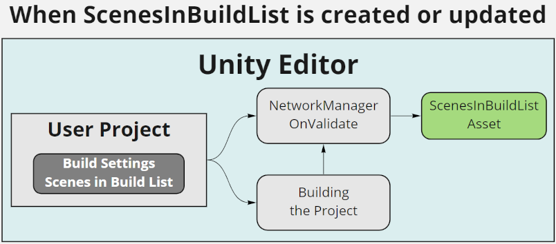
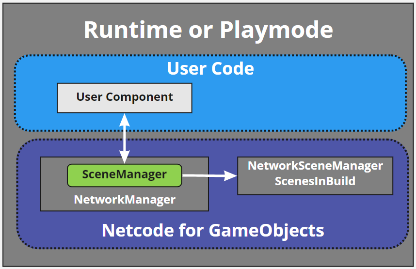
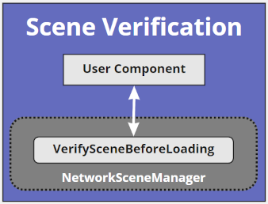
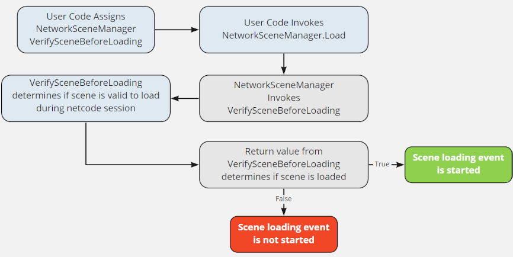

# Replace Scene Registration with Scenes in Build List
[feature]: #feature

- Start Date: `2021-07-20`
- RFC PR: [#0000](https://github.com/Unity-Technologies/com.unity.multiplayer.rfcs/pull/0000)
- SDK PR: [#0000](https://github.com/Unity-Technologies/com.unity.multiplayer.mlapi/pull/0000)

# Summary
[summary]: #summary

The original NetworkManager Scene registration process was designed to provide users with a means to control which scenes declared within the build settings “scenes in build list” could be loaded during an active session. While this did accomplish the underlying purpose of active session scene loading control, this proposal will outline a new approach that only requires users to populate the “build settings scenes in build list” (as they normally would) while also providing users with the ability to dynamically control which scenes are valid or not based on current game state.

# Motivation
[motivation]: #motivation

The more recent NetworkSceneManager updates allowed for the use of SceneAssets in place of the name of the scene.  This did help reduce the required user maintenance time by not requiring a user to update the registered scene names within the NetworkManager if they changed the name of a  SceneAsset.  However, this still required users to maintain two lists and the registered scenes approach was a globally static definition that did not allow for a more granular scene loading verification process.  

# Guide-level explanation
[guide-level-explanation]: #guide-level-explanation

By treating all of the scenes in the build list as registered scenes and providing a scene verification callback handler that was always invoked prior to loading a scene,  users no longer have more than one location to register scenes and they can build their own customized scene verification process that has the ability to dynamically change based on current game state (all depending upon the custom user implementation).
This approach still required some kind of master registered scenes list in order to provide the very basic scene verification checks of whether the scene name being requested for load (server side) or being commanded to load (client side) was even included in the build.  Since the “scenes in build list” is only available when running the Unity editor, a new scriptable object type (ScenesInBuild) was created as a runtime container to hold the list of scenes included in the build.  To even further simplify the scene registration process, the ScenesInBuild asset type is automatically created for the user when upon the assignment of a NetworkManager component to a GameObject, loading a scene (in the editor) that contains a GameObject with the NetworkManager component, or during the build process if any scene included in the “scenes in build list” contains a GameObject with a NetworkManager component.
  

The asset created will always be called “ScenesInBuildList” and is always initially created within the root Asset folder of the user’s project.  Once created, the user can choose to move the ScenesInBuildList asset to any sub-folder within their project’s Asset folder.  If a user creates a duplicate copy of the ScenesInBuildList asset and forgets to delete one of the ScenesInBuildList assets, whenever it is synchronized with the user’s project’s “scenes in build list” a console log warning will be generated telling the user that only one copy of the ScenesInBuildList asset should exist and the message will provide a path to the first version of the ScenesInBuildList asset that will be used until the user removes the unwanted duplicate asset.

All NetworkManager instances will point to the same ScenesInBuildList asset, and the NetworkSceneManger has been updated to use the ScenesInBuild.Scenes list exclusively in place of the previous NetworkConfig.m_RegisteredScenesList that was based on the NetworkManager scene registration process.

In addition, the NetworkConfig.m_AllowRuntimeSceneChanges property was removed as it no longer applies.  You either have the scenes you are going to use in the build settings “scenes in build list” or you do not.  The only exception to this rule is that unit tests that need to manually load scenes should let the ScenesInBuild class know they are running a unit test and must set the ScenesInBuild.IsTesting to true.

User defined scene verification occurs if the user has assigned a callback handler for NetworkSceneManager.VerifySceneBeforeLoading.  The callback is provided with the scene index, scene name, and the mode in which the scene is being loaded.  If the user’s game logic determines it is a valid scene to load then the callback should return true to continue the load scene event process, however if it is not valid the callback should return false and the scene in question will not be loaded.  If the callback is assigned, this process will occur on both server and client(s).

# Reference-level explanation
[reference-level-explanation]: #reference-level-explanation

This is the technical portion of the RFC. Explain the design in sufficient detail that:

- Its interaction with other features is clear.
- It is reasonably clear how the feature would be implemented.
- Corner cases are dissected by example.

The section should return to the examples given in the previous section, and explain more fully how the detailed proposal makes those examples work.

# Drawbacks
[drawbacks]: #drawbacks

Why should we _not_ do this?

# Rationale and alternatives
[rationale-and-alternatives]: #rationale-and-alternatives

- Why is this design the best in the space of possible designs?
- What other designs have been considered and what is the rationale for not choosing them?
- What is the impact of not doing this?

# Prior art
[prior-art]: #prior-art

Discuss prior art, both the good and the bad, in relation to this proposal. A few examples of what this can include are:

- For framework, tools, and library proposals: Does this feature exist in other networking stacks and what experience have their community had?
- For community proposals: Is this done by some other community and what were their experiences with it?
- For other teams: What lessons can we learn from what other communities have done here?
- Papers: Are there any published papers or great posts that discuss this? If you have some relevant papers to refer to, this can serve as a more detailed theoretical background.

This section is intended to encourage you as an author to think about the lessons from other projects, provide readers of your RFC with a fuller picture. If there is no prior art, that is fine - your ideas are interesting to us whether they are brand new or if it is an adaptation from other projects.

Note that while precedent set by other projects is some motivation, it does not on its own motivate an RFC. Please also take into consideration that Unity Multiplayer sometimes intentionally diverges from common multiplayer networking features.

# Unresolved questions
[unresolved-questions]: #unresolved-questions

- What parts of the design do you expect to resolve through the RFC process before this gets merged?
- What parts of the design do you expect to resolve through the implementation of this feature before stabilization?
- What related issues do you consider out of scope for this RFC that could be addressed in the future independently of the solution that comes out of this RFC?

# Future possibilities
[future-possibilities]: #future-possibilities

Think about what the natural extension and evolution of your proposal would be and how it would affect the Unity Multiplayer as a whole in a holistic way. Try to use this section as a tool to more fully consider all possible interactions with the Unity Multiplayer in your proposal. Also consider how the this all fits into the roadmap for the project and the team.

This is also a good place to "dump ideas", if they are out of scope for the RFC you are writing but otherwise related.

If you have tried and cannot think of any future possibilities, you may simply state that you cannot think of anything.

Note that having something written down in the future-possibilities section is not a reason to accept the current or a future RFC; such notes should be in the section on motivation or rationale in this or subsequent RFCs. The section merely provides additional information.
