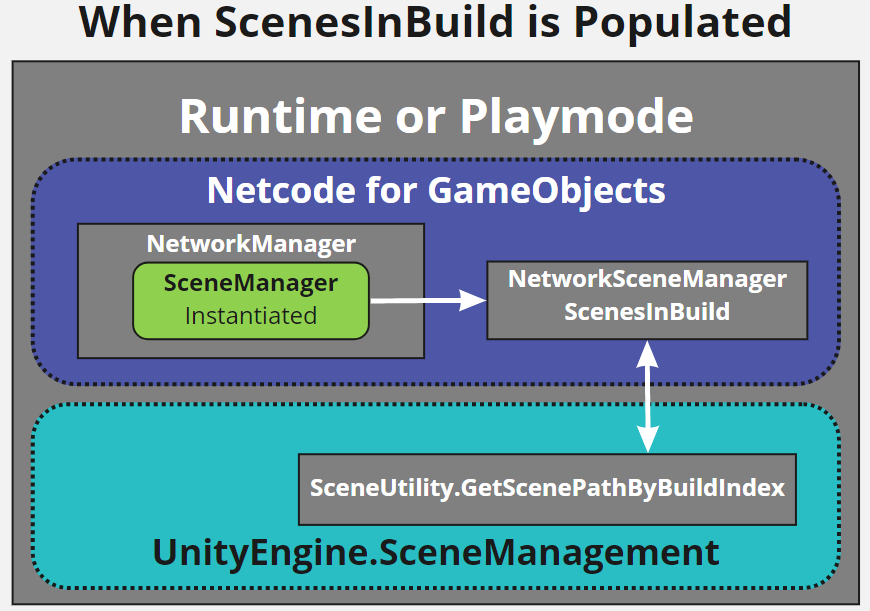

# Replace Scene Registration with Scenes in Build List
[feature]: #feature

- Start Date: `2021-07-20`
- RFC PR: [#0000](https://github.com/Unity-Technologies/com.unity.multiplayer.rfcs/pull/0000)
- SDK PR: [#0000](https://github.com/Unity-Technologies/com.unity.multiplayer.mlapi/pull/0000)

# Summary
[summary]: #summary

The original MLAPI Scene registration has always been slightly disconnected from the traditional Unity Scenes in Build list registration process that required users to maintain two lists of the same scenes whether by name or SceneAsset reference.  The primary focus of this proposal is to help reduce the amount of scene list maintenance required by the user when creating netcode enabled projects.

# Motivation
[motivation]: #motivation

The original MLAPI Scene registration process was always slightly disconnected from the traditional Unity scene registration process in that it required users to maintain two lists of the same scenes (by name or scene asset reference).  The more recent NetworkSceneManager updates provided the user with the ability to use SceneAssets in place of the name of the scene, which did help reduce the user maintenance time under the scenario where a scene name might change and a user would have to remember to change the name of the scene in the NetworkManager registered scenes list.  

During further investigation behind the original purpose of scene registration, it was discovered that it provided users with a level of control and/or security in assuring that a rogue server could not force a client to load a scene that was not intended to be loaded at that specific time or at any time during a network session.

# Guide-level explanation
[guide-level-explanation]: #guide-level-explanation

In order to provide a transparent user experience when it comes to scene registration, it was determined that the scene registration process could just use the Scenes in Build list for scene registration and then the NetworkSceneManager could provide a scene verification callback handler that would provide users the ability to have customized scene verification capabilities.
This required some refactoring on how the registered scenes list was generated since the Scenes in Build list is only available when running the Unity editor.  In order to solve for this dilemma, a new scriptable object type, ScenesInBuild, will be automatically created for the user upon the assignment of a NetowrkManager component to a GameObject, loading of a scene that contains a GameObject with the NetworkManager component, or during the build process if any scene included in the Scenes in Build list contains a GameObject with a NetworkManager component.  

The asset created will always be called “ScenesInBuildList”, and upon its initial creation will be within the root Asset folder of the user’s project.  Once created, the user can choose to move the ScenesInBuildList asset to any sub-folder within their project’s Asset folder.  If a user creates a duplicate copy of the ScenesInBuildList asset, a console log warning will be generated telling the user that only one copy of the ScenesInBuildList asset should exist and the message will provide a path to the first version of the ScenesInBuildList asset that will be used until the user removes the unwanted duplicate asset.

All NetworkManager instances will point to the same ScenesInBuildList asset, and the NetworkSceneManger has been updated to use the ScenesInBuild.Scenes list exclusively in place of the previous NetworkConfig.m_RegisteredScenesList that was based on the NetworkManager scene registration process.

In addition, the NetworkConfig.m_AllowRuntimeSceneChanges property was removed as it no longer applies.  You either have the scenes you are going to use in the BuildSettings Scenes in Build list or you do not.  The only exception to this rule is that unit tests that manually load scenes need to let the ScenesInBuild class know they are running a unit test and must set the ScenesInBuild.IsTesting to true.

User defined scene verification occurs if the user has applied their own delegate callback handler for NetworkSceneManager.VerifySceneBeforeLoading.  The delegate handler callback will be provided with the scene index, scene name, and the mode in which the scene is being loaded.  If the user’s game logic determines it is a valid scene to load then it can return true, however if it is not valid it can return false and the scene in question will not be loaded.  

# Reference-level explanation
[reference-level-explanation]: #reference-level-explanation

This is the technical portion of the RFC. Explain the design in sufficient detail that:

- Its interaction with other features is clear.
- It is reasonably clear how the feature would be implemented.
- Corner cases are dissected by example.

The section should return to the examples given in the previous section, and explain more fully how the detailed proposal makes those examples work.

# Drawbacks
[drawbacks]: #drawbacks

Why should we _not_ do this?

# Rationale and alternatives
[rationale-and-alternatives]: #rationale-and-alternatives

- Why is this design the best in the space of possible designs?
- What other designs have been considered and what is the rationale for not choosing them?
- What is the impact of not doing this?

# Prior art
[prior-art]: #prior-art

Discuss prior art, both the good and the bad, in relation to this proposal. A few examples of what this can include are:

- For framework, tools, and library proposals: Does this feature exist in other networking stacks and what experience have their community had?
- For community proposals: Is this done by some other community and what were their experiences with it?
- For other teams: What lessons can we learn from what other communities have done here?
- Papers: Are there any published papers or great posts that discuss this? If you have some relevant papers to refer to, this can serve as a more detailed theoretical background.

This section is intended to encourage you as an author to think about the lessons from other projects, provide readers of your RFC with a fuller picture. If there is no prior art, that is fine - your ideas are interesting to us whether they are brand new or if it is an adaptation from other projects.

Note that while precedent set by other projects is some motivation, it does not on its own motivate an RFC. Please also take into consideration that Unity Multiplayer sometimes intentionally diverges from common multiplayer networking features.

# Unresolved questions
[unresolved-questions]: #unresolved-questions

- What parts of the design do you expect to resolve through the RFC process before this gets merged?
- What parts of the design do you expect to resolve through the implementation of this feature before stabilization?
- What related issues do you consider out of scope for this RFC that could be addressed in the future independently of the solution that comes out of this RFC?

# Future possibilities
[future-possibilities]: #future-possibilities

Think about what the natural extension and evolution of your proposal would be and how it would affect the Unity Multiplayer as a whole in a holistic way. Try to use this section as a tool to more fully consider all possible interactions with the Unity Multiplayer in your proposal. Also consider how the this all fits into the roadmap for the project and the team.

This is also a good place to "dump ideas", if they are out of scope for the RFC you are writing but otherwise related.

If you have tried and cannot think of any future possibilities, you may simply state that you cannot think of anything.

Note that having something written down in the future-possibilities section is not a reason to accept the current or a future RFC; such notes should be in the section on motivation or rationale in this or subsequent RFCs. The section merely provides additional information.
