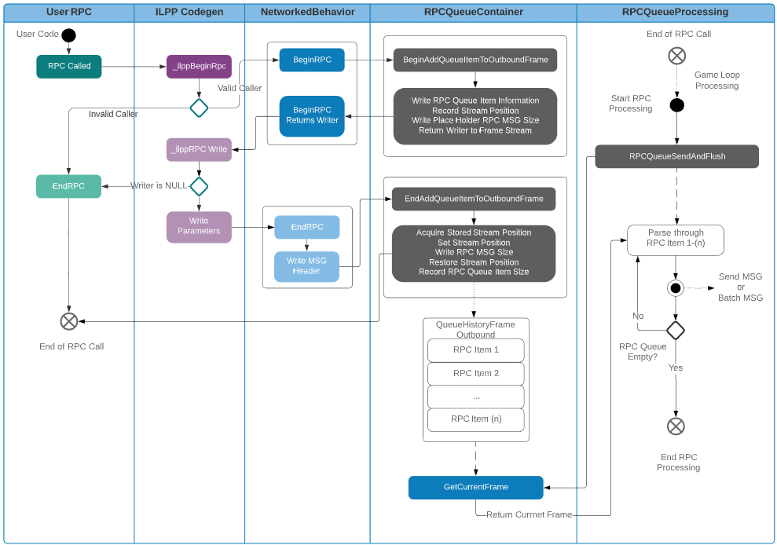

* Feature Name: `rpc-queue`
* Start Date: 2020-11-01
* RFC PR: [Unity-Technologies/com.unity.multiplayer.rfcs#0000](https://github.com/Unity-Technologies/com.unity.multiplayer.rfcs/pull/0000)
* Issue: [Unity-Technologies/com.unity.multiplayer#0000](https://github.com/Unity-Technologies/com.unity.multiplayer/issues/0000)

# Summary
[summary]: #summary

Ingress and egress data flow in netcode architectures frequently include synchronization mechanisms that provide further control over when and how messages/packets are processed or sent.   Placing RPCs into queues allows for the refinement of the invocation(inbound) and notification(outbound) process and provides the opportunity to develop more advanced netcode systems that could coalesce messages into specific categories/groups and/or provide additional processing opportunities for more complicated netcode architectures.

# Motivation
[motivation]: #motivation

There are several advantages to a queue based architecture vs writing directly to the OS network stack every time a section of game logic/code determines it should send some form of data (whether RPCs, state updates, etc).

1. Unifying outbound transmission allows us to feed RPCs, variable syncs, etc. through a unified interest management pipeline (including AOI)
2. Unifying outbound transmission helps developers keep state changes from different mechanisms in sync.  For example, in MLAPI today RPCs are sent immediately, but network variables update on a heartbeat.  According toit is not uncommon for MLAPI devs to employ workarounds to sew up this situation.
3. There are opportunities for consolidation / batching when messages go out as a group
4. Within the game loop process, directly sending messages at the time they are created can create an abundance of processing overhead ([Foong et al.](http://www.nanogrids.org/jaidev/papers/ispass03.pdf)) which can eat into the game developers’ precious game loop processing time (16ms) which should be allocated towards the developer(s) game logic and not the processing of network packets. However, there is also a balance between performance when it comes to large packets and latency between packets.   Larger packets that can consist of several fragmented packets within a reliable transmission protocol framework often have a slower point to point delivery time than smaller packets.  As such, there is a need (in netcode game development) to provide a mechanism for controlling when network messages are transmitted.  This control can result in the coalescing of specific network messages into groups where it can be determined when and how a network message is going to be delivered.
5. Providing a queue for inbound messages provides an alternate level of control over when the message will be processed and in the case of RPCs provides the ability to synchronize RPC oriented messages that rely upon any tickrate based synchronization methodologies/implementations.

# Guide-level explanation
[guide-level-explanation]: #guide-level-explanation

### RPC Queue Use Cases

Currently, the RPC Queue’s primary purpose is to provide additional control over when RPC messages are sent and upon being received when they are invoked (near future feature RPC Invocation Stage).  Additionally, RPC Queues provide the opportunity to place multiple RPC messages into a single outbound packet (near future feature RPC Message Batching) that reduces the total packets received and sent.

1. A user defined RPC within a NetworkedBehaviour derived child is initiated.
2. The ILPP generated code invokes the BeginSendXXXXRpc ( XXXX could be either Server or Client )
3. RPCQueueContainer initializes a new RPC entry in the current QueueHistoryFrame.  It then returns the stream writer to the ILPP generated code
4. RPC ILPP generated code writes serialized parameters of the RPC via the stream writer
5. RPC ILPP generated code invokes EndSendXXXXRpc method where the writer used to write serialized parameters is returned back to the RPCQueueContainer
6. The RPCQueueContainer finalizes the serialized RPC Queue entry
7. Later in the player loop (game update loop) the RPCQueueContainer processes through all outbound RPCs via RPCQueueProcessing and they are sent individually or batched.

1. The NetworkingManager enumerates through all current transport events (in the case of UNET) and adds any received RPC messages to the current inbound QueueHistoryFrame via the RPCQueueContainer (Network PreUpdate Stage).
2. Later in the PlayerLoop (Network FixedUpdate stage) the RpcQueueContainer enumerates through all inbound RPCs and as long as they are valid will invoke each RPC, NetworkedObject relative, within the associated NetworkedBehaviour component instance initiated by the sender.

# Reference-level explanation
[reference-level-explanation]: #reference-level-explanation

### Outbound RPC Data Flow Pipeline

### Inbound RPC Data Flow Pipeline

### RPC Queue Classes

- **RPCQueueContainer:** Manages inbound and outbound RPC queues.  Both inbound and outbound queues are byte arrays exposed as streams (i.e. currently BitStreams) and contained within a QueueHistoryFrame.  The number of QueueHistoryFrames is defined by calling the Initialize method and passing the maximum number of history frames.  The total number of frames is MaxFrameHistory + 1, where the additional frame is considered the “current frame” (i.e. it will always maintain the exact number of frames in history).
- **RPCQueueProcessing:** Currently, this class is instantiated by the RPCQueueContainer during its initialization.  It is highly probable that this class will get absorbed into the RPCQueueContainer.
- **QueueHistoryFrame:** Container class for handling the management of an RPC queue.  One QueueHistoryFrame instance per data flow pipeline (i.e. inbound and outbound yields two QueueHistoryFrames).

# Drawbacks
[drawbacks]: #drawbacks

Why should we _not_ do this?

# Rationale and alternatives
[rationale-and-alternatives]: #rationale-and-alternatives

- Why is this design the best in the space of possible designs?
- What other designs have been considered and what is the rationale for not choosing them?
- What is the impact of not doing this?

# Prior art
[prior-art]: #prior-art

Discuss prior art, both the good and the bad, in relation to this proposal. A few examples of what this can include are:

- For framework, tools, and library proposals: Does this feature exist in other networking stacks and what experience have their community had?
- For community proposals: Is this done by some other community and what were their experiences with it?
- For other teams: What lessons can we learn from what other communities have done here?
- Papers: Are there any published papers or great posts that discuss this? If you have some relevant papers to refer to, this can serve as a more detailed theoretical background.

This section is intended to encourage you as an author to think about the lessons from other projects, provide readers of your RFC with a fuller picture. If there is no prior art, that is fine - your ideas are interesting to us whether they are brand new or if it is an adaptation from other projects.

Note that while precedent set by other projects is some motivation, it does not on its own motivate an RFC. Please also take into consideration that Unity Multiplayer sometimes intentionally diverges from common multiplayer networking features.

# Unresolved questions
[unresolved-questions]: #unresolved-questions

- What parts of the design do you expect to resolve through the RFC process before this gets merged?
- What parts of the design do you expect to resolve through the implementation of this feature before stabilization?
- What related issues do you consider out of scope for this RFC that could be addressed in the future independently of the solution that comes out of this RFC?

# Future possibilities
[future-possibilities]: #future-possibilities

Think about what the natural extension and evolution of your proposal would be and how it would affect the Unity Multiplayer as a whole in a holistic way. Try to use this section as a tool to more fully consider all possible interactions with the Unity Multiplayer in your proposal. Also consider how the this all fits into the roadmap for the project and the team.

This is also a good place to "dump ideas", if they are out of scope for the RFC you are writing but otherwise related.

If you have tried and cannot think of any future possibilities, you may simply state that you cannot think of anything.

Note that having something written down in the future-possibilities section is not a reason to accept the current or a future RFC; such notes should be in the section on motivation or rationale in this or subsequent RFCs. The section merely provides additional information.
