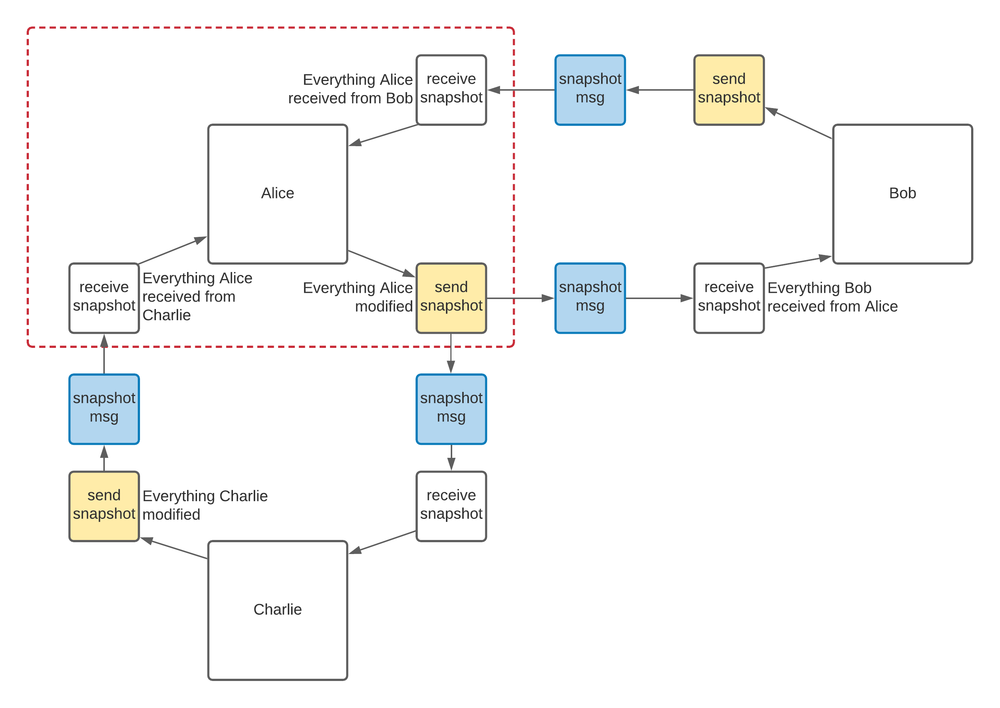
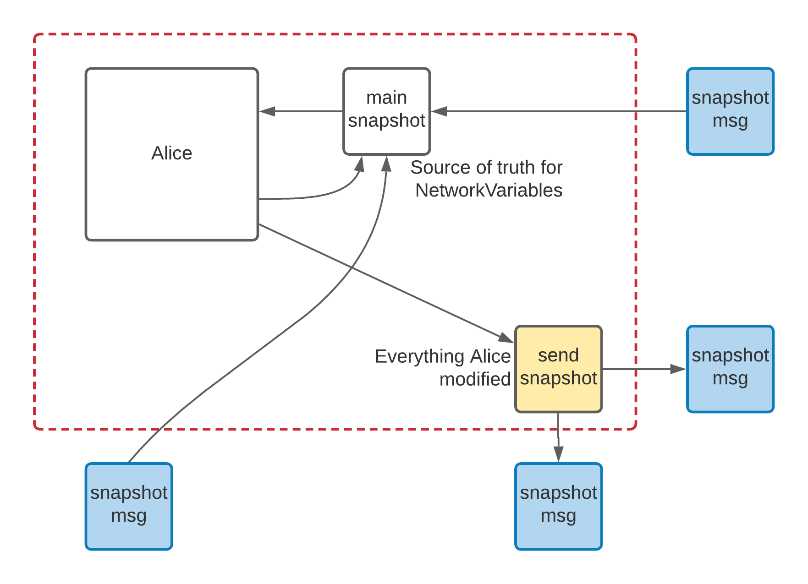

- Feature Name: `snapshot_system_part_1`
- Start Date: 2021-05-25
- RFC PR: [Unity-Technologies/com.unity.multiplayer.rfcs#0000](https://github.com/Unity-Technologies/com.unity.multiplayer.rfcs/pull/0000)
- Issue: [Unity-Technologies/com.unity.multiplayer#0000](https://github.com/Unity-Technologies/com.unity.multiplayer/issues/0000)

# Summary
[summary]: #summary

The snapshot system would store NetworkVariable updates and send them in blocks (called snapshots) at regular intervals (called ticks). Unreliable packets would be used for performance reason. An acknowledgement system and a prioritisation mechanism would allow pessimistic re-sends and prioritizing more important traffic. History would be maintained, for interpolation at first and rollback in a later addition. 

# Motivation
[motivation]: #motivation

The current system eventually delivers NetworkVariables, but there is no explicit mechanism to identify when a variable was modified or in conjunction which other variables. Because a reliable channel is used, any dropped packet will stall the delivery of all the traffic.

There currently is no uniform mechanism for interpolation of various NetworkVariable types. It is not easy to customize interpolation.

The proposed SnapshotSystem also aims a reducing memory allocations and scaling better.

# Guide-level explanation
[guide-level-explanation]: #guide-level-explanation

### The Snapshot System

The `NetworkManager` exposes a `SnapshotSystem` via a public getter. Under normal operation, the existence Snapshot System should have no direct impact on game code. It should improve delivery and performance, but game code should not directly interact with it.

### Send Snapshot

Where, previously, `NetworkBehaviour` would have internally called `NetworkManager.MessageSender.Send`, it instead calls the following function:

`SnapshotSystem.Store(NetworkObjectId, behaviourIndex, k, NetworkVariableFields[k]);`

The `SnapshotSystem` maintains every variables sent in a `Snapshot` class. In a nutshell, we remember, per connection, every variable changes that originated locally. This set of stored variables will be called the `Send Snapshot`. An instance of the `Snapshot` class stores:

- An array of entries
- A `byte[]` buffer
 
Each entry contains a `Key`: the NetworkVariable ObjectId, the Behaviour Index, the Variable Index within that behaviour and the tick written. This basically describes which variable we're talking about, at which tick.  Each entry also has a `Position` and a `Length` parameter. Those parameters specify where, in the buffer, this variable is serialized. 

### Receive Snapshot

On a per-connection basis, the Snapshot System also maintains a table of received variables, indexed by their Ids, and by ticks. Those are called Receive Snapshots. The same `Snapshot` data structure is reused. 

If we look at a case where Bob and Charlie are connected to host Alice, we can see this organisation:

The snapshot messages, shown in blue, are the unreliable messages exchanged. How they're built and sent is described further below. Their role is to efficiently copy the send snapshot of one machine to the received snapshot of another.

### Host in star topology

The only behaviour specific to the host is to mark the received variables as dirty so they get sent back to other clients.

# Reference-level explanation
[reference-level-explanation]: #reference-level-explanation

### Guiding principles

The first guiding principle to introduce is that under normal operations **no** memory allocations are done at runtime, within the Snapshot System. Every buffer is pre-allocated when the Snapshot System is started. Provisioning is made for sending, for receiving, and for any internal processing.  

Another guiding principle is that the Snapshot System doesn't care whether we have a star topology, a full mesh, or anything in between. Rather it is only concerned about:
- information generated locally
- information sent, acknowledged and not
- information received from a remote peer

### Main Snapshot

Logically, as described above, the Receive Snapshot will contain, on each machine, recent NetworkVariable values, at specific ticks. In practice, though, we want to be agnostic of which machine changed which variable and we want to have a single source of truth for the value of each variable. 

This forces the introduction of a Main Snapshot.   

The Main Snapshot, illustrated above, stores in a single structure everything that was received from other machines as well as local changes to send. We still need a separate structure for the Send Snapshot as this is the data that will be acknowledged by other machines and used for resends. 

### Expiry

In order for snapshots to not grow unbound, we must have a rule on when to remove content from them.

For the Send Snapshot, we remove data once it has been acknowledged by all machines or when there's enough more recent values of a given NetworkVariable.

For the Main Snapshot, we remove data for ticks old enough to not contribute to interpolation. This will probably be revisited in a later RFC, once we consider replay and rollback.

### Per-client send

# Visible changes

- NetworkVariables will have a different API for reading interpolated values at specific ticks than for writing a value to be sent.
- NetworkVariables will only support blittable value types 
- INetworkVariable gets to be renamed, still serve as an interface for NetworkSet, NetworkDictionary and NetworkList, but the NetworkVariable don't use this interface

# Drawbacks
[drawbacks]: #drawbacks

As a consequence of implementing the Snapshot System, there isn't a possibility of having different channels for different NetworkVariables.

# Rationale and alternatives
[rationale-and-alternatives]: #rationale-and-alternatives

- Keep a blit version of NetworkVariables and serializing as a second pass

# Prior art
[prior-art]: #prior-art

Discuss prior art, both the good and the bad, in relation to this proposal. A few examples of what this can include are:

- For framework, tools, and library proposals: Does this feature exist in other networking stacks and what experience have their community had?
- For community proposals: Is this done by some other community and what were their experiences with it?
- For other teams: What lessons can we learn from what other communities have done here?
- Papers: Are there any published papers or great posts that discuss this? If you have some relevant papers to refer to, this can serve as a more detailed theoretical background.

This section is intended to encourage you as an author to think about the lessons from other projects, provide readers of your RFC with a fuller picture. If there is no prior art, that is fine - your ideas are interesting to us whether they are brand new or if it is an adaptation from other projects.

Note that while precedent set by other projects is some motivation, it does not on its own motivate an RFC. Please also take into consideration that Unity Multiplayer sometimes intentionally diverges from common multiplayer networking features.

# Unresolved questions
[unresolved-questions]: #unresolved-questions

- What parts of the design do you expect to resolve through the RFC process before this gets merged?
- What parts of the design do you expect to resolve through the implementation of this feature before stabilization?
- What related issues do you consider out of scope for this RFC that could be addressed in the future independently of the solution that comes out of this RFC?

# Future possibilities
[future-possibilities]: #future-possibilities

The next RFC on this topic will cover how we manage acknowledgement, re-sends, and prioritizing content. 