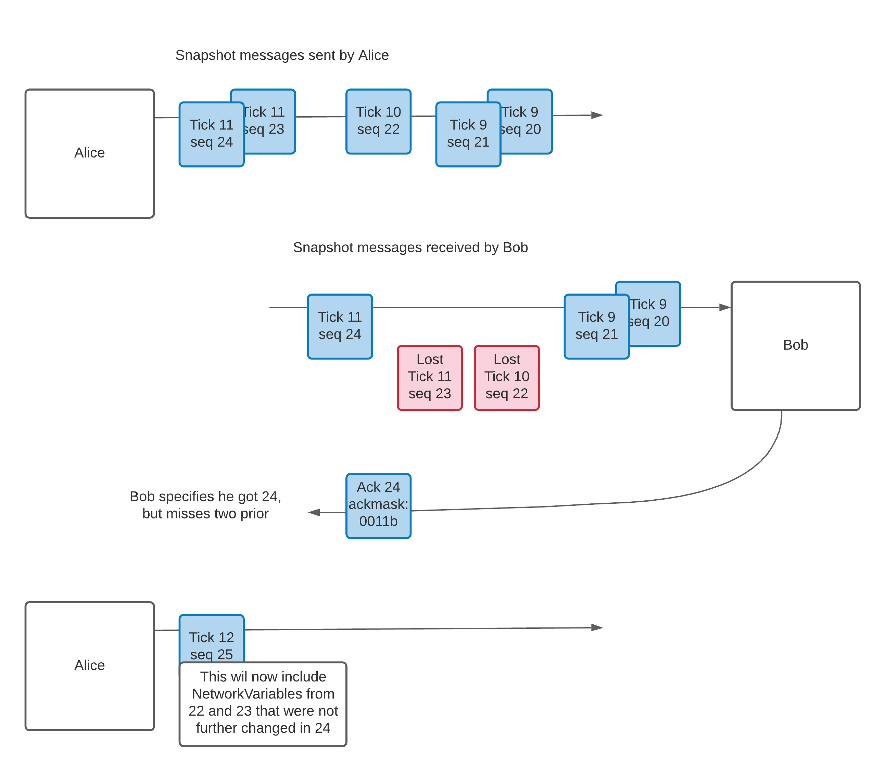

- Feature Name: `snapshot_system_part_1`
- Start Date: 2021-05-25
- RFC PR: [Unity-Technologies/com.unity.multiplayer.rfcs#0000](https://github.com/Unity-Technologies/com.unity.multiplayer.rfcs/pull/0000)
- Issue: [Unity-Technologies/com.unity.multiplayer#0000](https://github.com/Unity-Technologies/com.unity.multiplayer/issues/0000)

# Summary
[summary]: #summary

The Snapshot System would store NetworkVariable updates and send them in blocks (called snapshot messages) at regular intervals (called ticks). Unreliable packets would be used for performance reason. An acknowledgement system and a prioritisation mechanism would allow pessimistic re-sends and prioritizing more important traffic. History would be maintained, for interpolation in a first pass and rollback in a later addition. 

The Snapshot System depends on a tick system where machines have a synchronized tick number which quantize the time in discrete ticks. 

# Motivation
[motivation]: #motivation

The current system eventually delivers NetworkVariables, but there is no explicit mechanism to identify when a variable was modified or in conjunction which other variables. Because a reliable channel is used, any dropped packet will stall the delivery of all the traffic, until the missing packet is re-sent.

There currently is no uniform mechanism for interpolation of various NetworkVariable types. It is not easy to customize interpolation.

The proposed SnapshotSystem also aims a reducing memory allocations and scaling better.

# Guide-level explanation
[guide-level-explanation]: #guide-level-explanation

### The Snapshot System

The `NetworkManager` exposes a `SnapshotSystem` via a public getter. Under normal operation, the existence Snapshot System should have no direct impact on game code. It should improve delivery and performance, but game code should not directly interact with it.

### Send Snapshot

Where, previously, `NetworkBehaviour` would have internally called `NetworkManager.MessageSender.Send`, it instead calls the following function:

`SnapshotSystem.Store(NetworkObjectId, behaviourIndex, k, NetworkVariableFields[k]);`

The `SnapshotSystem` maintains every variables sent in a `Snapshot` class. In a nutshell, we remember every variable changes that originated locally. This set of stored variables will be called the `Send Snapshot`. An instance of the `Snapshot` class stores:

- An array of entries
- A `byte[]` buffer
 
Each entry contains a `Key`: the NetworkVariable ObjectId, the Behaviour Index, the Variable Index within that behaviour and the tick written. This basically describes which variable we're talking about, at which tick.  Each entry also has a `Position` and a `Length` parameter. Those parameters specify where, in the buffer, this variable is stored. Two options will be considered:
 1. storing a serialized NetworkVariable. (early prototype showed this as a possibility)
 2. storing a blit'ted NetworkVariable, and serializing it only at send time (most likely)

This Send Snapshot would then be sent by the Snapshot Manager at the next Network Tick.

### Receive Snapshot

On a per-connection basis, the Snapshot System also maintains a table of received variables, indexed by their Ids, and by ticks. Those are called Receive Snapshots. The same `Snapshot` data structure is re-used. In order to be consistent, whether we choose to keep serialized or blit'ted NetworkVariables, the same choice would be made here.  

If we look at a case where Bob and Charlie are connected to host Alice, we can see this organisation:


The snapshot messages, shown in blue, are the unreliable messages exchanged. How they're built and sent is described further below. Their role is to efficiently copy the Send Snapshot of one machine to the received snapshot of another.

### Host in star topology

The only behaviour specific to the host is to mark the received variables as dirty so they get sent back to other clients.

# Reference-level explanation
[reference-level-explanation]: #reference-level-explanation

### Guiding principles

The first guiding principle to introduce is that under normal operations **no** memory allocations are done at runtime, within the Snapshot System. Every buffer is pre-allocated when the Snapshot System is started. Provisioning is made for sending, for receiving, and for any internal processing.  

Another guiding principle is that the Snapshot System doesn't care whether we have a star topology, a full mesh, or anything in between. Rather it is only concerned about:
- information generated locally
- information sent, acknowledged and not
- information received from a remote peer

A third principle is to never try to capture the whole world state directly. It should be possible to query every variable at any tick, but it should not be necessary to deal with a message that contains all variables. Thus, at scale, NetworkVariables that are not touched are left out of the snapshots.

### Main Snapshot

Logically, as described above, the Receive Snapshot will contain, on each machine, recent NetworkVariable values, at specific ticks. In practice, though, we want to be agnostic of which machine changed which variables and we want to have a single source of truth for the value of each variable. 

This forces the introduction of a Main Snapshot.   


The Main Snapshot, illustrated above, stores in a single structure everything that was received from other machines as well as local changes to send. We still need a separate instance of the Snapshot class for the Send Snapshot as this is the data that will be acknowledged by other machines and used for resends. 

### Rationale for not merging Send and Main Snapshot

One could argue for merging even further: Putting the Main Snapshot and the Send Snapshot together. However, they serve different purposes: the Send Snapshot contains all the information that needs to go out. There's no point for the code generating Snapshot Messages to look at anything else. Similarly, processing in-bound information can be limited to the Main Snapshot. Leaving the two in different instances of the same class is an attempt at separation of concerns.  

### Expiry

In order for snapshots to not grow unbound, we must have a rule on when to remove content from them.

For the Send Snapshot, we remove data once it has been acknowledged by all machines or when there's enough more recent values of a given NetworkVariable.

For the Main Snapshot, we remove data for ticks old enough to not contribute to interpolation. This will probably be revisited in a later RFC, once we consider replay and rollback.

### Per-client send

At each network tick, the snapshot system would process the Send Snapshot and extract the SnapshotMessage to send to each client. It would prioritize the changed variables, with a metric for the importance of the variable. Then, it would include other variable changes that were not acknowledged yet (pessimistic resend). This would require parameters for:
- maximal Snapshot Message size (MTU implications)
- target bandwidth (pessimistically resend up to that bandwidth value)

It is quite possible that, at some ticks, we require more than one Snapshot message per tick. In those cases, we'd use a new property of NetworkVariable to guarantee correct grouping. Something like `public short Group;` in NetworkVariable. The Snapshot system would not separate NetworkVariables with the same (non-zero) group in different messages.

### Acknowledgements and resends

Since each connection will carry Snapshot Messages both ways, there's two very direct ways to go about acknowledgements:
- different channel, specific per-message ack
- including in each Snapshot Message the information on which Snapshot Message were received so far

In order to identify a Snapshot Message, two numbers would be used:

`int tick; // the tick this Snapshot Message was sent on`

`int sequence; // unique sequence number. Each Snapshot Message gets a different one`

With this system, each machine can simply acknowledge the latest sequential Snapshot Message it received. If there's any missing received Snapshot Message, it can use an acknowledgement mask to specify which of the previous _n_ Snapshot Messages were received. This allows the other side to know what each machine has and pick which NetworkVariable to prioritize/re-send. 

One important thing to remember is that when a Snapshot Message is lost, it is not necessary to re-send that exact message back. Rather, sending a newer state of the NetworkVariables in it is sufficient. Especially since many of those variables might already carry more recent values in in-transit messages. This update would happen at next tick Snapshot sending. This is illustrated below:



# Visible API changes

- NetworkVariables will have a different API for reading interpolated values at specific ticks than for writing a value to be sent. We suggest either:
    - `T NetworkVariable<T>.GetInterpolateValue(float tick);`
    - `T NetworkVariable<T>.GetInterpolateValue(); // implicitely uses current tick for this frame`
- NetworkVariable will be written to by using:
```
    public class NetworkVar<T>{
       public ref T Value{
           get{
```
This would allow game code that write to NetworkVariables in a simpler manner. For example:
```
MyNetVar.Value += 5;
MyNetVar.Value.y = 5; // this used to break
MyNetVar.Value = 42;
```

- NetworkVariables will only support blit'table value types, not reference types

This is necessary so that the Snapshot System can easily copy variables around and makes the semantics of NetworkVariables much clearer. 
 
- `INetworkVariable` gets to be renamed, still serves as an interface for `NetworkSet`, `NetworkDictionary` and `NetworkList`, but the NetworkVariable don't use this interface

Those existing classes are specialized for behaviours that do not directly align with snapshot. It's probably better to keep them in a working state, but separate and not affected for now.  

# Drawbacks
[drawbacks]: #drawbacks

As a consequence of implementing the Snapshot System, there isn't a possibility of having different channels for different NetworkVariables. All the Snapshot Messages get sent on the same unreliable channel.

# Rationale and alternatives
[rationale-and-alternatives]: #rationale-and-alternatives

For storage, two central options are left regarding the implementation:
- serialize NetworkVariables directly into the snapshot
- Keep a blit version of NetworkVariables and serializing as a second pass

# Prior art
[prior-art]: #prior-art

# Unresolved questions
[unresolved-questions]: #unresolved-questions

- How, internally, will fast look-up into the Snapshot structures be implemented? This is probably an implementation detail, but will impact the performance of the resulting solution.
- Are we better off serializing the NetworkVariables directly into the snapshot or blit'ting them and only serializing. Although the blit solution is probably better in the long term, it increases immediate complexity, and risk, especially around serialization.  
- When we get to delta compression, having Snapshot Messages carrying the latest modified values will make the solution more complex, as opposed to a solution where the complete state is sent on every tick. Do we want to cut on scalability to make delta encoding easier?

# Future possibilities
[future-possibilities]: #future-possibilities

Rollback and replay features should be detailed further in a follow-up RFC, but would build on top of this.

 