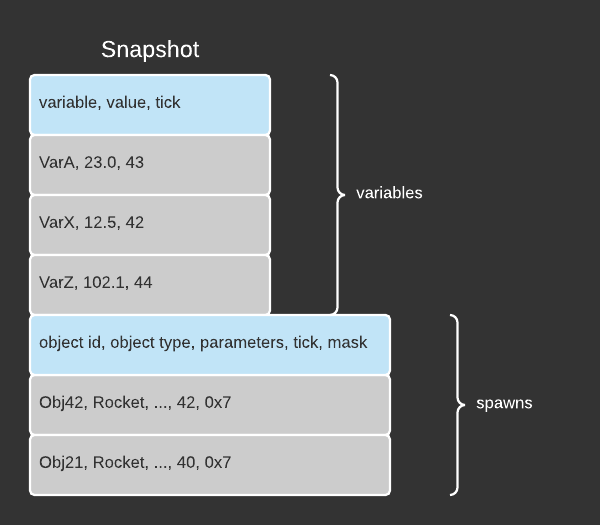
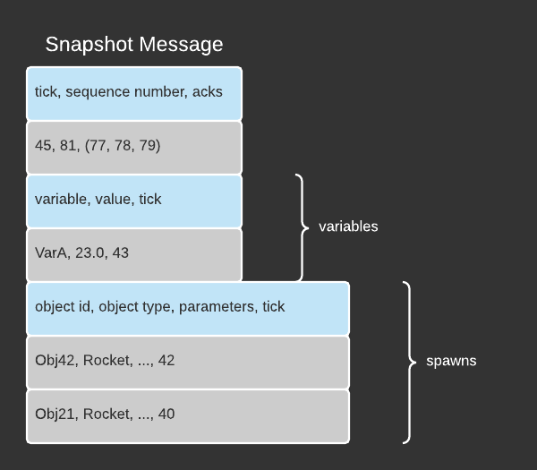
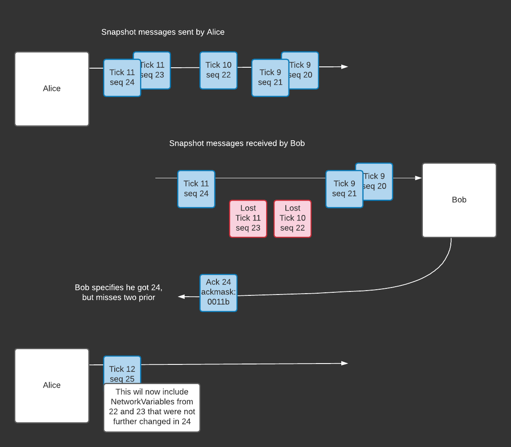

- Feature Name: `snapshot_system_spawns`
- Start Date: 2021-07-22
- RFC PR: [Unity-Technologies/com.unity.multiplayer.rfcs#0000](https://github.com/Unity-Technologies/com.unity.multiplayer.rfcs/pull/0000)
- Issue: [Unity-Technologies/com.unity.multiplayer#0000](https://github.com/Unity-Technologies/com.unity.multiplayer/issues/0000)

# Summary
[summary]: #summary

The Snapshot System will store state (NetworkVariable updates) and send them in blocks (called Snapshot Messages) at regular intervals (called ticks). The Snapshot System will also store events (Spawn commands, for example) and deliver them reliably.

This RFC covers a first usage of the Snapshot System for the first release. This first usage is for sending a first type of event: Spawn commands. Despawns commands will be handled the same way, but to keep the text easy to read, we'll write `spawn` to refer to either type.

Throughout this RFC, when we refer to time, we refer to Network Ticks. Those are described in the NetworkTime RFC

# Motivation
[motivation]: #motivation

The motivation for the Snapshot System are:

- Reducing and controlling bandwidth usage
- Leveraging unreliable channels
- Being more tolerant to packet loss
- Allowing good responsiveness even when there’s packet loss
- Interfacing with AoI
- Providing a foundation for future systems like rollback and replay
- Offering consistency between different features (you don’t update an object that is not spawned)


# Guide-level explanation
[guide-level-explanation]: #guide-level-explanation

### The Snapshot System

The `NetworkManager` will expose a `SnapshotSystem` via a public getter. Under normal operation, the existence Snapshot System should have no direct impact on game code. It should improve delivery and performance, but game code should not directly interact with it.

### The Snapshot data structure

Each machine will have a snapshot that captures, in-memory, the knowledge it has of various NetworkVariables values at specific ticks, and objects that were spawned. As shown below, a Snapshot will contain:
- NetworkVariables values at specific ticks
- Spawn commands, with all the spawn parameters, the tick and a bitmask of target connections 



### The Snapshot Message 

Machines will exchange Snapshot Messages. A Snapshot Message is nothing but a partial Snapshot (plus a header). Those messages will be used to synchronize the state and replicate events. Apart from containing less elements than Snapshots, the only difference between Snapshot Messages and Snapshot is that Snapshot messages don't need the bit mask for destination.

Additionally, a Snapshot Message will include a header that contains:
- a sequence number unique to this message
- the tick it was sent on
- acknowledgment for previous messages from this connection (in the form of a bitmask over the _n_ previous sequence numbers)



### Eventual Consistency

The model we will use for synchronisation is eventual consistency. Any Snapshot Message might be lost, but retransmits(1) will have the information eventually arrive to its destination. In the case of packet loss, some variables still get to update.

Dependencies between variable updates and spawning will be managed by the Snapshot System. You will only ever get updates to variables belonging to objects that were spawned. State information (NetworkVariable) is updated with latest available value, and intermediate values can be skipped. That happens, for example, if there's packet re-ordering in transit.

Event information (spawns) is guaranteed to be applied only once, and in order. 

(1) When we refer to retransmit, we mean that further Snapshot Messages will carry the same information again. Past Snapshot Messages will not be re-sent identically.

### Enabling Snapshot

Whether Snapshot is enabled or not, for NetworkVariables or Spawns, should have no visible impact to the user, apart for:
- bandwidth improvements
- delivery improvements
- consistency between delivery of NetworkVariable updates and Spawning

To enable or disable it, the following public variables will be offered in `NetworkConfig`:

```
public bool UseSnapshotVariable = false;
bublic bool UseClassicSpawn = false;
```

The first one will control whether NetworkVariables are sent via the Snapshot System or not, and the second one whether the Spawns are sent via the Snapshot System.

# Reference-level explanation
[reference-level-explanation]: #reference-level-explanation

### Guiding principles

The first guiding principle to introduce is that under normal operations **no** memory allocations are done at runtime, within the Snapshot System. Every buffer is pre-allocated when the Snapshot System is started. Provisioning is made for sending, for receiving, and for any internal processing.  

Another guiding principle is that the Snapshot System doesn't care whether we have a star topology, a full mesh, or anything in between. Rather it is only concerned about:
- The information it has about Variables and Spawns at various points in time
- Which information was acknowledged by each connection
- What information is received on a connection

We will still distinguish, in the description below, between:
- a machine that is connected to a single other. We'll call that a client
- a machine that is connected to many other machine. We'll call that a host

A third principle is to never try to capture the whole world state directly. It should be possible to query every variable at any tick, but it should not be necessary to deal with a message that contains all variables. Thus, at scale, NetworkVariables that are not touched are left out of the snapshots.

### Maintained data

In the example above, we'll assume two clients, Alice and Bob, connected to a host, Charlie.

In order to perform its job, the Snapshot System will maintain the following data: (the usage of this data will be presented later)

On hosts, only, for each connection (client):
- List of interesting objects (AoI-provided)

On all machines, for each connection:
- For each object: acknowledged spawned status, with tick.

    For example, Alice Client might know that object Rocket, spawned at tick 42, has been acknowledged by Charlie Host.
- Per variable: the acknowledged value, with tick.

    For example, Charlie Host might know that the variable RocketPosition, with specific value at tick 50, has been acknowledged by Alice Client.

On all machines, globally:

- Per object: the latest tick an object was spawned

- Per variable: the latest value and the tick it was modified

### Flows 

The following sections will elaborate on the inner workings of the Snapshot System by describing the operations it will perform at various points.

### - Variable updates and spawns

Whenever a NetworkVariable is modified, the value gets written in the Snapshot, with the current tick

Whenever an Object is spawned locally, the spawn command and its parameters are written in the Snapshot

### - Snapshot update

This part is host-specific. Area-of-Interest, AoI, is only used on the host.

At each network tick, the host will 

- For each connection
  - Make AoI an request for this connection
  - Compare the list of interesting objects with previous tick’s list
  - Filter (1) for objects to spawn
  - For any object newly spawned, add/update a SpawnCommand to the snapshot
  - For any object that became of interest, add a variable update to snapshot

For (1), above, a boolean in the config will offer the choice between two behaviours:
1. Always despawn objects as they become of non-interest
2. Simply skip updating the position of non-interest objects, but leave the object spawned

There's a trade-off between the two, memory usage versus CPU usage. As such, the game code knows best what works for them.

### - Snapshot Message sending

At each frame, each machine will:
- for each connection
  - Order the interesting variable update entries in the Snapshot by priority
  - Pick the spawn commands applicable to this connection (mask)
  - Fill Snapshot Message(s) up to MTU or desired bandwidth usage
  - Send Snapshot Message(s), including acks

An important note is that, here, the snapshot system applies a critical rule: No variable update gets in a message unless either:
1. The spawn was already ack’ed 
2. The unack’ed spawn command gets included in that message, too
 
Overall this approach is: pessimistically include un’acked spawns, add most recent variable updates, prioritized, while maintaining consistency.

To illustrate, the diagram below shows Alice and Bob exchange some Snapshot Message. This is for an hypothetical case where Alice needed to send multiple messages per tick, and where two messages were lost.




### - Snapshot Message reception

Upon receiving a Snapshot Message, the receiving machine will
- Apply (de)spawns if they were not already applied. That’s why we maintain the latest tick for each object. 
This introduces a limitation: the same object can’t be spawned and despawned on the same frame.

- Read, into the NetworkVariable, the received updates (in the long run, the NetworkVariable takes on interpolation responsibility, but this may not be in the next release)

- Read the acknowledgments. At this point, spawn commands that were acknowledged by all their target connections can be removed. The same goes for variable updates that have more recent ack’ed values.

### Delta encoding

This proposal put some importance on each machine keeping track of the acknowledged values of Network Variables. The reason for this is that NetworkVariables will use some form of delta encoding to minimize bandwidth usage. This is internal to the Snapshot System and still TBD, but worth mentionning.

### Implementation details

This section outlines the way Snapshot system will initially hook with the rest of Netcode for GameObjects, for the spawn part. It's not fully fleshes out, but it is intended to give the reader an idea of the inner workings. Nothing in this section is final, or authoritative.

`NetworkConfig.cs`
```
public bool UseSnapshotVariable = false;
bublic bool UseClassicSpawn = false;
```
to enable/disable SnapshotSystem for spawns and variable updates.

`NetworkObject.cs`
From `SpawnInternal()`, we'll add call into the Snapshot System, to save the spawn command.

From the Snapshot System, to spawn object received via Snapshot Message, we'll call into `SpawnManager.SpawnNetworkObjectLocally`.

# Drawbacks
[drawbacks]: #drawbacks

As a consequence of implementing the Snapshot System, there isn't a possibility of having different channels for different NetworkVariables. All the Snapshot Messages get sent on the same unreliable channel.

As previously mentioned, we also add the limitation of disallowing spawning and despawning the same object on the same Network Tick. 
 
