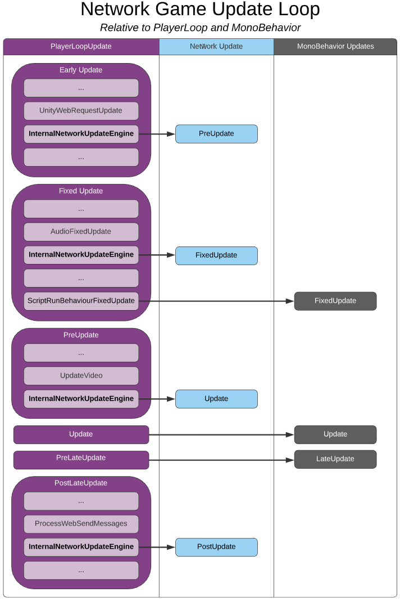
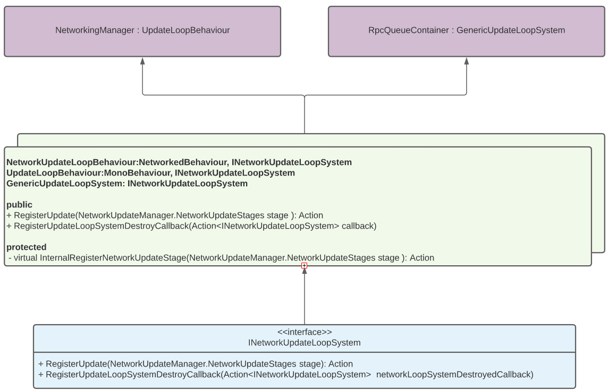

# RPC Processing Hook
[feature]: #feature

- Start Date: `2021-01-19`
- RFC PR: [#6](https://github.com/Unity-Technologies/com.unity.multiplayer.rfcs/pull/6) & [#10](https://github.com/Unity-Technologies/com.unity.multiplayer.rfcs/pull/10)
- SDK PR: [#477](https://github.com/Unity-Technologies/com.unity.multiplayer.mlapi/pull/477)

# Summary
[summary]: #summary

Often there is a need to update specific netcode related systems at intervals outside of the traditional Unity [`MonoBehaviour`](https://docs.unity3d.com/ScriptReference/MonoBehaviour.html) defined updates (FixedUpdate, Update, and LateUpdate).  It is proposed that a new set of updates are provided to netcode related systems in order to assure tasks that require a specific order of operations are executed prior to or after game logic ([`MonoBehaviour`](https://docs.unity3d.com/ScriptReference/MonoBehaviour.html)) related code is executed.  As such, it is proposed that a new method for registering and invoking actions that can occur outside of the traditional [`MonoBehaviour`](https://docs.unity3d.com/ScriptReference/MonoBehaviour.html) updates is implemented.

# Motivation
[motivation]: #motivation

While a [`MonoBehaviour`](https://docs.unity3d.com/ScriptReference/MonoBehaviour.html) derived class provides three different options of when to handle updates, there is a need to provide an alternate set of updates, that exist outside of the MonoBehavior realm, for current and future MLAPI systems.  The [`UnityEngine.LowLevel.PlayerLoop`](https://docs.unity3d.com/ru/2020.2/ScriptReference/LowLevel.PlayerLoop.html) class provides the ability to register new `PlayerLoopSystems` to be invoked at alternate engine-level update stages (i.e. `PlayerLoopSystem`) that can occur prior to, during, or after all of the standard update stages offered by a [`MonoBehaviour`](https://docs.unity3d.com/ScriptReference/MonoBehaviour.html) derived class.  This proposal is meant to further explore the potential opportunity to provide a new set of update stages within MLAPI as well as offer users the additional flexibility to provide their own set of network update logic and/or update actions  through the registration of an alternate network update engine.

# Guide-level explanation
[guide-level-explanation]: #guide-level-explanation

The Network Game Update Loop diagram below shows a comparison of the various update stages between PlayerLoop (full game loop), Network Updates (all network specific updates), and MonoBehavior (updates exposed to MonoBehavior children).  The proposed additional network update stages (PreUpdate, FixedUpdate, Update, and PostUpdate) provide this functionality:

(*Network*) **PreUpdate**: Things like network tickrate, transport event polling (if supported), and typically anything that requires “beginning of the frame” processing would be invoked at this stage.

(*Network*) **FixedUpdate:** Anything that needs to update before any [`MonoBehaviour.FixedUpdate`](https://docs.unity3d.com/ScriptReference/MonoBehaviour.FixedUpdate.html) call is made would occur at this stage (i.e. updating values of rigid bodies could happen here).

(*Network*) **Update**:  Anything that needs to be updated/processed before any [`MonoBehavior.Update`](https://docs.unity3d.com/ScriptReference/MonoBehaviour.Update.html) call is made would occur at this stage (i.e. updating values to systems that might be used prior to any system dependent MonoBehaviour child is updated).

(*Network*) **PostUpdate**: Things like sending out queued messages, getting the results of a batched job (i.e. snapshots or the like) would occur here.

*The original implementation only allowed for a single method to be registered per stage via the `InternalNetworkUpdateEngine` (legacy) format.  This had limitations to its design, and as such it was proposed to further extend this functionality to any [`INetworkUpdateLoopSystem`](https://github.com/Unity-Technologies/com.unity.multiplayer.mlapi/blob/develop/com.unity.multiplayer.mlapi/Runtime/Core/NetworkUpdateLoopSystem.cs) such that any class could register for any of the new network update loop stages.*

# Reference-level explanation
[reference-level-explanation]: #reference-level-explanation
In order to provide a more modular mechanism for registering with the network game update loop system, it is proposed that a new [`INetworkUpdateLoopSystem`](https://github.com/Unity-Technologies/com.unity.multiplayer.mlapi/blob/develop/com.unity.multiplayer.mlapi/Runtime/Core/NetworkUpdateLoopSystem.cs) interface be used to define the underlying methods that would be used for this process.

Where the RegisterUpdate method is called for each of the four new network loop update stages (PreUpdate, FixedUpdate, Update, and LateUpdate).  The class that defines the RegisterUpdate method would either return an action for the update stage in question or null for no updates during the stage being queried for registration.  This approach not only provides a wider area of coverage (i.e. any class could register), but it also provides the ability to not register thus not adding the additional overhead of invoking an action for a stage not being used by the class.

The class defined below provides one potential way to both define the [`INetworkUpdateLoopSystem`'s](https://github.com/Unity-Technologies/com.unity.multiplayer.mlapi/blob/develop/com.unity.multiplayer.mlapi/Runtime/Core/NetworkUpdateLoopSystem.cs) methods while providing additional class relative helper methods for registering and deregistering from the network update loop system.

Both the `RegisterUpdate` and the `RegisterUpdateLoopSystemDestroyCallback` methods are called by the [`NetworkUpdateManager`](https://github.com/Unity-Technologies/com.unity.multiplayer.mlapi/blob/develop/com.unity.multiplayer.mlapi/Runtime/Core/NetworkUpdateManager.cs) during the registration process.  Below is a diagram to help better understand the network update loop system registration process:

1. Class instance registers with the NetworkUpdateMananger.
2. During registration, the [`NetworkUpdateManager`](https://github.com/Unity-Technologies/com.unity.multiplayer.mlapi/blob/develop/com.unity.multiplayer.mlapi/Runtime/Core/NetworkUpdateManager.cs) calls the class instance’s `RegisterUpdate` method that will either return null or an Action to be registered for the particular update stage in question.  (*the diagram above shows only the Update and LateUpdate were registered for example purposes*)
3. If any update stage was registered, then the [`NetworkUpdateManager`](https://github.com/Unity-Technologies/com.unity.multiplayer.mlapi/blob/develop/com.unity.multiplayer.mlapi/Runtime/Core/NetworkUpdateManager.cs) will invoke the class instance’s `RegisterUpdateLoopSystemDestroyCallback` method passing the callback action to be invoked upon the class instance being destroyed or if the class instance just wants to remove itself from the network update loop system stages.
So, any [`INetworkUpdateLoopSystem`](https://github.com/Unity-Technologies/com.unity.multiplayer.mlapi/blob/develop/com.unity.multiplayer.mlapi/Runtime/Core/NetworkUpdateLoopSystem.cs) derived class can opt to register or deregister from network loop update stages during runtime.  This can be useful if a network object has associated [`INetworkUpdateLoopSystem`](https://github.com/Unity-Technologies/com.unity.multiplayer.mlapi/blob/develop/com.unity.multiplayer.mlapi/Runtime/Core/NetworkUpdateLoopSystem.cs) based components and is not considered ‘active’ but is still considered enabled.  Under this situation, one could deregister the [`INetworkUpdateLoopSystem`](https://github.com/Unity-Technologies/com.unity.multiplayer.mlapi/blob/develop/com.unity.multiplayer.mlapi/Runtime/Core/NetworkUpdateLoopSystem.cs) based components to be removed from any network loop system update stages until the network object becomes activated (“active”) again.  The registration and deregistration process provides runtime control over when the network update stages for a specific class will be invoked.  Under other circumstances, one might want to register for only specific network loop update stages depending on certain events or states.  This too can be accomplished by simply deregistering (if already registered) and then re-registering with the new update stages.

Currently, the [`NetworkingManager`](https://github.com/Unity-Technologies/com.unity.multiplayer.mlapi/blob/develop/com.unity.multiplayer.mlapi/Runtime/Core/NetworkingManager.cs) and the [`RpcQueueContainer`](https://github.com/Unity-Technologies/com.unity.multiplayer.mlapi/blob/develop/com.unity.multiplayer.mlapi/Runtime/Messaging/RPCQueue/RPCQueueContainer.cs) derive from two predefined [`INetworkUpdateLoopSystem`](https://github.com/Unity-Technologies/com.unity.multiplayer.mlapi/blob/develop/com.unity.multiplayer.mlapi/Runtime/Core/NetworkUpdateLoopSystem.cs) derived classes (`UpdateLoopBehaviour` and `GenericUpdateLoopSystem`).

**NetworkingManager:** Now derives from the `UpdateLoopBehaviour` and registers for the following network update loop stages:
1. **PreUpdate:** Transport event polling occurs here
2. **Update:** The remainder of the [`NetworkingManager's`](https://github.com/Unity-Technologies/com.unity.multiplayer.mlapi/blob/develop/com.unity.multiplayer.mlapi/Runtime/Core/NetworkingManager.cs) update occurs here.

**RpcQueueContainer:**  Now derives from the `GenericUpdateLoopSystem` and registers for all network update loop stages:
1. **PreUpdate:**  RPCs registered to be invoked at this stage will be invoked.
2. **FixedUpdate:**  RPCs registered to be invoked at this stage will be invoked.
3. **Update:**  RPCs registered to be invoked at this stage will be invoked.
4. **LateUpdate:**  RPCs registered to be invoked at this stage will be invoked.
5. **LateUpdate:**  Outbound RPCs queued for sending will be batched and sent at this stage

**Invoking RPCs at specific Network Update Loop Stages:**
While there are many future possibilities for this new feature, one of the several driving purposes for this added capability was to provide an intuitive way to invoke RPCs at specific stages during runtime (i.e. dynamically).  In order to accomplish this, the network update loop registration process needed to be enhanced (as explained above) and some minor adjustments to the RPC send parameters were needed.

In order to specify what network update stage one might want an RPC to be invoked, adding the [`ServerRpcParams`](https://github.com/Unity-Technologies/com.unity.multiplayer.mlapi/blob/develop/com.unity.multiplayer.mlapi/Runtime/Messaging/RpcParams.cs) or [`ClientRpcParams`](https://github.com/Unity-Technologies/com.unity.multiplayer.mlapi/blob/develop/com.unity.multiplayer.mlapi/Runtime/Messaging/RpcParams.cs) as the last RPC method’s parameter and setting the UpdateStage is all that is needed:

The above code snippet shows that the `ServerRpc`, `UpdateMyRigidBodyPosition`, will be invoked during the network FixedUpdate stage when invoked on the receiver side (in this case the server).  The class containing the Rpc method itself does not need to be registered with the [`NetworkUpdateManager`](https://github.com/Unity-Technologies/com.unity.multiplayer.mlapi/blob/develop/com.unity.multiplayer.mlapi/Runtime/Core/NetworkUpdateManager.cs) as the [`RpcQueueContainer`](https://github.com/Unity-Technologies/com.unity.multiplayer.mlapi/blob/develop/com.unity.multiplayer.mlapi/Runtime/Messaging/RPCQueue/RPCQueueContainer.cs) handles this portion of the RPC invocation process.
# Drawbacks
[drawbacks]: #drawbacks

This feature does expose the potential for improper usage that could lead to elongated processing times in areas that could impact the over-all system performance.  Although, this same issue holds true for many game engine technologies.  This can be mitigated through clear documentation with appropriate warnings regarding usage where applicable.

# Rationale and alternatives
[rationale-and-alternatives]: #rationale-and-alternatives

Since multiplayer/netcode architectures have, up until more recently, not evolved with the rest of the Unity Technologies, there are not many alternative paths that can offer alternate update callbacks outside of the Monobehaviour scope.

# Prior art
[prior-art]: #prior-art

N/A

# Unresolved questions
[unresolved-questions]: #unresolved-questions

- What parts of the design do you expect to resolve through the RFC process before this gets merged?
- What parts of the design do you expect to resolve through the implementation of this feature before stabilization?
- What related issues do you consider out of scope for this RFC that could be addressed in the future independently of the solution that comes out of this RFC?

# Future possibilities
[future-possibilities]: #future-possibilities

### AtomicNetworkTether (ANT)

The ANT would derive from the [`NetworkUpdateLoopBehaviour:MonoBehaviour, INetworkUpdateLoopSystem`](https://github.com/Unity-Technologies/com.unity.multiplayer.mlapi/blob/develop/com.unity.multiplayer.mlapi/Runtime/Core/NetworkUpdateLoopSystem.cs)  class which would provide both the basic [`MonoBehaviour`](https://docs.unity3d.com/ScriptReference/MonoBehaviour.html) functionality and further automate the Network Update Loop system registration process for any ANT derived child classes.  From an ease of use perspective, registration would only require one to override the `InternalRegisterNetworkUpdateStage` (name would most likely change) and to return Actions for any update stages that the ANT child class instance needs to perform its function.

Since a [`NetworkedObject`](https://github.com/Unity-Technologies/com.unity.multiplayer.mlapi/blob/develop/com.unity.multiplayer.mlapi/Runtime/Core/NetworkedObject.cs) or [`NetworkedBehaviour`](https://github.com/Unity-Technologies/com.unity.multiplayer.mlapi/blob/develop/com.unity.multiplayer.mlapi/Runtime/Core/NetworkedBehaviour.cs) would be children of ANT, they would become more closely knit into the network loop update system itself.  This would provide users with a whole new set of updates that network game/entity objects could leverage from.  Since Job's can be kicked off at any time during any of the network update stages, network based job systems could  be designed such that any ANT derived class could register for specific "network related" job queues that could be processed throughout the `PlayerLoop` (i.e. provide a "Network Lerping" job queue that any NetworkedObject could "subscribe" to). 

This type of functionality could lead to a "network job queue module" that provided the means to creating customized network job queue modules.  In the likeness of a GPU shader that receives data in byte streams and has access to video memory, network job queue modules could have access to the "network frames or snapshot frames" as well as any byte streams (native arrays) with associated data structures to parse the byte streams with.  

### Separating Network Update Loop from RPC Processing Hook

Currently, this RFC is proposing a design to hook RPCs to be processed at specific stages. However it also suggests a mechanism to inject methods into Player Loop to enable that functionality. Network Update Loop design could be separated, refactored and treated as a standalone feature on its own.
