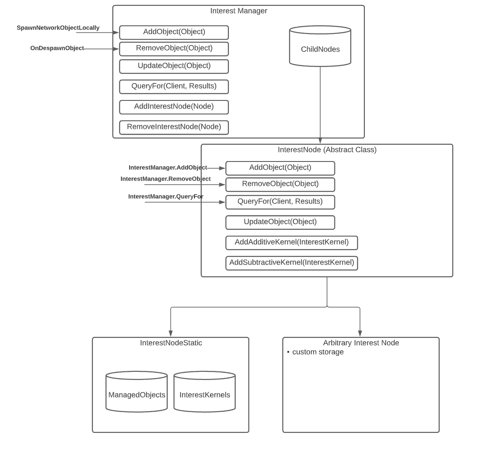

* Feature Name: `interest-management`
* Start Date: 2020-05-11
* RFC PR: TBA
* Issue: TBA0

# Summary
[summary]: #summary
This RFC proposes an interest management system to help MLAPI support greater scale in games.  It is sometimes conceptualized as an 'AOI' (Area of Interest) system, but goes beyond that in also providing support for later elements such as prioritization.

# Motivation
[motivation]: #motivation

In the existing MLAPI Interest system, every networked object (i.e. `NetworkedObject`) stores a list of all clients that can see that object (in the variable `observers`).  In the default case, every object stores a list of all connected clients.  This creates some scalability problems

* Every client has to be checked against every object
* Storage: every object has to store a list of all clients
* Updating: every time a client joins / leaves, every object must be scanned and modified

For example, a leading FPS game begins with around 100 clients and 50,000 replicated objects.  With the current scheme, one would need to store 20 MB of client / object data and do 50,000*100 = 5 million client/object checks each tick.


## Desired Outcome

What we instead would like to achieve:

* We want to minimize the computational per-frame work.  As the library walks through its connected clients, we want a system that will efficiently answer the question 'which objects should this connection see'
* Therefore, we desire an interface that takes in a connection and returns the objects for that client
* We want the way this question is answered to be user-extensible to support all kinds of different scenarios.  Domain decomposition / geometric / AOI is very common, but we also want developers to be able to come up with creative, game-specific **schemes** that have nothing to do with spatial relationships
* We want the aforementioned schemes to be composable.  For instance, a user should be able to have both a AOI scheme and a "always synchronize players who are in the same cohort" scheme and have the results from each efficiently combine
* Each scheme should be free to decide how to implement relationships; so long as the scheme can take in a client and return a set of objects it should be free to come up with that answer using whatever storage and computation it wants
* Each scheme can therefore decide at what cadence it does its work.  A scheme can choose to dynamically come up with an answer every frame.  Or, it could return cached results each time except every 30th frame.
* We also want a means for code outside the scheme to be able to trigger an update.  That is, there are times when it's best for the scheme itself to know when it's time to do things like the cache/compute decision, but then there are other times when game code outside the Interest System knows better that it's time for the scheme to adjust itself

# Guide-Level Explanation

The interest system consists of 5 main components:



## Components
### 1. `InterestManager`

There is one and only one `InterestManager` per `NetworkManager`.  It is defined / setup / torn down just like the many other "managers" in `NetworkManager`.  It has the following jobs:


* It maintains a list of `InterestNodes` which implement the 'schemes' described above
* Via the `QueryFor()` method, it is the entry point for getting the "which objects for this client" answer.  It is designed such that, if a user does not implement any schemes it produces the same result as if there was no interest system (e.g. all clients get all objects)
* It listens to all MLAPI object spawns / de-spawns so that it can tell associated the `InterestNodes` (see below) it manages about them.  Logic for this lives in `AddObject()` and `RemoveObject()`, which are linked to via `NetworkSpawnManager's`  `SpawnNetworkObjectLocally()` and `OnDespawnObject()` methods respectively

### 2. `InterestNode` (abstract class, scriptable object)

The core interest scheme functionality happens here in derivations of `InterestNode`  Its jobs are to:

* return its results in for the per-connection queries that come in from the `InterestManager`
* respond to `AddObject` / `RemoveObject` from `InterestManager`.  How it responds to this is totally up to the node, as illustrated in examples below
* respond to `UpdateObject` calls when came code wants to make specific triggers to the node
* Multiple `InterestNode`s can be instantiated of the same kind with different settings.  For instance, one could define a Radius-based node with a value of 10 for shotgun shell casings (only interesting if you're very close by) but 100 for rockets.

#### 2A. `InterestNodeStatic` (derived from `InterestNode`)
This is a special verson of `InterestNode` that adds 2 special capabilities

* It has bulit-in storage for the objects it manages.  That is, implements `AddObject` / `RemoveObject` for you and stores / removes the corresponding object in its own store.  As we will see later, if you want to devise your own storage means (e.g. for a graph-based node) instead override the `InterestNode`
* It has a framework for adding one or more `InterestKernels`.  These are simple functions that will be called in succession in the `QueryFor` call.  If no `InterestKernels` are implemented, then all the nodes that have been added (and not removed) are returned in the query.
   * one might wonder "why the separation between `InterestNode`s and `InterestKernels`?"  Consider the classic case where, for a given prefab we want to consider it relevant if it is within a given radius and on the same team as the querying connection's object.  If we implemented this with 2 `InterestNodes` both associated with the prefab, then the storage for both `InterestNodes` would be unnecessarily duplicated - both nodes would be tracking all the same objects that came in via `AddObject` / `RemoveObject`.  By keeping the kernels separate from the storage we can have the same storage shared with any number of kernels
   * one might wonder, why not also have `InterestKernels` in non-`InterestNodeStatic` nodes?  They too will have some kind of kernel running.  And the answer (currently) is that, in practice, these non-`InterestModeStatic` nodes should work as a dispatch (e.g. a Graph node that dispatches to the correct graph cell - which itself should be a `InterestNodeStatic` node - example shown later).

### 3. `InterestKernel` (scriptable object)
As described above, this is where the user expresses the computation that happens in a `InterestNodeStatic` node.  It is a class (so that it can be Scriptable Object-instantiated) with one function to override, `QueryFor`, which takes in the `NetworkClient` and object under consideration and returns the answer in the same hashset format as the other queries.

### 4. `InterestSettings`
This is the least-developed component and doesn't have any settings in it as of this writing, but it is a placeholder for per-`InteresNode` settings that are not specific to any particular `InterestNode`.  For later when prioritization is added this is where we can place data that prioritization system uses when considering results from this node.

## Integration Points
Apart from the spawn / de-spawn connections mentioned above, the `InterestManager` integrates with the rest of the library in 2 places:

* In `NetworkBehaviour::NetworkBehaviourUpdate()`. In the loop over clients the `InterestManager` is queried resulting in a list of objects.  Then this list is iterated over as the library prepares to transmit variable updates to the client.  This is basically a filter on top of the existing mechanism which updates all variables unconditionally
* When RPCs are sent from the server, the library queries the `InterestManager` to get a list of objects that a given client can see, so that it can then determine if the object associated with the RPC is relevant to the client. 


## Sample 1: Creating a Radius-based Node 

Let's walk through a sample.  We will establish a node, then a kernel, then associate the kernel with the node and the node with a prefab.  For context while we're here, let's just look at an abbreviated version of the code for `InterestNodeStatic`:

```
public class InterestNodeStatic : InterestNode
{
    public List<InterestKernel> InterestKernels = new List<InterestKernel>();

    // these are the objects under my purview
    protected HashSet<NetworkObject> ManagedObjects;

    public override void AddObject(in NetworkObject obj)
    {
        ManagedObjects.Add(obj);
    }

    public override void RemoveObject(in NetworkObject obj)
    {
        ManagedObjects.Remove(obj);
    }

    public override void QueryFor(in NetworkClient client, HashSet<NetworkObject> results)
    {
        if (InterestKernels.Count > 0)
        {
            foreach (var obj in ManagedObjects)
            {
                foreach (var ik in InterestKernels)
                {
                    ik.QueryFor(client, obj, results);
                }
            }
        }
        else
        {
            results.UnionWith(ManagedObjects);
        }
    }
}
```

As we described earlier, this node maintains its own storage for the objects it tracks (`ManagedObjects`).  When it is told one of its associated objects is added, it simply adds it to its storage and vice versa when an object is going to be deleted.  At query time, if we have no kernels we simply merge the results passed in from the other clients with all the objects we manage and do no other computation.  Otherwise we invoke our kernel(s) and merge in those results.

A default instance of this node, by the way, is instantiated in the `NetworkingManager` and is where objects go that have no associated `InterestNodes`.

Now let's author the `RadiusInterestKernel`.  Actually, this file is included but let's look at its implementation:

```
public class RadiusInterestKernel : InterestKernel
{
    public float Radius = 0.0f;
    public override void QueryFor(in NetworkClient client, in NetworkObject obj, HashSet<NetworkObject> results)
    {
        if (Vector3.Distance(obj.transform.position, client.PlayerObject.transform.position) <= Radius)
        {
            results.Add(obj.GetComponent<NetworkObject>());
        }
    }
}
```
Here, we have a `Radius` variable.  When we instantiate this kernel as a scriptable object we then can enter in the desired radius _for this instance_.  

The `InterestNodeStatic` calls `QueryFor` as the inner function as it iterates over its managed objects.  Then this kernel simply measures the distance between the object and the client.  The results then have the per-client-custom result of objects that are within a desired radius. 

**Note**: `InterestKernels` are implemented as `ScriptableObjects`.  This allows the user to create multiple instances of them in the editor but with different parameters (e.g. a different radius for each).  More on that as we go through the example.

## How the `InterestNode`, `InterestManager`, `InterestKernels` and Prefabs relate & connect

Ok, now that we have the node and the kernel, let's see how they associate with objects in the actual game.  

1. As nodes are `ScriptableObjects`, the first step is to create the Nodes in the editor.  In this case, you would do *Assets->Create->Interest->Nodes->Static*.  Now we have a blank node.  Note, other user-defined nodes would appear hear if they are annotated with the corresponding `CreateAssetMenu`.


2. Now let's instantiate a `InterestRadiusKernel`:  *Assets->Create->Interest->Kernels->Radius*.  Then click on this newly created Radius node in the inspector and configure its radius, say, to **3**.


3. Now we need to associate this node from step 1 with a prefab that has a `NetworkObject` element.  We drag this `InterestNode` into the `InterestNodes` section.  Now, any time this prefab is instantiated it will be associated with this node.  Note, you can associcate a prefab with more than one `InterestNode`.  This may seen unnecessary since a node can have more than one kernel.  On the other hand, you might want to have a combination of one node that is a `InterestNodeStatic` with 1 or more kernels AND a custom `InterestNode` with its own storage.

***Image needs to go here***


Now that we understand how `InterestNodes` register with prefabs, we can understand how the `InterestManager` can deal with them.  When the `InterestManager's` `AddObject()` method is called, it looks to see which `InterestNodes` are associated with the object being spawned.  If none are associated, then it goes into the default `m_DefaultInterestNode` node mentioned earlier; that is, if you don't register a prefab with an `InterestNode` then it will always be relevant to all connections.  However if there is one or more `InterestNodes`, then:

1. The `InterestNodes` are told about the added object, and
2. The `InterestManager` adds this new `InterestNode` to its children


## Sample 2: Creating a custom storage arrangement
_Note, this example exists in the `InterestTests.cs` unit test file_

Let's now imagine that we want to have an arrangement where a scheme as simple as in `InterestNodeStatic` isn't sufficient; that is, we want to customize the storage scheme.  Say we break the game playfield into a 100x100 grid (10,000 cells).  We would hope to have these characteristics:

* When it's time to find the objects that a connection can see, we want to very quickly get a 'cached' set of objects in the same cell as the player; we want to simply skip all the other 9,999 cells.
* We want the game developer to be able to choose how and how often (if ever) that objects are re-assigned to different cells

Without building a full on graph system, we'll use a little bit of imagination and an **odds and evens** setup.  That is, instead of distributing items into cells, we'll simply distribute them by mod-ing their network id.  Odd-numbered objects will go in the odd bucket, and vice versa.  Then our query will, given an odd-numbered player return the odd objects and vice versa.

As before let's start with our node, `OddssEvensNode`, which implements `InterestNode`.  Let's look at the methods gradually

```
public class OddsEvensNode : InterestNode
{
        private InterestNodeStatic m_Odds;
        private InterestNodeStatic m_Evens;
        
        public override void AddObject(in NetworkObject obj)
        {
            if (obj.NetworkObjectId % 2 == 0)    m_Evens.AddObject(obj);
            else                                 m_Odds.AddObject(obj);
        }

        public override void RemoveObject(in NetworkObject obj)
        {
            if (obj.NetworkObjectId % 2 == 0)    m_Evens.RemoveObject(obj);
            else                                 m_Odds.RemoveObject(obj);
        }
        // ...
```
Here we see that the node implements its two 'buckets' as 2 `InterestStaticNodes`.  The analog in a grid example is where `m_Evens` and `m_Odds` would be cells in the grid.

Remember, in their default form (with no kernels) these nodes simply store and return the objects they manage.  As you can see, we just look at the object to be added / removed and place it into / remove it from the correct bucket; again, the analogy with a grid would be we are placing those objects in the right (initial) grid spot.  Now let's look how this serves to make queries efficient:

```
        public override void QueryFor(in NetworkClient client, HashSet<NetworkObject> results)
        {
            // if a client with an odd NetworkObjectID queries, we return objects with odd NetworkObjectIDs
            if (client.PlayerObject.NetworkObjectId % 2 == 0)  m_Evens.QueryFor(client, results);
            else                                               m_Odds.QueryFor(client, results);
        }
```

Now at query time, we are - with no calculation - returing the appropriate results - the odd entries are returned when queried by an odd client and vice versa.  Compare this to the radius example where each query we needed to do a per-object radius calculation.  

One running theme here is to give the users the ability to strategize about how to do the minimum calculations needed.  We did the calculation once at storage time.  And in this case, since network id's never change, it's a safe assumption and we can then much more quickly return the correct odd / even result.

But now let's say the network id of objects *can* change, however it's infrequent.  What's more, the game code knows when this happens to which object.  We can implement that simply with the `UpdateObject` method

```
        public override void UpdateObject(in NetworkObject obj)
        {
            RemoveObject(obj);
            AddObject(obj);
        }
```

Here, the game code can call into the node itself and pass in the changed object.  Here we chose to simply remove it from itself and re-add it, letting the standard processing to determine which bucket it goes in take place.

With this in mind we can think about the analogues in the more realistic graph node example

* in the same way, objects move around from cell to cell.  However, we don't want the Interest Node to have to re-scan all the objects every frame to re-assign them to the proper graph.  We assume the user code will likely know more about when these things happen (e.g. an object teleports instantly).  OR, we imagine the developer will want to strategize; if a player is subscribed as is common to a cluster of overlapping cells with objects sometimes belonging to > 1 cell, then - assuming max object velocity is taken into account - one can safely re-scan objects into cells much, much less often then every frame
* Developers have the option to avoid every re-scanning some objects at all.  Say we have a 'tree' prefab and an associated grid node associated with it.  The developer could:
  * make a special `InterestedGraphNodeDormant` or other that has no `UpdateObject` body, and/or
  * in its own code simply know what objects never need to be updated and not call `UpdateObject` on them.


# FAQ

## Why can one associate more than one `InterestNode` with a prefab?

Let's imagine you're setting up your player's prefab.  Say you want players can see other players if they're some distance away using a dispatched / custom storage like the second example.  But let's say we also want to enable players to see other players who are on the same team, regardless of distance.  You could write a special `RadiusOrTeam` combination node that does both.  For better re-use, however, the system allows one to add more than one node; in this case you would have a `GraphInterestNode` *and* a `TeamInterestNode`.  Then, when the query happens on player prefabs the result from both nodes is merged


# Drawbacks
- The U/X is a bit cumbersome in the `InterestNodeStatic` case in that you must create a node, then create the kernel and then associate both to the prefab

# Prior art

# Unresolved questions
- as an alternative to having storage of nodes under management in `InterestNodeStatic`, what about an API change to allow a node to simply get access to all spawned objects?
- or, put another way, should the Interest System become the single source of truth for `SpawnManager.SpawnedObjects`?
- What happens if we want to re-bind a node?  That is, if initially a player is a type *Player*, but then the player dies and is now type *Corpse* which has different relevancy and replication needs?
- rather than merge `HashSets`, should we return lists of lists?  Matt has attempted to do high-resolution timing of very high (10,000+ objects and 1000s of nodes) and has seen very little time consumed, but needs to fully validate the compiler isn't eliding results or the timing isn't faulty
- the binding of RPC sends is work that remains.  It may be clunky to use the current interface to find if a RPC message going from A to B should be transmitted if it means getting a list of objects from A and seeing if 'B' is in it.
- Some have suggested caching be built into the Interest System.  There already is caching for the objects being managed, but we might consider to have each node cache results from previous queries with the option to dirty it.

# Future possibilities / Work to do
- should attempt to replace the `NetworkShow()` / `NetworkHide()` with this framework
- should prototype a basic `InterestNodeGraph` to add to the samples
- In similar systems, replication parameters and settings are also bound to these nodes.  Here I have just put in a placeholder for settings.  But there is an open question as to whether the Interest System should simply return whether an object is in or out OR return a 'strength' (how relevant) score along with 'in' results so that a prioritization system could then sort / act on these scores.  For example with the `Radius` example, if the computed distance was returned in the results with the object the prioritization system could make sure near objects are more likely to go out than further ones without having to repeat the radius calcuation.
