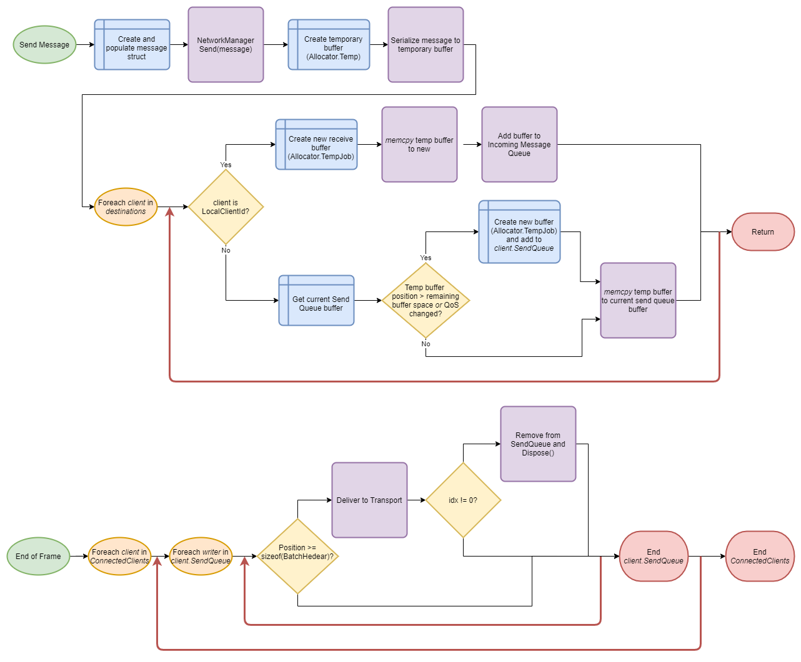
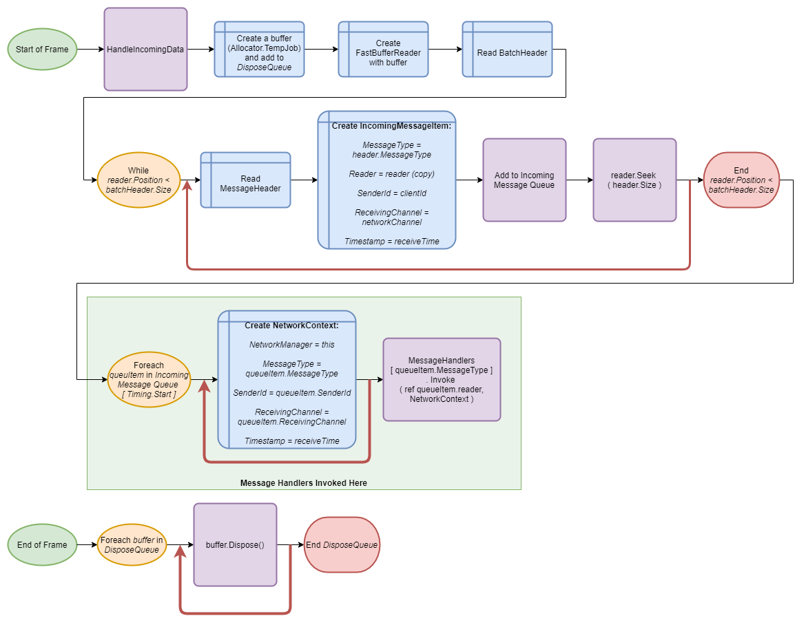

# Zero-Alloc Messaging Flow

[feature]: #feature

- Start Date: `2021-07-12`
- RFC PR: [#29](https://github.com/Unity-Technologies/com.unity.multiplayer.rfcs/pull/29)
- SDK PR: [#0000](https://github.com/Unity-Technologies/com.unity.multiplayer.mlapi/pull/0000)

# Summary

[summary]: #summary

This feature builds upon the fast zero-alloc serialization detailed in 0026-serialization.md to describe the ways those serializers are used to create an efficient, easy-to-use, and easy-to-understand approach to messaging. Just as with serialization, the goals of the zero-alloc message flow are that it is:

- Fast
- Allocation-free
- Consistent
- Debuggable
- Transparent (that is, easy for end users to follow and understand)
- Maintainable
- Future-ready (i.e., for jobs)

# Motivation

[motivation]: #motivation

This is both a performance and architectural change to MLAPI. Currently, sending a message passes through a number of steps that can be difficult to follow for an unfamiliar user - the message is first serialized (and serialized differently depending on whether it's going to another node or going to the inbound queue), placed into the MessageQueueHistoryFrame as a buffer, then later deserialized, modified, and reserialized in a different format. The serialization itself is also sometimes spread out throughout the code base - one function serializes some of it, then calls another function that adds more to it, and so on. All of this comes at the cost that users unfamiliar with the code base can have a difficult time following the path a message takes or understanding what is (or should be) in the buffer in order to debug it.

This feature will rethink the whole flow of sending a message, from the beginning (defining messages) all the way through serializing, batching, sending, deserializing, and handling messages.

# Guide-level explanation

[guide-level-explanation]: #guide-level-explanation

## Defining Messages

Messages in MLAPI are represented in-memory using structs containing, as much as possible, only unmanaged POD. Each struct must implement the IMessage interface, which is defined as follows:

```C#
interface IMessage
{
    enum MessageType
    {
        //...
    }

    // Returns the type of the message, used in automatic message header generation
    MessageType MessageType { get; };

    // Serialize to a buffer
    void Serialize(ref FastBufferWriter writer);
}
```

Additionally, each message should have a method associated with it it as follows:

```c#
[MessageHandler(IMessage.MessageType.MyMessageType)]
static void Receive(ref FastBufferReader reader, NetworkContext context);
```

This static method is responsible for constructing an instance of the received type and handling it. The `[MessageHandler]` attribute statically registers this handler to be responsible for this type via ILPP code generation, just like `[ServerRpc]` and `[ClientRpc] `. This method does NOT have to be part of the message struct - it can be anywhere, it just has to *exist*; however, making it part of the message struct consolidates all the code related to serializing and deserializing the struct into one location so it's easy to view both ends in the same place, and so by convention, we will make it part of the struct.

Handling will be put in its own method so that it's separate from deserialization, which is important in efficient handling of loopback messages.

The second parameter, `NetworkContext`, looks like this:

```C#
ref struct NetworkContext
{
    public NetworkManager NetworkManager;
    public IMessage.MessageType MessageType;
    public ulong SenderId;
    public NetworkChannel ReceivingChannel;
    public float timestamp;
}
```

More information may be added to `NetworkContext` as necessary.

Serialization and deserialization follows the guide in 0026-serialization.md.

# Reference-level explanation

[reference-level-explanation]: #reference-level-explanation

## Messages

When sending messages, instead of working directly with buffers, messages are created on the stack as struct instances, populated with data, and then serialized to the buffer from there. There are a few reasons for doing it this way:

- The primary reason is readability and maintainability. Putting all the code related to serializing, deserializing, and handling a message in one place makes it easy to understand how that message works. Building the message as a struct, which should match the network transfer format as closely as possible, makes it easy to understand what the data going across the wire will look like.
- The secondary reason is performance - structs can be created on the stack with no heap allocations, and with FastBufferWriter and FastBufferReader, they can be rapidly serialized as whole units.
- The third reason is easier debugging - for situations where a lot of packed integers are being used, a preprocessor flag can be used to switch between optimal byte packing and simple whole-struct serialization. At debug time, when there's no dynamic data involved, the buffer in a reader or writer can be simply cast to the desired type by adding a watch of `*(MessageType*)reader.GetUnsafePtrAtCurrentPosition()`
- The fourth reason is to improve the interface by which messages are sent - instead of needing a Begin...() to add header information and an End...() to perform sending logic, MessageQueueContainer now simply has `public void SendMessage<TMessageType>(in TMessageType message) where TMessageType: IMessage{}`, which can handle both responsibilities, as well as message batching responsibilities, all in one location.

## Message Header

Each message sent will be prepended with a standardized message header, which is also represented as a struct with the following data:

```c#
struct MessageHeader
{
    // Sized 1 byte
    public MessageType MessageType;
    // Sized 1 byte
    public NetworkChannel NetworkChannel
    // Sized 2 bytes
    public short MessageSize;
}
```

Since the largest value is 2 bytes in size, the struct should be aligned to a 2 byte alignment, which should make the struct packed and the total header size equal to exactly 4 bytes, which can be sent and received using `WriteValue` and `ReadValue` without any wasted bandwidth.

In addition to the message header, there's also a batch header:

```C#
struct BatchHeader
{
    // Sized 2 bytes
    public ushort BatchSize;
}
```

### Message timing

Based on issues we've seen with UpdateStage recently, rather than the current support for sending messages to be executed at any time in the frame, we will change network processing to always process messages during `EarlyUpdate` and remove `UpdateStage` from both the internal and RPC interfaces.

For situations where a message needs to be processed at a certain stage, the following utility class is added to be utilized on the client side rather than dictated on the server side:

```C#
public class DelayUtility
{
    public enum DelayStage: byte
    {
        PreFixedUpdate = NetworkUpdateStage.FixedUpdate,
        PreUpdate = NetworkUpdateStage.Update,
        PreLateUpdate = NetworkUpdateStage.PreLateUpdate,
        PostLateUpdate = NetworkUpdateStage.PostLateUpdate
    }

    public delegate DelayedNetworkAction();

    public void DelayUntil(DelayStage stage, DelayedNetworkAction callback);
    
    // Returns true if processing should be delayed, false if the specified stage is the current stage
    // and thus the message should be processed.
    public bool DelayMessage(DelayStage stage, ref FastBufferReader reader, NetworkContext context);
}
```

During each of those three stages, we'll process any delayed queues.

This uses a static queue of (configurable) fixed size per DelayStage value, so no allocations will be incurred in the queueing itself, **however, generally speaking, in the first version, creating delegates will cause an allocation.** There's no real way around that.

The second version *is* able to avoid allocations, though, and is intended to be called within a `MessageHandler` callback, allowing internal and custom messages to be delayed without allocations. This version is also exposed to RPCs as a parameter in the `ServerRpc` attribute or `ClientRpc` attribute and used in the InvokeRPC handler.

`DelayUtility` exists as a publicly-accessible member of both `NetworkBehaviour` and `NetworkManager` for easy access.

```c#
// Causes an allocation, but is flexible to allow runtime determination of delay stage
// or delaying only part of the logic while processing part immediately
[ServerRpc]
MyServerRpc(float a, bool b)
{
	DelayUtility.DelayUntil(
    	DelayUtility.DelayStage.FixedUpdate,
        () => {
            DoSomeStuff(a);
            if(b)
            {
                DoOtherStuff();
            }
        }
    )
}

// No allocation, requires implementing a custom message
[MessageHandler(MessageType.MyMessage)]
public static Receive(ref FastBufferReader reader, NetworkContext context)
{
    if(!context.NetworkManager.DelayUtility.DelayMessage(DelayUtility.DelayStage.PreUpdate, ref reader, context))
    {
        return;
    }
    reader.ReadValue(out MyMessage message);
    message.Handle();
}

// No allocation, locked in at compile time
[ServerRpc(DelayUntil=DelayUtility.DelayStage.FixedUpdate)]
MyServerRpc(float a, bool b)
{
    DoSomeStuff(a);
    if(b)
    {
        DoOtherStuff();
    }
}
```

## Sending Messages

Sending messages is straightforward: A message struct is created and passed to one of the following send functions:

```C#
public void SendMessage<TMessageType>(in TMessageType message, ulong clientId, NetworkChannel channel)
    where TMessageType: IMessage

public void SendMessage<TMessageType, TListType>(in TMessageType message, in TListType clientIds, NetworkChannel channel)
    where TMessageType: IMessage
    where TListType: IReadOnlyList<ulong>
```

The former of which calls into the latter using `NativeArrayWrapper<ulong>` (a simple ref struct around NativeArray that simply adds an implementation of `IReadOnlyList` and otherwise passes everything through) allocated with `Allocator.Temp` (basically stack allocation).

The latter function creates a `NativeArray<byte>` using `Allocator.Temp` and allocating for the full allowed buffer size for the QoS associated with the channel. `message.Serialize()` is called with a `FastBufferWriter` pointed at that array.

Each client has a `SendQueue` associated with it, which is a simple array (statically sized to avoid allocations) of nullable `FastBufferWriter` instances. Each `FastBufferWriter` in the array has enough space to hold the maximum supported message size for the QoS that was active when it was created (1300 bytes for non-fragmenting, a larger transport-specific value for fragmenting). If the currently active buffer in the `SendQueue` has enough space to contain the amount of data that was written to the temp buffer *and* the QoS has not changed, the temp buffer is copied into that buffer. Otherwise, a new buffer is created using `Allocator.TempJob` (nearly as fast as `Allocator.Temp`) and added to the `SendQueue`, and the temporary buffer is copied into that one instead (after reserving enough space for `sizeof(BatchHeader)`).

The first item in the SendQueue is a persistent buffer (allocated with `Allocator.Persistent`) that contains enough space for a non-fragmenting QoS. This buffer is kept around from frame to frame, so that frames where small amounts of data are sent don't even suffer `Allocator.TempJob` allocations.

### Sending to LocalClientId

When the server sends to its own LocalClientId, some small changes are made to the flow: Instead of creating a buffer with `Allocator.Temp`, it creates it with `Allocator.TempJob`. Then, once the buffer has been serialized, instead of copying it to a `SendQueue` buffer, it bypasses the transport by directly inserting the buffer into the Incoming Message Queue. Messages destined for Timing.End will be processed in the same frame; messages destined for Timing.Start will be processed in the next frame, unless added during processing of another message during EarlyUpdate.

### Buffer Overflow Protection

Before writing anything to a `FastBufferWriter`, a `VerifyCanWrite()` method must be called to verify that the amount of bytes you intend to write are available in the buffer. Since we're writing to temporary buffers, we make this easy by simply calling `VerifyCanWrite()` with the full buffer size before calling `message.Serialize()`, and then use the serialized size for the call into the actual destination buffer.

### Channels/QoS

The way channels work is going to be rethought - the `NetworkChannel` value sent to the transport will represent a direct one-to-one mapping between a single `NetworkChannel` and a single QoS value. The current `NetworkChannel` values will be lofted up to a higher level and will be represented as a byte-sized value in the message header. This allows us to be a little more intelligent about how we handle network channels - specifically because it allows us to be able to to tell when two channels are behaviorally identical and treat them the same at the transport level.

Since messages sent with different QoS guarantees have different behavior requirements, the data for different QoS guarantees cannot be stored in the same buffer. To handle this, each client object stores its current QoS on its object next to the buffer. If any message is sent for a QoS other than the one currently stored, the batch is completed and a new batch is started for the new QoS (i.e., a new NativeArray is added to the send queue).

### End of Frame

At the end of the frame, each client is iterated once to determine if its writers contain unsent messages. It first iterates the `SendQueue` up to the queue size to see if any writers exist in it, and for each writer, if `writer.Position != sizeof(BatchHeader)`, it's finalized (the batch header filled in) and also sent to the transport. The writer's `Dispose()` method is then called (unless it's the persistent writer at index 0, which is not disposed until the client disconnects), and once all writers have been sent, the queue size is reset to 0.




## Receiving Messages

Incoming messages are processed through an incoming message queue, which contains items of this type:

```C#
struct IncomingMessageItem
{
    MessageType MessageType;
    FastBufferReader Reader;
    ulong SenderId;
    NetworkChannel ReceivingChannel;
    float Timestamp;
}
```

A queue of this type exists as a simple array with a configurable fixed size. If it gets full, we begin discarding messages to avoid allocating to resize the array.

At the point of receiving, we construct a new `NativeArray<byte>` using `Allocator.TempJob` and copy the received data into it, then create a `FastBufferReader` from that NativeArray. The `BatchHeader` is read to determine the total size of the message batch. We then iterate, reading messages (but not processing them) and appending them to the `InternalMessageQueue`, using the `MessageHeader`'s `MessageSize` value to find the beginning of each new message, until we have read the full batch.

We then iterate through `IncomingMessageQueue` as a separate step (thus picking up loopback messages from the previous frame first), looking up each registered `MessageHandler` via a fixed array indexed on `IMessage.MessageType`, and call the handler without any knowledge of the message it will be processing.

Finally, an additional queue exists: The dispose queue. Like the incoming message queues, this queue is a fixed-size array of `NativeArray<byte>` objects sized to the combined size of all update queues. Once each buffer has been processed, it's added to the dispose queue, where it will be disposed at the end of the frame after all messages pointing into it have been handled. Disposing is deferred to the end of the frame in order to ensure that the buffers stay alive when `DelayUtility` is used.



## Custom Messages

Custom messages as they are, using buffers, no longer need to exist. Since the message handling code is part of the message definition, users have the freedom to define their own messages. Our internal code doesn't need to know anything about the messages themselves in order to send or receive them, so users can create any custom message they want the same way we define our own internal messages, and send them the same way we send ours, and their message handler will be magically invoked when the message is received. The only gotcha is the MessageType enum - since users can't extend the enum itself, we provide a `MessageType.Custom` that's always at the end of the enum, and users can operate as such:

```C#
enum CustomMessageType
{
	MyMessage1 = IMessage.MessageType.Custom,
	MyMessage2,
	Etc,
}

struct Message : IMessage
{
	MessageType MessageType => (MessageType)CustomMessageType.MyMessage1;
    
    void Serialize(ref FastBufferWriter writer)
    {
        writer.WriteValue(this);
    }

    void Handle(in NetworkContext context)
    {
        // Handler code
    }

    [MessageHandler((MessageType)CustomMessageType.MyMessage1)]
    static void Receive(ref FastBufferReader reader, in NetworkContext context)
    {
        reader.ReadValue(out Message message);
        message.Handle();
    }
}
```

# Drawbacks

[drawbacks]: #drawbacks

There are certainly some good reasons not to take this approach:

- The proposed design is restrictive and necessitates coding in a style that avoids allocations
- The proposed design places fixed limits on various values: the size of the send queue, the number of items that may be received per frame, the size of the send buffer in both fragmenting and non-fragmenting QoS, etc.
- The proposed design uses fixed-size receive queues, which will use memory even when empty (though the size of the ReceiveQueueItem is relatively small, so the memory use should be reasonable)
- The proposed design encourages (though it does not require) messages to be unmanaged types
- Since the proposed design puts the message handling inside the message definition itself, and many messages have to interact with other systems (`SpawnManager`, etc), the proposed design does add one more place where `NetworkManager` has to be passed around in order to avoid using it as a singleton.

However...

# Rationale and alternatives

[rationale-and-alternatives]: #rationale-and-alternatives

- This approach achieves extremely fast performance, with only one concession in making a buffer copy to avoid requiring a clunky interface
- This approach avoids memory allocations at the core layer except by way of `NativeArray`'s `Allocator.Temp` and `Allocator.TempJob`, which are orders of magnitude faster, and are only used in situations where incoming data needs to be moved from memory we don't own to memory we do, or where we need a temporary buffer to avoid reserializing.
- This approach makes our message formats clean, easy to understand, and easy to debug.
- This approach gives each message its own "home" in the form of the struct that contains it, making it easy to find all the code that serializes, deserializes, and processes the message.
- This approach serializes data exactly once, removing a current step wherein data is deserialized, changed, and reserialized

Ultimately, this approach not only increases the performance of MLAPI, but also reduces the barrier of entry for new developers and increases the readability and transparency of our codebase - all of which will have the effect of increasing our users' ability to feel confident in MLAPI.

# Prior art

[prior-art]: #prior-art

This RFC is largely inspired from personal past experience on multiple projects discovering the fastest and most effective ways to serialize data with minimal allocations and minimal copies, applied within the current MLAPI framework.

Below are some comparisons to some of our main competitors in the C#/Unity arena.

- **Unity Netcode:**
  One difference between Unity Netcode and the proposal here is that Unity Netcode separates the command struct/class definition from the serialization code - rather than having a command struct with the proper serialization and deserialization functions on it, Unity Netcode has a separate struct to contain the serialization code. We're opting not to go this route primarily because it would disallow encapsulation in our message structs - any data that has to be serialized can't be private in this approach.

  In terms of the overall architecture, it should be obvious to say that the Unity Netcode library is not entirely comparable to this proposal, primarily because it's built around jobs and designed to operate in parallel. This is something we'd like to do, as well, but are not tackling as part of this proposal. 

- **UNet/HLAPI:**
  UNet's source repository seems to no longer exist, so I am basing this information on a fork that I hope is accurate to the state of HLAPI prior to the repository being removed.

  UNet's approach to defining messages bears some surface similarities to this proposal: you define it by inheriting a MessageBase class and implementing Serialize and Deserialize methods. There are a few differences, though.

  One difference at the interface level is that UNet's deserialization is a non-static method - meaning UNet will create a version of your struct and ask you to populate it, as opposed to giving you control over the creation of the struct as this proposal does. In practice this may not actually matter from the user perspective, and there could be arguments made to adjust our approach to match this. The big advantage we get from the proposed approach, though, is that the networking code doesn't actually have to know anything about the messages - it simply invokes a callback indexed on the message type and allows that callback to do the rest. This makes it very easy to expand the system to support new messages, as indicated in the custom messages section.

  Another difference at the interface level is that UNet's implementation does not associate the message type with the class in a static way (as this proposal does via the `MessageType` property), which means the correct message type has to be specified manually at each send location. This is a minor detail, but does present an opportunity for error that this design mitigates.

  At the implementation level, one difference is that UNet does not require users to implement their own serialization methods - if the methods are omitted, UNet fills them in automatically via codegen. This is helpful, but it does come at a cost of transparency in being able to tell exactly what the code is going to be doing. This proposal does not recommend codegen due to the presence of `WriteValue()` - since unmanaged types can be trivially written and read with a single method call,  a serializer can be trivially written for those types:

  ```c#
  public void Serialize(FastBufferWriter writer) => writer.WriteValue(this);
  ```

  We could consider using a codegen solution; however, since this solution is primarily intended for internal messages, I believe it's better for us to write our own serialization code directly, because that allows our users to better understand exactly what we're doing, whereas codegen creates a black box that our users will struggle to understand (and that we ourselves may indeed struggle to understand when debugging).

  UNet does not appear, from what I can tell, to support any form of message batching functionality.

  One interesting thing to note is that UNet actually does avoid using fragmented QoS unless a message is large enough to need it - they don't actually provide an option to request a fragmented QoS, instead only providing Reliable and Unreliable as options, and they send the message as fragmented automatically if it exceeds the fragmentation size. Fragmentation cannot be disabled, resulting in the associated costs always being incurred.

- **Mirror:**
  Mirror uses Weaver to generate its serialization code. In usage, that results in the serialization itself feeling similar to this proposal when directly reading and writing structs, except that it's able to handle more complex types automatically as well (such as types that use strings or dynamically sized arrays). However, while convenient, this doesn't come without its costs:

  - The code that reads and writes data is completely inaccessible to the user, as Weaver injects it directly into the dll after compiling.
  - There's little to no transparency as to the format that's actually sent across the wire.
  - There's no ability to pack integers or make fields optional to optimize bandwidth usage
    - You can write your own custom serialization code as extension functions and Weaver will use those instead of serializing, but when doing so, you're ultimately falling back on the same behavior as our current code and UNet's code, with all the same drawbacks

  Mirror is not allocation-free - its NetworkReader and NetworkWriter classes must be instantiated. As a result, they do much the same that we do: they create PooledNetworkReader and PooledNetworkWriter classes and get and release them from a pool. By comparison, using mutable structs for FastBufferReader and FastBufferWriter involves no allocations at all, and they cannot be leaked.

  Mirror also does support message batching functionality. However, a brief analysis of the code shows this involves a series of buffer pool lookups (or allocations if it's empty) and copies in forming each batch: when sending a message, first it's serialized using MessagePacking.Pack using a PooledNetworkWriter, then the result of that is sent to the batcher, which makes a copy of it by creating another PooledNetworkWriter and writing the result to it before enqueuing it onto a Queue (which may potentially incur an allocation to make space in the queue). Then later, the queue is iterated, each PooledNetworkWriter in the queue is pulled out and its data is then copied into yet another PooledNetworkWriter, before finally passing it to the transport (which then makes another copy of it before finally delivering it to the network).

  By comparison, this proposal does the writing directly to the final buffer from the beginning, leaving space in it for any header information that can be filled in necessary with no copies required. Our buffers are created using NativeArrays, which allow for very fast creation, and we never make any copies of them ourselves - the transport may potentially do so, but we do not.

  Mirror uses the KCP protocol as defined here: https://www.programmersought.com/article/11114836523/ Determination of protocol is a transport-level feature, so this proposal doesn't suggest a specific protocol, but this is mentioned because the KCP protocol performs fragmentation automatically. As a result, Mirror, like UNet, provides only two QoS options: Reliable or Unreliable, and fragmentation is something the user cannot disable, resulting in the associated costs always being incurred.

# Unresolved questions

[unresolved-questions]: #unresolved-questions

- There are currently no unresolved questions.

# Future possibilities

[future-possibilities]: #future-possibilities

I believe this RFC represents a fairly comprehensive plan for handling serialization in a high-performance, zero-allocation approach. Aside from the possibility of incorporating jobification (which is an open question - not to be answered by this RFC - as to determine what parts of our codebase can find value from jobification and whether it will be beneficial or detrimental to move serialization to jobs after this work is done - the cost of the context switch to a job thread may actually be more expensive than the serialization itself after these changes), I have no current thoughts on future work to add to this.