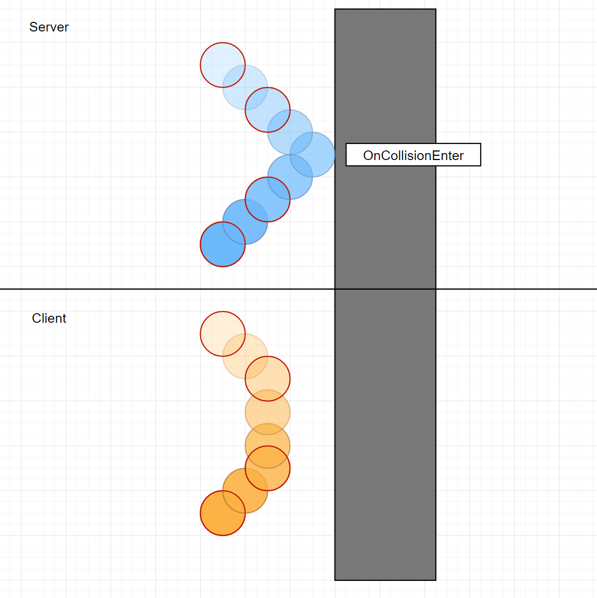

# Physics for CO-OP 
[feature]: #feature

- Start Date: `2021-08-27`
- RFC PR: [#0035](https://github.com/Unity-Technologies/com.unity.multiplayer.rfcs/pull/0035)
- SDK PR: [#0000](https://github.com/Unity-Technologies/com.unity.multiplayer.mlapi/pull/0000)

# Summary
[summary]: #summary

This RFC suggest adding NetworkRigidbody and NetworkRigidbody2D prototyping components to Netcode for GameObjects.

# Motivation
[motivation]: #motivation

The goal of the network physics components is to provide beginner and generalist Unity developers with a way of creating a physics based multiplayer small scale co-op game.

We will not support any high precision or fast pace use cases. We will not support prediction.

# Definitions

The term `controller` will be used to refer to the peer which is in control of the movement of a NetworkObject. I'm using this term to reduce confusion with the term `Ownership` and `Authority Mode` which are two different concepts.

`Dynamic` refers to a Rigidbody which is not `Kinematic` (has `IsKinematic` set to false in the Unity Inspector).

# Guide-level explanation
[guide-level-explanation]: #guide-level-explanation

## How NetworkRigidbody works

NetworkRigidbody is a very simple component. It simply sets the kinematic mode of the Rigidbody to kinematic on all clients except the controller (server in server auth mode, owner in client auth mode).

This allows the physics simulation to only be run on one machine and the resulting position to be replicated by NetworkTransform. NetworkRigidbody only works in combination with NetworkTransform and the component will enforce that NetworkTransform is present.
 
## How Triggers/Collision Events Work

Unity has OnTriggerEnter and OnCollisionEnter and Stay and Exit events these can be placed on any MonoBehaviour on the GameObject and will be fired if the Rigidbody collides or enters a trigger.

NetworkRigidbody does not change the way trigger or collision event does and does not synchronize them over the network. What this means is:
- On the controller all physics events are triggered correctly.
- On the other peers which just replicate the position of the Rigidbody events can be lost. A common situation where this happens is when two dynamic bodies bounce of each other.


*Example of an edge case where collision events don't get fired on all peers. Red circles indicate frames where positions are synced to client. On the server the Rigidbody collides with the wall. The interpolated client object does never collide with the wall.*

If a collision or trigger event is crucial for gameplay it is recommended to manually sychronize that event with an RPC. Here is an example for how to do that:
```cs
public class CollisionSynchronizer : NetworkBehaviour
{
    public void OnCollisionEnter(Collision collision)
    {
        CollisionEnterClientRPC();
    }

    public void OnCollisionExit(Collision collision)
    {
        CollisionExitClientRPC();
    }

    [ClientRPC]
    private void CollisionEnterClientRPC()
    {
        Debug.Log("Important collision entered on the server");
    }

    [ClientRPC]
    private void CollisionExitClientRPC()
    {
        Debug.Log("Important collision exited on the server");
    }
}
```
*note the above works for a server authoritative use case only* <br>
*This example does not synchronize any information about the collision. The Collision class is not network serializable and can't be sent over an RPC. If the `other` object of the Collision is a NetworkObject the id of the object could be sent in the RPC to the clients to reference the right object*

## 3D and 2D Physics

3D and 2d Physics work exactly the same. The only difference is that the Rigidbody2D and NetworkRigidbody2D components need to be added to the GameObject instead of the Rigidbody and NetworkRigidbody components. The `Update` simulation mode of Physics2D is supported.

# Reference-level explanation
[reference-level-explanation]: #reference-level-explanation

## Interactions of Advanced Physics Features

### Server Only Simulation
If all Rigidbody NetworkObjects are controlled by the server (Object is owned by the server or has the NetworkTransform authority set to server) then all Physics features are fully supported.
- On the server the physics simulation will play out like in a singleplayer games and all interactions triggers, joints, raycasts, collisions, forces etc. will work fine.
- Clients will receive position updates

### Mixed Simulation Player Collision

If two player controlled dynamic rigidbodies collide this will result in two dynamic/kinematic collisions as if both players where running against an immovable object.

### Mixed Simulation Joints

Joints between two dynamic rigidbodies which are owned by different peers will not resolve properly. This is not a scenario which we can support. The joints will instead act as if all the the Rigidbodies which are not controlled by the controller of the corresponding Rigidbody were kinematic.

### Mixed Simulation Forces

Forces can only be applied to a NetworkRigidbody by the peer which is controlling it. Often forces are applied in a specific area, by applying these forces on every peer all the NetworkRigidbodies will be affected correctly.

### Interaction With Non Networked Physics Objects

NetworkRigidbodies can interact and collide with regular Rigidbodies. Since this is often unwanted behavior it is recommended to either use a different collision layer for non networked rigidbodies or to move them into a separate physics scene entirely.

## Why we do not synchronize velocity

There are two reasons why we would need to synchronize velocity.
1. Prediction: velocity allows for a more accurate prediction.
2. Extrapolation in case of packet loss.

We do not support prediction currently so 1. is not relevant. Regarding extrapolation while this might improve the smoothness of the Rigidbody when extrapolating in case of a lag due to packet loss it is non trivial to implement this without resulting in jitter. What we would need to do here is transition the Rigidbody from a simply replicating mode into a dynamic Rigidbody again and run the physics simulation to extrapolate. We currently do not have a good way to make this transition smooth because we are not in control of the FixedUpdate and the physics simulation. Instead simply using the NetworkTransforms extrapolation mode results in a more smooth experience and keeps our implementation simple.

## Why we do not synchronize triggers and collision events

1. Collision and Trigger events contain information in reference types (classes) which is not something we could properly serialize. In addition these events contain information about the components and GameObject involved in the collision. We currently have no way to serialize that information over the network.

2. Assuming we could serialize the data of the collision event there's an other issue. When sending collisions we could either send them reliable or unreliable both of them have downsides:
    1. Unreliable: Would kind of defeat the purpose because collisions and triggers would still not be fully reliable
    2. Reliable: If the packet gets dropped the collision even will be delayed compared to the position sync.

Because of the two reasons above we will not do collision and trigger synchronization above and instead ask people to write their own using reliable RPCs if they need a collision event to be reliably synced to all clients. 

## Switching Kinematic Mode at Runtime

Sometimes for gameplay reasons switching the kinematic mode of the Rigidbody is needed. We do support switching the kinematic mode of the Rigidbody on the controller of the Rigidbody. The kinematic mode of the Rigidbody will be synchronized with a NetworkVariable to all other peers. This allows switching the owner of the Rigidbody 

## Synchronizing Rigidbody Parameters

We will not synchronize any Rigidbody parameters besides `IsKinematic`. For instance we will not synchronize the Mass or the Drag or the Constraints of a Rigidbody. The reasons we do not synchronize them are to save bandwidth and to keep the use cases of Rigidbody flexible. If synchronization of a specific Rigidbody parameter is needed users can add this with a custom script using a NetworkVariable.

# Drawbacks
[drawbacks]: #drawbacks

No drawbacks were discovered so far.

# Rationale and alternatives
[rationale-and-alternatives]: #rationale-and-alternatives

# Prior art
[prior-art]: #prior-art

## UNet

UNet's NetworkTransform had a `Transform Sync Mode`. This could be either `Sync None`, `Sync Transform`, `Sync Rigidbody 2D`, `Sync Rigidbody 3D` or `Sync CharacterController`. The Rigidbody synchronization modes would sync both the transform and the velocities of the Rigidbody. This didn't really work out too well because they were not interpolated correctly and pretty jittery.

## Mirror

Mirror has a separate `NetworkRigidbody` component. It does a similar thing as the UNet NetworkTransform where it synchronizes the velocities. It does not force the Rigidbodies to kinematic on the receiving end and the physics simulation is still run on them which is a flawed design. A common pattern is people opting out of the `NetworkRigidbody` component and using a similar design as proposed in this RFC.

## UNet & Mirror Server/Client Callback

UNet and Mirror have `[ServerCallback]` attributes which can be added to unity functions such as `Update` but also `OnCollisionEnter`. These can be used to have them only be fired on the client. They are kind of an replacement for a `!IsServer => return` code. We do not have a similar pattern anywhere in Netcode for GameObjects and UNet and Mirror use codegen to achieve this.

## Photon Unity Networking

Photon Unity Networking has a `Photon Rigidbody View` which works in a similar way to `NetworkRigidbody` in Mirror.

# Unresolved questions
[unresolved-questions]: #unresolved-questions

## Ideas of not having a separate component

UX wise it might be much nicer to just have a `enable NetworkRigidbody` flag on `NetworkTransform` instead of having separate components. The reason why we go for separate components is because the composition approach is more future proof and allows us to add functionality and configurations which are specific for 2d or 3d use cases.

# Future possibilities
[future-possibilities]: #future-possibilities

## Adding prediction

In the future we might add client side prediction to Netcode for GameObjects. To do that we would need to control the physics simulation and resimulate it when running reconciliation and in addition we would need to sync velocities for an accurate prediction. Since it is not yet entirely clear how we plan to approach that, the solution in this RFC will not address this. Having a separate NetworkRigidbody component should allow us to extend the component and support prediction in the future.

## Supporting Other Physics Engines

Think about what the natural extension and evolution of your proposal would be and how it would affect the Unity Multiplayer as a whole in a holistic way. Try to use this section as a tool to more fully consider all possible interactions with the Unity Multiplayer in your proposal. Also consider how the this all fits into the roadmap for the project and the team.

This is also a good place to "dump ideas", if they are out of scope for the RFC you are writing but otherwise related.

If you have tried and cannot think of any future possibilities, you may simply state that you cannot think of anything.

Note that having something written down in the future-possibilities section is not a reason to accept the current or a future RFC; such notes should be in the section on motivation or rationale in this or subsequent RFCs. The section merely provides additional information.
